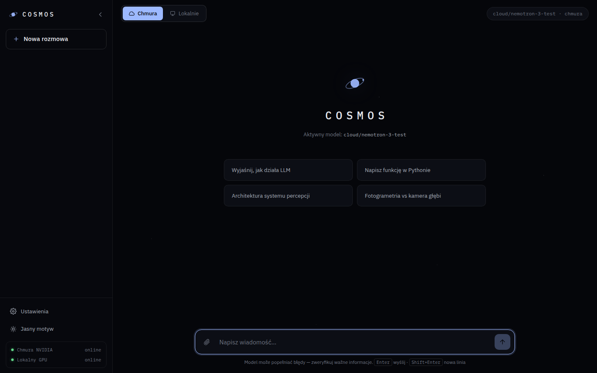

# ✦ COSMOS

Osobiste środowisko AI klasy premium — czysty, kosmiczny interfejs (IBM Plex) dla modeli
**NVIDIA Nemotron** i innych modeli open source. Działa **hybrydowo**: lokalnie na Twoim
GPU (np. RTX 3080) oraz przez chmurę NVIDIA — przełączasz jednym kliknięciem.



> ### 👉 Pierwszy raz? Zacznij tutaj:
> **[docs/START-TUTAJ.md](docs/START-TUTAJ.md)** — jedna instrukcja od zera do działania,
> prostym językiem. Na początku wybierasz ścieżkę:
> - **Ścieżka A** — serwer na Twoim komputerze (0 zł, maksymalna prywatność; działa,
>   gdy komputer jest włączony) — wraz z wariantem mini-PC 24/7 i dostępem przez Tailscale,
> - **Ścieżka B** — serwer w chmurze (VPS): Cosmos **zawsze dostępny** z telefonu
>   i Surface Pro, z RTX 3080 w domu podłączaną na żądanie.
>
> Dalej: instalacja jako aplikacja (Windows/Android/iOS/macOS), zmysły, Cursor,
> przegląd funkcji i rozwiązywanie problemów.
>
> ### 💡 Masz już Cosmosa i szukasz zastosowań?
> **[docs/BADANIA.md](docs/BADANIA.md)** — sześć protokołów badawczych z mierzalnym
> wynikiem (walidacja nasłonecznienia, krzywa fotogrametrii, granica widzenia kamer,
> słuch przestrzenny, macierz lotu, komfort termiczny).
>
> **[docs/POMYSLY.md](docs/POMYSLY.md)** — pomysły od praktycznych (archiwum wideo,
> checklista sprzętu) przez **pomiary z drona** (nasłonecznienie działki, sun scouting,
> zmiany w czasie) po projekty badawcze i kierunek „Jarvis". Każdy pomysł oznaczony:
> ✅ działa dziś / 🔧 wymaga dopisania / 💰 kosztuje.
>
> Poniżej znajduje się dokumentacja techniczna każdego elementu.

## ✨ Funkcje

- 💬 Czat ze streamingiem odpowiedzi w czasie rzeczywistym (SSE)
- 🖼️ **Obsługa obrazów** — załącz lub wklej zdjęcie, odpowie model wizyjny (Nemotron VL i in.)
- ☁️ / 🖥️ **Tryb hybrydowy** — przełącznik Chmura NVIDIA ↔ lokalny GPU w pasku górnym.
  Po dodaniu klucza dochodzą osobne zakładki **OpenAI** i **Claude** (`OPENAI_API_KEY`,
  `ANTHROPIC_API_KEY`) — każda z własnym modelem
- 🛰️ Monitor statusu silników i zmysłów na żywo w panelu bocznym
- 🧠 **Modele rozumujące** — tok myślenia widoczny na żywo w zwijanym bloku; gdy model
  zużyje cały budżet na myślenie, Cosmos pokazuje to myślenie zamiast pustej odpowiedzi
- ✦ **Dopracowanie promptu** — przycisk obok mikrofonu przepisuje podyktowaną wypowiedź
  na precyzyjny prompt; drugie kliknięcie przywraca Twoją wersję
- 🗂️ Wiele rozmów z historią, renderowanie Markdown, kopiowanie kodu
- 🔎 **Zarządzanie rozmowami**: wyszukiwarka (po tytule i treści), przypinanie, zmiana
  nazwy, eksport, regeneracja odpowiedzi, edycja własnej wiadomości, skróty klawiszowe
- 🧾 **Podsumowania rozmów**, licznik tokenów w kompozytorze, profil użytkownika
  doklejany do kontekstu każdej rozmowy
- ⚙️ Osobny wybór modelu dla chmury i dla GPU, system prompt, temperatura, limit tokenów
- 🌗 Motyw ciemny (kosmos) i jasny (sterylny), czcionki IBM Plex dołączone offline
- 🌍 **Dwa języki interfejsu — polski i angielski** (przełącznik w panelu bocznym
  i na ekranie logowania); język steruje też instrukcją systemową modelu
  i rozpoznawaniem/syntezą mowy
- 📸 **Panel kamery na żywo** z detekcją YOLO na podglądzie, zdarzeniami pozycji
  (po lewej / na środku / po prawej) i **wake-word „Hej, Kosmos"**. Źródłem może być
  kamera przeglądarki (na telefonie z przełącznikiem przód/tył) albo **Kinect 360** —
  obraz i mapa głębi. Przycisk powiększenia przenosi podgląd na środek ekranu
- 🎤 **Wybór mikrofonu** (Ustawienia) — macierz Kinecta, słuchawki Bluetooth, telefon
  albo mikrofon laptopa; wybór zapamiętywany, z powrotem do domyślnego przy odłączeniu
- 🦴 **Kinect 360 w pełni** — głębia, obraz RGB, **szkielet 20 stawów**, postawa, gesty
  i silnik pochylenia przez `senses/kinect_win.py` (Windows, SDK 1.8)
- 🎓 **Nauka** — uczysz Cosmosa rozpoznawania (pokaż w kamerze i nazwij),
  nagrywasz **procedury** (czynności krok po kroku) i planujesz je jako **rutyny**
  cykliczne; kroki wrażliwe (płatność, wysłanie) zawsze wymagają potwierdzenia.
  Opcjonalnie **automatyzacja web tylko-do-odczytu** (Playwright) wykonuje same
  bezpieczne odczyty (sprawdź cenę / saldo / status)
- 🕰️ **Digital Time Machine** (włączana w Ustawieniach) — automatyczny zapis migawek
  sceny do osi czasu, ze wskaźnikiem „REC"
- 💾 **Kopie zapasowe i statystyki** danych, **tryb offline**, uwierzytelnianie hasłem
- 🎓 **Eksport danych treningowych** (JSONL) + przykład **QLoRA** — dotrenuj własny model
  na swoich rozmowach i wepnij go z powrotem jako profil „Lokalnie" (`training/`)
- 📱 **Instalacja jako aplikacja**: Windows (PWA lub Electron + instalator .exe),
  Android (PWA), iOS/iPadOS (Safari) i macOS (Dock/PWA)

## 🚀 Szybki start (każdy system)

Wymagany tylko [Node.js ≥ 18](https://nodejs.org). Bez `npm install`, bez budowania.

```bash
git clone https://github.com/Marcin1000/Bear.git
cd Bear
cp .env.example .env    # Windows: copy .env.example .env
npm start               # otwórz http://localhost:3000
```

## 📲 Instalacja jako aplikacja

### Windows — wariant 1: PWA (najprostszy)

1. Uruchom serwer (`npm start`) i otwórz `http://localhost:3000` w **Chrome lub Edge**.
2. Kliknij ikonę **„Zainstaluj aplikację"** w pasku adresu (albo menu ⋯ → *Zainstaluj Cosmos*).
3. Cosmos pojawi się w menu Start jako osobna aplikacja z własnym oknem i ikoną.

### Windows — wariant 2: aplikacja natywna (Electron)

```bash
npm install        # jednorazowo (pobiera Electrona)
npm run desktop    # uruchamia Cosmos jako aplikację okienkową
npm run dist       # (opcjonalnie) buduje instalator .exe w katalogu dist/
```

Wariant Electron sam startuje serwer — nie musisz nic uruchamiać osobno.

### Android — PWA

1. Upewnij się, że telefon jest **w tej samej sieci Wi-Fi** co komputer z serwerem.
2. Sprawdź adres IP komputera (Windows: `ipconfig` → IPv4, np. `192.168.1.20`).
3. Na telefonie otwórz w Chrome: `http://192.168.1.20:3000`.
4. Menu ⋮ → **„Dodaj do ekranu głównego"** / **„Zainstaluj aplikację"**.

Cosmos działa wtedy jak natywna aplikacja (pełny ekran, własna ikona). Telefon łączy się
z serwerem na Twoim PC — tam jest klucz API i tam wykonuje się cała logika.

### iPhone / iPad — PWA (Safari)

Otwórz adres serwera w **Safari** → **Udostępnij** → **„Dodaj do ekranu początkowego"**.
Ikona i pasek stanu są przygotowane pod iOS.

### Mac — PWA (Safari / Chrome)

Safari (macOS Sonoma+): **Plik → Dodaj do Docka**. Chrome/Edge: ikona „Zainstaluj"
w pasku adresu. Cosmos trafia do Docka jako osobna aplikacja.

> 💡 Chcesz używać Cosmos poza domem? Wystaw serwer przez [Tailscale](https://tailscale.com)
> (darmowy VPN między Twoimi urządzeniami) — bez otwierania portów na routerze.

**Ikony aplikacji** są dołączone dla wszystkich platform: Windows/Android (192, 512,
maskable 192/512, SVG), iOS (`apple-touch-icon` 180, nieprzezroczysta), macOS Safari
(`mask-icon` do przypiętej karty) oraz 1024 px dla ekranów o wysokiej rozdzielczości.

## 🔌 Konfiguracja modeli (`.env`)

### Profil „Chmura" — NVIDIA build.nvidia.com

```ini
NVIDIA_API_KEY=nvapi-...            # klucz z build.nvidia.com (darmowa rejestracja)
NEMOTRON_BASE_URL=https://integrate.api.nvidia.com/v1
NEMOTRON_MODEL=nvidia/nvidia-nemotron-nano-9b-v2   # podmień na wybrany model
NEMOTRON_VISION_MODEL=              # model wizyjny (VL) do rozmów z obrazami
```

> 👁 **`NEMOTRON_VISION_MODEL` warto ustawić.** Większość modeli tekstowych nie
> odczytuje obrazów — wysłane zdjęcie albo kończy się błędem 400, albo (gorzej)
> odpowiedzią „nie mam dostępu do żadnego zdjęcia", choć obraz poleciał. Gdy to
> pole jest wypełnione, Cosmos **sam kieruje same zdjęcia** do modelu wizyjnego,
> a rozmowę zostawia modelowi wybranemu w Ustawieniach; pod odpowiedzią widać
> wtedy, który model ją napisał. Bez tego pola żądanie ze zdjęciem jest
> zatrzymywane z czytelnym wyjaśnieniem. Sprawdzony wybór:
> `nvidia/llama-3.1-nemotron-nano-vl-8b-v1`.

> ⚠️ **NVIDIA zmienia identyfikatory modeli** — ten sam model bywa dostępny raz jako
> `nvidia/nemotron-nano-9b-v2`, a po jakimś czasie jako `nvidia/nvidia-nemotron-nano-9b-v2`.
> Nieaktualny wpis kończy się błędem **404 „page not found"**. Nie przepisuj więc nazw
> z dokumentacji w ciemno — sprawdź aktualną listę w aplikacji.

Dokładne identyfikatory modeli sprawdzisz w aplikacji: **Ustawienia → Pobierz listę**.
Pod polem wyboru pojawia się opis modelu — do czego się nadaje, czy widzi obrazy,
jaki ma kontekst i na co uważać. Katalog opisów: `public/models.js`.

### „Sprawdź" — które modele naprawdę działają

Lista z „Pobierz listę" to **wszystko, co dostawca hostuje**, a nie to, do czego
Twój klucz ma dostęp. Część pozycji NVIDII kończy się błędem
*„Function … Not found for account"*. Katalog opisów też tylko zgaduje po nazwie,
czy model widzi obrazy. Jedyna pewna odpowiedź to spróbować — i od tego są dwa
przyciski w Ustawieniach:

| Przycisk | Co robi |
|---|---|
| **Sprawdź** (obok pola modelu) | Wysyła do wybranego modelu dwa najtańsze możliwe żądania (`max_tokens: 1`): jedno tekstowe, jedno z obrazkiem 1×1. Odpowiada: `✓ rozmowa działa`, `👁 czyta też obrazy` albo `✗ niedostępny na Twoim koncie` z powodem od dostawcy |
| **Sprawdź wszystkie z listy** (pod wybierakiem) | To samo dla całej pobranej listy, **po kolei** (nie równolegle — inaczej dostawca odrzuci nas za nadmiar żądań). Każdą pozycję oznacza znaczkiem: `✗` nie działa, `✓` rozmowa, `👁` rozmowa + obrazy. Na końcu podsumowanie „Działa N z M. Obrazy czyta K." |

Wzrok sprawdzamy tylko wtedy, gdy sama rozmowa działa — inaczej zdublowalibyśmy
ten sam błąd dostępu i niepotrzebnie obciążyli limit.

**Ile to kosztuje?** Jedno sprawdzenie to jeden lub dwa tokeny. Przy chmurze to
w praktyce zero; przy modelu lokalnym — tyle, ile ładowanie modelu do pamięci GPU.

**Czego to NIE naprawia.** Jeśli model jest wyłączony na Twoim koncie u dostawcy,
Cosmos nie ma jak tego obejść — pokaże tylko uczciwie, że tak jest. A modelu
lokalnego, którego nie masz jeszcze na dysku, nie da się użyć bez pobrania:
w takiej sytuacji komunikat podaje gotową komendę `ollama pull <model>`.

Model wybrany w Ustawieniach jest **ważniejszy niż `.env`** i obowiązuje wszędzie:
w czacie, przy dopracowywaniu promptu i przy streszczeniach. `.env` to wartość
domyślna dla urządzeń, które niczego nie wybrały.

**Który model wybrać?**

| Do czego | Model | Uwagi |
|---|---|---|
| Czat w chmurze (codziennie) | `nemotron-3-super-120b-a12b` | MoE 12 mld aktywnych, kontekst 1M — najlepszy balans jakości i szybkości |
| Czat w chmurze (maksimum) | `nemotron-3-ultra-550b-a55b` | Flagowiec, wolniejszy |
| Wzrok w chmurze | `nemotron-3-nano-omni-30b-a3b-reasoning` | Omni-modalny: obrazy, wideo, mowa, tekst |
| Model lokalny (RTX 3080) | `nemotron-nano-9b-v2` | ~6 GB w 4-bit — mieści się w 10 GB |
| Lokalny wzrok | `llama-3.1-nemotron-nano-vl-8b-v1` | 8B, zmieści się obok |

> ⚠️ **`nemotron-3-nano-30b-a3b` nie zmieści się na RTX 3080** mimo opisu „3 mld
> aktywnych" — MoE oszczędza obliczenia, nie pamięć: wszystkie 30 mld musi być
> w VRAM (~16–18 GB). Ten i większe (super, ultra) — tylko przez chmurę.
>
> Po polsku lepiej radzą sobie modele większe, stąd sensowny podział: **chmura do
> pisania i rozumowania, model lokalny do rzeczy prywatnych i pracy bez internetu**.
> Pełny przewodnik: [docs/START-TUTAJ.md](docs/START-TUTAJ.md#który-model-nemotron-wybrać).

### Profil „Lokalnie" — Twój RTX 3080

Najprościej przez [Ollama](https://ollama.com) (Windows/Linux/macOS):

```bash
# po zainstalowaniu Ollama:
ollama pull rwxproject/nemotron-nano-9b-v2-q4_k_m
```

```ini
LOCAL_BASE_URL=http://localhost:11434/v1
LOCAL_MODEL=rwxproject/nemotron-nano-9b-v2-q4_k_m
LOCAL_VISION_MODEL=qwen2.5vl   # lokalny model wizyjny (opcjonalnie)
```

> Nemotron Nano 9B v2 nie ma oficjalnego wpisu w bibliotece Ollamy — dostępne są tylko
> konwersje społeczności. Wybór wersji (`q4_k_m` vs `q8_0`…), weryfikacja po pobraniu
> i zapasowe źródło z Hugging Face: [docs/START-TUTAJ.md](docs/START-TUTAJ.md) — KROK 8.

Alternatywy dla Ollama: **vLLM** (`http://localhost:8000/v1`) albo kontener **NVIDIA NIM**.

> **Co zmieści się na RTX 3080 (10 GB)?** Modele do ~9–14 mld parametrów w kwantyzacji
> 4-bit (np. Nemotron Nano 9B, Qwen 7B/14B, Mistral 7B). Większe modele (49B+) używaj
> przez profil „Chmura".

## 🧠 Orkiestra — jeden byt, wiele zmysłów

Cosmos to nie czat + osobne narzędzia, tylko **jeden organizm**:

```
                        🖥 UI (przeglądarka / PWA / Electron)
                 mikrofon 🎤 · aparat 📷 · głos 🔊 · czat 💬
                                   │
                          ✦ COSMOS CORE (server.js)
              dyrygent: routing modeli + pamięć zdarzeń percepcji
                 │                  │                    │
        ☁ chmura NVIDIA      🖥 lokalny GPU        🐍 COSMOS SENSES (Python)
        Nemotron / VL        Ollama / vLLM         słuch  — Whisper (STT)
        OpenAI · Claude      (RTX 3080)            głos   — Piper (TTS)
        (opcjonalnie)                              wzrok  — YOLO (detekcja)
                                                   głębia — Kinect 360 (SDK 1.8)
                                                   szkielet — 20 stawów, gesty
                                                   słuch³ — macierz 4 mikrofonów
                                                   oczy²  — watcher.py (kamera 24/7)
```

> `ciało — MediaPipe (pozy)` jest zainstalowane i wystawione jako `/pose`, ale
> **żadna funkcja interfejsu go jeszcze nie wywołuje** — sylwetkę czyta się dziś
> z Kinecta. Stan każdego modułu: [`senses/README.md`](senses/README.md).

**Jak zmysły współgrają z mózgiem:** obserwator kamery (`senses/watcher.py`) wykrywa
zmiany w otoczeniu i wysyła je do Cosmosa (`POST /api/events`). Serwer dokleja ostatnie
zdarzenia do **kontekstu każdej rozmowy** (sekcja „KONTEKST PERCEPCJI"), więc możesz
zapytać *„co się zmieniło w pokoju?"* — a Nemotron odpowie na podstawie prawdziwych
obserwacji, niezależnie od tego, czy działa lokalnie, czy w chmurze.

### 🎙️ Asystent głosowy — „Hej, Kosmos"

Kliknij ikonę fal dźwiękowych w pasku górnym — Cosmos przechodzi w tryb asystenta
głosowego (jak Asystent Google na Androidzie):

1. **Nasłuch**: orb oddycha, czekając na słowa **„Hej, Kosmos"** (możesz też od razu
   dokończyć: *„Hej, Kosmos, co mam w ręku?"*).
2. **Rozmowa**: po sygnale mówisz pytanie; odpowiedź jest czytana na głos, a Cosmos
   od razu słucha pytania uzupełniającego — rozmowa płynie bez powtarzania wake word.
   Cisza albo „koniec" wraca do nasłuchu.
3. **Wzrok**: przy pytaniach typu *„co mam w ręku?"*, *„co widzisz?"* Cosmos może
   dołożyć klatkę z kamery. Podgląd **włączasz świadomie** ikoną kamery w oknie
   głosowym — nie startuje sam, bo na telefonie zasłaniał pół ekranu.
4. **Internet**: gdy pytasz np. *„jaki to telefon?"*, model może zarządzić
   wyszukiwanie — Cosmos mówi „Sprawdzam w internecie", pobiera wyniki
   (DuckDuckGo, bez klucza API) i odpowiada z podaniem źródeł.

Wyszukiwanie pobiera **treść dwóch pierwszych stron**, nie same tytuły i zajawki.
Zajawka wyszukiwarki to zwykle opis serwisu („Radar temperatury pokazuje aktualne
wartości…"), a nie odpowiedź — model nie znajdował w niej liczby, o którą pytano,
i szukał w kółko. Rundy są ograniczone; po wyczerpaniu limitu model dostaje
polecenie odpowiedzieć tym, co zebrał, i podać adresy do sprawdzenia.

Wymagania trybu głosowego: przeglądarka **Chrome lub Edge** (Web Speech API; działa
też w PWA na Androidzie). Rozpoznawanie wake word wymaga otwartej aplikacji.
Wyszukiwarkę można podmienić na własną (np. SearXNG): `SEARCH_URL` w `.env`.

### 📚 Baza wiedzy

Przycisk **„Baza wiedzy"** w panelu bocznym otwiera Twój prywatny magazyn materiałów
(`data/kb/` na serwerze):

- **Pliki dowolnego typu** (przycisk lub przeciągnij-upuść): dokumenty, PDF, Word,
  **Excel**, PowerPoint, grafiki, **audio i wideo**. Tekst jest wyciągany automatycznie
  (dokumenty — usługa zmysłów `/extract`; nagrania — transkrypcja Whisper; obrazy —
  opis detekcji YOLO, a przy użyciu w rozmowie trafiają do modelu wizyjnego).
- **Linki do stron** — Cosmos pobiera treść strony i indeksuje ją jak plik.
- **Notatki głosowe** — przycisk 🎙 w bazie (start/stop) albo **komendy głosowe**
  w trybie „Hej, Kosmos": powiedz *„nowa notatka"* / *„zacznij nagrywanie"*, dyktuj,
  zakończ słowami *„koniec notatki"* — transkrypcja ląduje w bazie.

**Użycie w rozmowie:** pozycje zaznaczone ☑ są **zawsze** dołączane do kontekstu
(„interesują mnie te konkretne pliki"), a z pozostałych Cosmos **sam przywołuje
pasujące fragmenty** (embeddingi bge-m3 albo słowa kluczowe, gdy zmysły są offline).
Licznik zaznaczonych pozycji widać na przycisku w panelu bocznym.

**W interfejsie:**
- 🎤 przycisk mikrofonu — dyktowanie: Whisper (lokalnie, przez Senses), a gdy usługa
  nie działa, rozpoznawanie wbudowane w Chrome/Edge. **Którym mikrofonem** — wybierasz
  w Ustawieniach (macierz Kinecta, słuchawki Bluetooth, telefon, mikrofon laptopa);
  wybór jest zapamiętywany,
- ✦ „dopracuj prompt" (obok mikrofonu, pojawia się przy dłuższym tekście) — przepisuje
  podyktowaną wypowiedź na precyzyjny prompt: usuwa wypełniacze i powtórzenia,
  porządkuje wymagania w listę. Drugie kliknięcie przywraca Twoją wersję,
- 🔊 przełącznik głosu (pasek górny) — odpowiedzi czytane przez Piper (naturalny polski
  głos, lokalnie), fallback: głos systemowy przeglądarki,
- 📷 przycisk aparatu — zdjęcie z kamery (webcam/Kinect RGB) prosto do rozmowy,
  analizowane przez model wizyjny; na telefonie przełącznik przód/tył (wybór
  zapamiętywany),
- 🔗 adresy w odpowiedziach są klikalne — także te wpisane gołym tekstem, nie tylko
  w formie `[nazwa](adres)`; otwierają się w nowej karcie,
- 🖼 kliknięcie w obraz w rozmowie otwiera go na pełnym ekranie, z pobieraniem,
- 🧠 przy modelach rozumujących (Nemotron 3, gpt-oss, R1) tok myślenia jest
  widoczny na żywo w zwijanym bloku. Gdy model zużyje cały budżet tokenów na
  myślenie, Cosmos pokazuje to myślenie zamiast pustej odpowiedzi,
- 🛰️ status „Zmysły" w panelu bocznym pokazuje, które zmysły są aktywne.

Instalacja zmysłów: **[senses/README.md](senses/README.md)** (każdy jest opcjonalny —
Cosmos działa też bez żadnego z nich).

### 🔎 Embeddingi — wyszukiwanie semantyczne, które działa zawsze

Baza wiedzy i pamięć długotrwała używają wektorów semantycznych. Cosmos liczy je
**lokalnie** (bge-m3 w zmysłach — za darmo i prywatnie), a gdy komputer domowy jest
wyłączony, **automatycznie przechodzi na darmowy endpoint NVIDII**
(`llama-nemotron-embed-1b-v2`, 26 języków z polskim). Dzięki temu **baza wiedzy działa
w pełni także z VPS-a**, gdy Twój PC śpi.

```ini
EMBED_PROVIDER=auto        # domyślnie: zmysły → chmura (senses | nvidia | off)
NVIDIA_EMBED_MODEL=nvidia/llama-nemotron-embed-1b-v2
```

> **Bezpieczeństwo wyników:** wektory z różnych modeli mają inny wymiar i znaczenie —
> porównywanie ich dałoby bezsens. Cosmos znakuje każdy zapisany wektor modelem, który
> go policzył, i przy zmianie **sam przelicza** wpisy (pamięć i wzorce od razu, fragmenty
> bazy wiedzy w tle). Aktywnego dostawcę zobaczysz w `/api/status` i w manifeście zdolności.

### Pamięć długotrwała (RAG)

Pod każdą wiadomością jest przycisk **„✦ Zapamiętaj"** — zapisany fakt trafia do
`data/memory.json` na serwerze. Podczas rozmowy Cosmos **sam przywołuje pasujące
wpisy** (wyszukiwanie semantyczne przez embeddingi **bge-m3** z usługi zmysłów;
gdy zmysły są offline — wyszukiwanie po słowach kluczowych) i dokleja je do
kontekstu jako sekcję „PAMIĘĆ DŁUGOTRWAŁA". Wpisami zarządzasz w **Ustawieniach**.

### 🎓 Nauka — uczysz Cosmosa (przycisk „Nauka" w panelu bocznym)

Trzy zakładki, wszystkie z zasadą **człowiek w pętli** (nic nieodwracalnego nie dzieje się samo):

**1. Rozpoznawanie (przez zmysły).** Włącz kamerę, pokaż coś (klucz, gest, pozę), nazwij
i kliknij *Naucz*. Cosmos zapisuje wzorzec (etykieta + opis + miniatura + embedding) i od
tej pory **rozpoznaje to na żywo** w panelu kamery — dopisuje np. „✦ Mój klucz" do statusu
i melduje jako zdarzenie percepcji, więc możesz o tym rozmawiać. To nauka **przez przykład**,
lokalnie — nie dotrenowuje wag Nemotrona. Bez usługi zmysłów działa dopasowanie po słowach
kluczowych.

**2. Procedury (nauka czynności).** Rozpisz czynność (np. *„sprawdź rachunek za prąd"*) na
kroki — ręcznie **albo nagraj z ekranu**: przycisk **„🔴 Nagraj procedurę"** (gdy masz
zainstalowany Playwright) otwiera przeglądarkę na komputerze z serwerem, a Twoje kliknięcia,
wpisywany tekst i nawigacja zapisują się jako kroki (stabilne selektory elementów, nie
współrzędne — dlatego odtwarzają się wiernie). Po „Zakończ" procedura jest gotowa. Nagrywarka
**nie** zapisuje haseł (pole → krok „logowanie" z `{{secret:...}}`), nie rejestruje ruchów
myszki ani innych aplikacji (przeglądarka nie widzi reszty systemu). Dostępne akcje kroku:
otwórz stronę, kliknij, wpisz, odczytaj, poczekaj, **potwierdź**, notatka. Kroki
oznaczone jako **wrażliwe** (płatność, wysłanie, potwierdzenie) w runnerze **zawsze** wymagają
Twojego kliknięcia — Cosmos nigdy nie zapłaci sam. Hasła i dane karty **nie są** zapisywane
w procedurze (wartość kroku możesz zostawić jako wskazówkę „z menedżera haseł"). Uruchomienie
prowadzi Cię krok po kroku (asystent z bramką), z przyciskiem otwarcia strony i kopiowaniem
wartości. Nemotron może sam zaproponować uruchomienie: *„odpal sprawdzenie rachunku"* →
`[AKCJA: procedura | nazwa]`, którą zatwierdzasz.

**3. Rutyny (cyklicznie).** Zaplanuj procedurę: codziennie / co tydzień / co miesiąc / co N
minut. O wyznaczonej porze Cosmos **przygotowuje** czynność i pyta, czy uruchomić (z bramką
na krokach wrażliwych). Licznik przy „Nauce" pokazuje, ile rutyn czeka.

**Automatyzacja web tylko-do-odczytu (opcjonalny moduł Playwright).** Dla procedur
zawierających wyłącznie kroki nie zmieniające stanu (otwórz / poczekaj / odczytaj /
nawigacja) pojawia się przycisk **„⚡ Uruchom auto (tylko odczyt)"** — Cosmos sam otwiera
stronę w prawdziwej przeglądarce i zwraca odczytane wartości (np. saldo z publicznej strony,
cena, status), a wynik trafia do kontekstu rozmowy. Rutyna z **trybem auto** zrobi to sama
o wyznaczonej porze i przyśle powiadomienie. **Twarda bramka:** jeśli procedura ma choć jeden
krok wrażliwy lub zmieniający stan (wpisywanie danych, potwierdzenie, płatność), moduł
odmawia i odsyła do ręcznego runnera z potwierdzeniem. Włączenie: `npm install playwright`
(szczegóły: **[automation/README.md](automation/README.md)**).

**Logowanie z menedżera haseł.** Aby auto‑odczyt działał też za logowaniem, krok możesz
oznaczyć jako **„logowanie"** i podać hasło jako odwołanie `{{secret:nazwa}}` — Cosmos
pobierze je z Twojego menedżera (Bitwarden / 1Password / pass / KeePassXC / zmienne
środowiskowe / własne polecenie) **w chwili uruchomienia**. Hasło **nigdy** nie trafia do
procedury, plików ani przeglądarki‑klienta; leci do runnera przez potok. Konfiguracja:
`SECRETS_PROVIDER` w `.env`. Logowanie jest dozwolone w trybie auto — ale każdy krok
płatności/wysłania/potwierdzenia i tak wraca do ręcznego runnera z bramką.

> **Bezpieczeństwo pieniędzy:** żadna rutyna nie wykonuje płatności automatycznie. Tryb auto
> obsługuje odczyt (i ewentualnie logowanie); kroki zmieniające stan zawsze wymagają Twojego
> potwierdzenia.

### 🎓 Trening własnego modelu (fine-tuning)

„Nauka" uczy **Cosmosa** (pamięć/umiejętności) — nie zmienia wag modelu. Jeśli chcesz
**wpisać** swój styl/domenę w wagi, możesz dotrenować własny model:

1. **Ustawienia → Dane treningowe → „Eksport JSONL (chat)"** — Twoje rozmowy jako zbiór
   treningowy (jedna rozmowa na linię; dostępny też format „instrukcje").
2. **`training/`** — gotowy skrypt **QLoRA** (Unsloth, pod jedno GPU jak RTX 3080) i przewodnik.
3. Po treningu wpinasz model z powrotem jako profil **„Lokalnie"** (przez Ollama/GGUF) —
   rozmawiasz z własnym modelem w tym samym UI. **Pętla:** używaj → zbierz dane → dotrenuj → wepnij.

**Albo jednym kliknięciem — przycisk „🎓 Dotrenuj teraz"** (Ustawienia → Dane treningowe).
Pojawia się, gdy masz lokalnie **Pythona** i skrypt; Cosmos zapisuje dataset, uruchamia
QLoRA w tle (podgląd logu na żywo) i po sukcesie **sam rejestruje model w Ollamie**
(`ollama create`) — zostaje tylko ustawić `LOCAL_MODEL` i przełączyć na profil „Lokalnie".
Wymaga zainstalowanych zależności (patrz `training/README.md`); trening korzysta z Twojego GPU.

Szczegóły, wybór modelu bazowego (Qwen/Llama/Nemotron) i wymagania sprzętowe:
**[training/README.md](training/README.md)**.

### 🦴 Kinect 360 — cztery czujniki w jednym

Kinect nie jest kamerą UVC: przeglądarka go nie widzi, a `getUserMedia` nigdy go nie
zwróci. Dlatego obraz idzie inną drogą — usługa zmysłów → serwer → przeglądarka.

Na **Windowsie** `senses/kinect_win.py` mostkuje oficjalne Kinect for Windows SDK 1.8
przez `ctypes` — bez C# i bez C++. Potwierdzone na sprzęcie:

| Czujnik | Polecenie | Co daje |
|---|---|---|
| Mapa głębi | `python kinect_win.py depth` | dystans, obecność, ruch |
| Obraz RGB | `python kinect_win.py color -o kadr.png` | zwykła kamera dla YOLO |
| **Szkielet — 20 stawów** | `python kinect_win.py skeleton` | postawa, gesty, kierunek zwrócenia |
| Silnik pochylenia | `python kinect_win.py tilt 10` | zakres −27…27° |
| Macierz 4 mikrofonów | `python soundloc.py --listen` | kierunek źródła dźwięku |

Zanim podłączysz czujnik: `python kinect_win.py selftest` sprawdza układ struktur
i logikę **bez sprzętu** (22 kontrole).

**W interfejsie Cosmosa** panel „Kamera na żywo" ma wybór źródła: kamera przeglądarki,
**Kinect — obraz**, **Kinect — głębia**. Obraz leci strumieniem MJPEG (jedno połączenie,
klatki jedna za drugą), więc podgląd jest płynny także przez Tailscale. Detekcja YOLO
działa na obu źródłach tak samo.

Na **Linuksie** `kinect_watcher.py` używa libfreenect — daje głębię, ale **nie ma
szkieletu**; ten jest wyłącznie w SDK Microsoftu. Pełny opis, z pułapkami dwóch różnych
konwencji wywołań w jednym API: [`senses/README.md`](senses/README.md).

### 🏡 Analiza terenu — Cosmos Terrain (dron → pomiary)

`senses/terrain.py` zamienia model 3D z `photoscan.py` w **realne pomiary** — czysta
geometria, bez AI i bez internetu:

```bash
python senses/terrain.py selftest                     # sprawdź poprawność obliczeń
python senses/terrain.py sun model.ply --lat 52.23 --lon 21.01 --date 2026-06-21
python senses/terrain.py shadow model.ply --lat 52.23 --lon 21.01 --time "2026-06-15 17:30"
python senses/terrain.py view model.ply --eye 4.5     # co widać z okna na piętrze
python senses/terrain.py volume halda.ply             # kubatura pryzmy
python senses/terrain.py compare styczen.ply maj.ply  # co się zmieniło
```

- **`sun`** — mapa godzin bezpośredniego słońca na każdy metr kwadratowy w danym dniu
  (+ JSON: długość dnia, maks. wysokość słońca, **jaki % terenu ma ≥6 h** — próg dla
  warzywnika i paneli PV). Gdzie postawić dom, taras, panele, grządki.
- **`shadow`** — cień o konkretnej godzinie („sun scouting" przed zdjęciami).
- **`view`** — analiza widoku: co zobaczysz z danego punktu i czy sąsiad widzi Twój taras.
- **`volume`** / **`compare`** — kubatura hałd i wykopów, postęp budowy, erozja.

Pozycja słońca liczona algorytmem NOAA (offline), zapis map PNG bez zewnętrznych
bibliotek — wymagane tylko `numpy`. Wyniki są poprawne **tylko dla modelu w metrach
i zorientowanego na północ** (ENU) — flagi `--scale`, `--north`, `--up` pozwalają
doprowadzić do tego chmurę bez georeferencji.

### 🧭 Samoświadomość — Cosmos wie, czym jest i co potrafi

Do kontekstu każdej rozmowy trafia **manifest zdolności** budowany z żywego stanu systemu:
które mózgi są gotowe, czy zmysły są online, jakie silniki Studia masz opłacone, ile masz
rozmów, faktów, wzorców, procedur, rutyn i urządzeń, czy są moduły terenu i treningu.
Dzięki temu Cosmos **nie obiecuje rzeczy, których nie ma** — wymienia je i mówi, jak je
włączyć („wideo Seedance — ustaw SEEDANCE_API_KEY").

**Nauka → Pomysły** to jego własna inicjatywa, zawsze za Twoją zgodą:
- **„✨ Co jeszcze możesz dla mnie zrobić?"** — model dostaje swój manifest, Twój profil,
  tematy ostatnich rozmów i zawartość bazy wiedzy, po czym proponuje konkretne
  zastosowania **szyte pod Ciebie**, z krokami wdrożenia.
- **„Pokaż, co potrafisz"** — pełny, uczciwy stan systemu w jednym miejscu.
- **Backlog usprawnień** — pomysły (Twoje i jego) ze statusami *nowy → zaakceptowany →
  zrobione*. W rozmowie model może zaproponować `[AKCJA: pomysł | …]`, ale zapis następuje
  dopiero po Twoim kliknięciu.

Endpointy: `/api/capabilities`, `/api/suggest`, `/api/improvements`.

### 🏠 Urządzenia i poranna odprawa (Jarvis)

- **Urządzenia** (Ustawienia → Urządzenia): dowolny sprzęt sterowany przez HTTP —
  Home Assistant, Shelly, Hue, Tasmota. W rozmowie powiesz *„przygaś światło"*,
  a Cosmos zaproponuje `[AKCJA: urządzenie | …]` — **wykonanie zawsze po Twoim kliknięciu**.
- **Poranna odprawa** (Ustawienia → Poranna odprawa): pogoda (open-meteo, bez klucza API),
  wydarzenia z kalendarza `.ics`, czekające rutyny i ostatnie zdarzenia — streszczone
  modelem i **czytane na głos**. Ręcznie albo automatycznie o wybranej godzinie.
  Konfiguracja: `BRIEFING_LAT`, `BRIEFING_LON`, opcjonalnie `CALENDAR_ICS`.

### Fotogrametria — Cosmos PhotoScan

`python senses/photoscan.py <folder-ze-zdjęciami>` — copilot ocenia zestaw
(liczba ujęć, ostrość, ekspozycja) i radzi po polsku, co poprawić, a gdy
zainstalowany jest **COLMAP** (CUDA na RTX 3080), buduje model 3D automatycznie
(`--dense` = gęsta chmura punktów `.ply` do Blendera/MeshLaba). Wynik skanu
trafia do Cosmosa jako zdarzenie.

### 🎨 Studio i silniki komercyjne (Twoje klucze API)

Po wpisaniu kluczy w `.env` Cosmos zyskuje dodatkowe moce (płacisz tylko za to,
czego użyjesz — środkami ze swoich kont):

- **OpenAI** (`OPENAI_API_KEY`) — nowa zakładka czatu **OpenAI** obok Chmura/Lokalnie
  oraz **generowanie obrazów** w Studiu (gpt-image-1). W rozmowie wystarczy poprosić:
  *„wygeneruj grafikę…"* — model użyje narzędzia `[OBRAZ:]` i obraz pojawi się w czacie.
- **Claude** (`ANTHROPIC_API_KEY`) — zakładka czatu **Claude** (przez warstwę
  zgodności Anthropic z API OpenAI). Świetny do pracy nad kodem.
- **ElevenLabs** (`ELEVENLABS_API_KEY`) — **Studio → Dźwięk**: naturalny lektor
  z dowolnego tekstu (mp3).
- **Seedance** (`SEEDANCE_API_KEY`) — **Studio → Wideo**: generowanie klipów
  z promptu, także **z wygenerowaną wcześniej grafiką jako pierwszą klatką**
  (wybierasz obraz z bazy wiedzy). Zadania są asynchroniczne — Cosmos sam
  odpytuje o status i pobiera gotowy plik.

**Wszystko spina baza wiedzy:** każdy wygenerowany obraz, dźwięk i wideo trafia
do niej automatycznie (z promptem jako opisem), więc możesz się do nich odnosić
w rozmowie i używać ich w kolejnych krokach (obraz z OpenAI → wideo w Seedance).

**Studio to więcej niż jeden przycisk „generuj":**
- **Warianty** — jednym poleceniem stwórz 1 / 2 / 4 wersje tego samego promptu.
- **Szablony promptów** — gotowe style (np. fotorealizm, plakat, ikona) doklejane
  do Twojego opisu jednym kliknięciem.
- **Storyboard** — rozpisz scenę na kadry i wygeneruj je seryjnie (przydatne przed
  klipem w Seedance).
- **Edycja / inpainting** — zamaluj fragment obrazu na płótnie i podmień tylko go.
- **Upscale** — powiększanie i wyostrzanie (Real-ESRGAN przez usługę zmysłów).
- **Galeria** — wszystkie wygenerowane materiały w jednym miejscu, z podglądem
  i ponownym użyciem w rozmowie lub jako pierwsza/ostatnia klatka wideo.

### 🎬 Adobe: Firefly + Creative Cloud

**Adobe Firefly** działa w Studiu jako drugi silnik obrazów (obok OpenAI —
wybierasz z listy przy generowaniu). Jak zdobyć dane dostępowe:

1. Wejdź na [developer.adobe.com/console](https://developer.adobe.com/console)
   i zaloguj się kontem Adobe.
2. *Create new project → Add API → Firefly Services → OAuth Server-to-Server*.
3. Skopiuj **Client ID** i **Client Secret** do `.env`
   (`FIREFLY_CLIENT_ID`, `FIREFLY_CLIENT_SECRET`).

Cosmos sam pobiera i odświeża token Adobe IMS. Uwaga: dostęp do Firefly API
bywa rozliczany osobno od subskrypcji Creative Cloud (kredyty generatywne /
plan Firefly Services) — sprawdź warunki w konsoli developerskiej.

**Aplikacje Creative Cloud (Premiere, Photoshop…):** ustaw `STUDIO_EXPORT_DIR`
w `.env` na folder swojego projektu (np. `C:\Projekty\Premiere\assets`) — każdy
plik ze Studia zapisze się tam automatycznie; w Premiere podpinasz folder
w Media Browser. (Adobe nie udostępnia publicznego API do zdalnego sterowania
aplikacjami desktopowymi, więc most działa przez pliki — standardowy,
niezawodny workflow.)

### 🖱️ Cursor (i inne narzędzia MCP)

Cosmos wystawia mostek **MCP** (`mcp/cosmos-mcp.js`) — agent w Cursorze może
przeszukiwać Twoją bazę wiedzy, czytać pamięć i zdarzenia percepcji, dopisywać
notatki i generować obrazy przez Studio. W Cursorze: *Settings → MCP → Add server*:

```json
{
  "mcpServers": {
    "cosmos": {
      "command": "node",
      "args": ["C:/sciezka/do/Bear/mcp/cosmos-mcp.js"],
      "env": { "COSMOS_URL": "http://localhost:3000" }
    }
  }
}
```

Ten sam wpis działa w Claude Desktop i Claude Code. Cosmos musi być uruchomiony.

### Pozostałe elementy orkiestry

| Zadanie | Narzędzie | Jak podłączyć |
|---|---|---|
| Widzenie (opis obrazu) | Nemotron VL (chmura) lub **Qwen2.5-VL** (Ollama) | `NEMOTRON_VISION_MODEL` / `LOCAL_VISION_MODEL` w `.env` |

## 🏗️ API serwera

| Endpoint | Metoda | Opis |
|---|---|---|
| `/api/chat` | POST | Rozmowa (tekst + obrazy) + kontekst percepcji i pamięci, strumień SSE |
| `/api/models?endpoint=` | GET | Lista modeli danego endpointu |
| `/api/models/check` | POST | Sprawdza jednym najtańszym żądaniem, czy dany model działa na tym koncie i czy czyta obrazy. Zwraca `{model, silnik, rozmowa, obrazy, blad, podpowiedz, bladObrazy}` |
| `/api/status` | GET | Dostępność chmury, lokalnego GPU i zmysłów |
| `/api/config` | GET | Konfiguracja serwera (bez kluczy) |
| `/api/events` | POST/GET | Zdarzenia percepcji (od watcherów/czujników) |
| `/api/memory` | POST/GET/DELETE | Pamięć długotrwała (zapis, lista, usuwanie) |
| `/api/stt` `/api/tts` `/api/detect` `/api/pose` | POST | Proxy do zmysłów (Whisper/Piper/YOLO/MediaPipe). `/api/pose` jest dostępny, ale żadna funkcja interfejsu z niego jeszcze nie korzysta |
| `/api/kinect/stream` `/api/kinect/frame` `/api/kinect/status` | GET | Obraz z Kinecta 360 (kolor / głębia) — przeglądarka nie widzi go sama, bo nie jest kamerą UVC. `stream` to MJPEG (płynny podgląd), `frame` to pojedyncza klatka |
| `/api/polish` | POST | Przepisuje podyktowany tekst na precyzyjny prompt (`{text, endpoint}` → `{text}`) |
| `/api/lessons` `/api/lessons/match` | GET/POST/DELETE | Nauka: wzorce rozpoznawania i dopasowanie |
| `/api/procedures` | GET/POST/PUT/DELETE | Nauka: procedury (czynności krok po kroku) |
| `/api/routines` `/api/routines/due` | GET/POST/PUT/DELETE | Nauka: rutyny (harmonogram) i zadania do wykonania |
| `/api/automation/status` `/api/procedures/run-readonly` | GET / POST | Nauka: automatyzacja web tylko-do-odczytu (Playwright) |
| `/api/procedures/record/{start,stop,status}` | GET/POST | Nauka: nagrywanie procedury z ekranu (Playwright) |
| `/api/train/dataset?format=` `/api/train/stats` | GET | Eksport danych treningowych (JSONL: chat/instrukcje) i licznik przykładów |
| `/api/train/env` `/api/train/start` `/api/train/status` `/api/train/stop` | GET/POST | Trening w aplikacji: wykrycie wymagań, start/stop, log |
| `/api/devices` `/api/devices/run` | GET/POST/DELETE | Urządzenia smart home (HTTP) i ich uruchamianie za zgodą |
| `/api/briefing` | GET | Poranna odprawa: pogoda + kalendarz + zadania, streszczone |
| `/api/capabilities` | GET | Manifest zdolności — czym Cosmos jest i co realnie potrafi teraz |
| `/api/suggest` | POST | Propozycje zastosowań szyte pod użytkownika (z manifestu + profilu) |
| `/api/improvements` | GET/POST/PUT/DELETE | Backlog usprawnień z akceptacją |
| `/api/auth` `/api/login` `/api/logout` | GET/POST | Stan logowania, logowanie hasłem, wylogowanie |
| `/api/conversations` `/api/conversations/meta` `/api/conversations/search` | GET/PUT/POST/DELETE | Rozmowy: treść, metadane (tytuł, przypięcie), szukanie po treści |
| `/api/kb` `/api/kb/file` `/api/kb/link` `/api/kb/note` `/api/kb/raw` `/api/kb/search` | GET/POST/DELETE | Baza wiedzy: pliki, linki, notatki, pobieranie, wyszukiwanie |
| `/api/studio/*` | GET/POST | Studio: obraz, warianty, storyboard, edycja, upscale, dźwięk, wideo + status |
| `/api/timeline` | GET/POST/DELETE | Oś czasu (Digital Time Machine) |
| `/api/profile` | GET/POST | Profil użytkownika (pamięć profilowa) |
| `/api/summarize` | POST | Streszczenie rozmowy |
| `/api/search` | GET | Wyszukiwanie w internecie (dla narzędzia `[SZUKAJ:]`) |
| `/api/backup` | GET/POST | Kopia zapasowa: pobranie i przywrócenie |
| `/api/admin/stats` | GET | Statystyki danych i włączonych silników |

## 💰 Koszty

- **Lokalnie (RTX 3080):** 0 zł za tokeny — płacisz tylko za prąd (~0,3–0,5 zł za godzinę
  intensywnego generowania).
- **Chmura NVIDIA (build.nvidia.com):** rejestracja darmowa, konto deweloperskie dostaje
  pulę darmowych zapytań; przy większym użyciu obowiązuje cennik NVIDIA. Do prototypowania
  zwykle wystarcza pula darmowa.
- **Aplikacja Cosmos:** open source, bez opłat; czcionki IBM Plex na licencji OFL.

## 🛠️ Rozwiązywanie problemów

| Problem | Rozwiązanie |
|---|---|
| „Brak klucza API dla chmury NVIDIA" | Uzupełnij `NVIDIA_API_KEY` w `.env` i zrestartuj serwer |
| „Nie udało się połączyć z lokalnym modelem" | Uruchom Ollama/vLLM; sprawdź `LOCAL_BASE_URL` |
| Lokalny status „offline" | Ollama nie działa lub inny port — `ollama serve` i sprawdź `.env` |
| Błąd 404 przy czacie / „404 page not found" | Zły identyfikator modelu. Komunikat podaje w nawiasie kwadratowym silnik i model, który poleciał. NVIDIA zmienia nazwy — sprawdź **Ustawienia → Pobierz listę** i popraw `NEMOTRON_MODEL` w `.env` |
| „(pusta odpowiedź modelu)" | Model rozumujący zużył cały budżet na myślenie. Zwiększ **Maks. tokenów odpowiedzi** albo weź szybszy model; Cosmos pokaże wtedy przynajmniej tok myślenia |
| „Model oddał odpowiedź, której nie da się odczytać" | Dostawca zwrócił coś innego niż JSON — strumień mimo `stream: false` albo stronę błędu proxy. Komunikat zawiera status HTTP i początek odpowiedzi |
| Czytanie na głos milczy, w oknie zmysłów `wave.Error: # channels not specified` | Stare API Pipera. Zaktualizuj zmysły (`git pull` na komputerze z czujnikami) |
| Dyktowanie nie działa, `Library cublas64_12.dll is not found` | Brak bibliotek CUDA 12 dla `faster-whisper`. Usługa sama przechodzi na procesor; żeby pominąć próbę — `WHISPER_DEVICE=cpu` |
| Dyktowanie urywa się w pół zdania | Chrome kończy sesję rozpoznawania po pauzie. Naprawione — nasłuch wznawia się do kliknięcia „stop" |
| Obraz bez odpowiedzi „wizyjnej" | Ustaw `NEMOTRON_VISION_MODEL` / `LOCAL_VISION_MODEL` na model VL |
| Telefon nie łączy się z serwerem | Ta sama sieć Wi-Fi + zapora Windows: zezwól Node.js na sieć prywatną |
