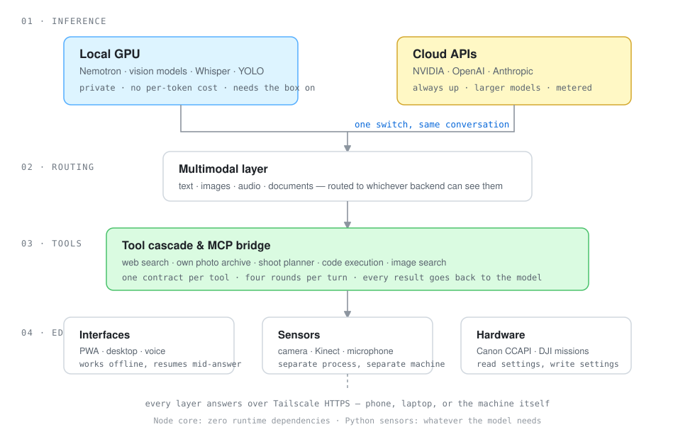
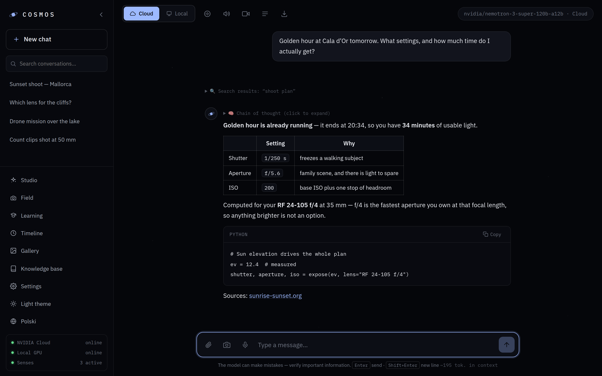
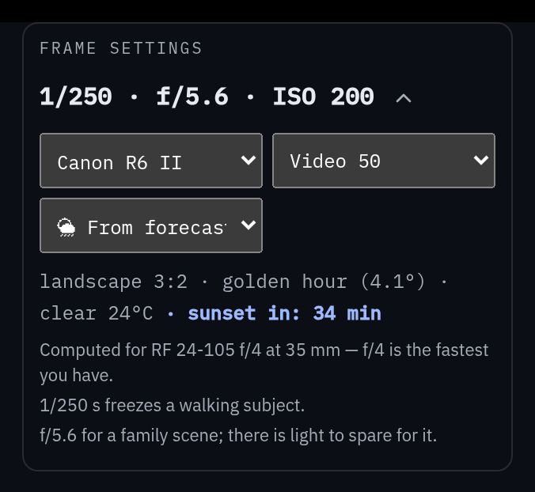
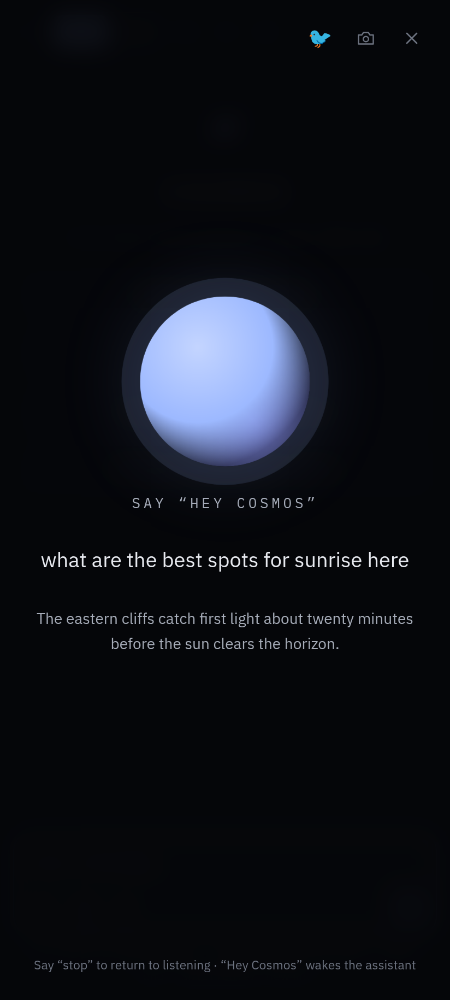
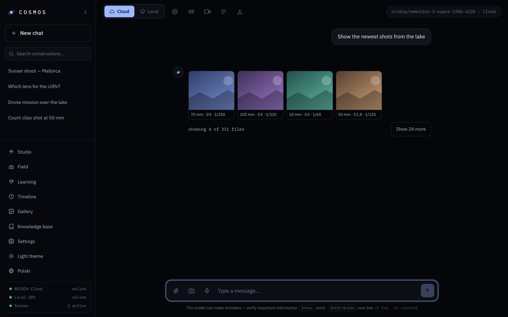

<p align="center">
  
</p>

<p align="center">
  
  
  
  
  <a href="README.pl.md"></a>
</p>

---

## What is Cosmos?

Cosmos is a personal AI environment that runs the same conversation across a
local GPU and three cloud providers, and switches between them mid-thread. It
started as a question I could not answer by reading: **what actually breaks when
you put a multimodal model behind a real interface, on real hardware, with real
data?** Not a demo — something used daily, from a phone, over a home network.

The answer turned out to be *almost everything, and rarely the model*. Streams
die when a phone screen locks. Vision models silently drop images they cannot
read. A context window fills with signed thumbnail URLs instead of photographs.
An archive of 57 000 files answers questions correctly and uselessly. Most of
this repository is the shape those problems left behind.

---

## Architecture

<p align="center">
  
</p>

Four layers, one rule between them: **each layer only receives what it needs to
do its job.** The tool cascade never sees application state. The view builders
never see the conversation. The Node core never imports a Python sensor. This is
not style — it is what makes the boundaries testable, because a module that
cannot reach something cannot quietly start depending on it.

| Layer | What lives there | Lines |
|---|---|---|
| Inference | provider adapters, streaming, resumable runs | `server.js`, `lib/rdzen.js` |
| Routing | model catalogue, capability detection, prompt assembly | `lib/instrukcje-narzedzi.js`, `public/models.js` |
| Tools | one contract per tool, four rounds per turn | `public/narzedzia.js` |
| Edge | PWA, voice, camera, sensors, hardware | `public/`, `senses/` |

---

## Why hybrid?

The switch between local and cloud is the one design decision everything else
follows from. Five reasons, in the order they actually matter:

**Privacy.** The photo archive indexes personal files — family, home, locations.
Those queries run against a local index and, when a vision model is needed, a
local vision model. Nothing about them has to leave the house.

**Cost.** Bulk work is unmetered locally. Indexing 57 000 photos through a cloud
vision API is a bill; through a local GPU it is an evening.

**Latency.** A camera frame that needs a verdict in under a second cannot make a
round trip to a datacentre. Object detection and pose run on the sensor machine.

**Availability.** The local GPU is off most of the day. The cloud is not. A
system that only works when a specific computer is awake is not a system you
use from a train.

**Model choice.** No single provider is best at everything. Reasoning traces,
vision, long context and speech each have a different winner this month, and the
switch is one click because the answer keeps changing.

The interesting part is not that both exist — it is that they share one
conversation, one tool cascade, and one set of guarantees. Switching providers
mid-thread must not lose the thread.

Sharing a thread means respecting each side's limits instead of pretending they
are the same. A home Ollama holds 4 096 tokens by default and silently drops the
oldest messages when a prompt overflows — in one measured search cascade it
dropped the user's actual question. So the local path gets a budget: a shorter
tool description when the window is small, oldest turns trimmed openly (with a
note under the reply), and a reply limit that fits what is left. A sleeping home
PC behind Tailscale is named as such and short-circuited for 30 s, rather than
costing every message an 11-second connect timeout.

---

## Engineering notes

These are the parts I would actually defend in a review.

**Zero runtime dependencies in the Node core.** 28 500 lines of production code,
`node server.js`, nothing to build. Deployment to a VPS is `git clone`. There is
no dependency tree to audit and nothing that breaks overnight. Python sensors are
the deliberate exception — nobody should write an object detector from scratch —
and they live in a separate process on a separate machine.

**Tests measure behaviour, never source text.** 105 suites plus 9 Python
selftests. This was learned the expensive way: source-text assertions broke six
times in a single refactor while the functions they guarded worked perfectly. A
test that fails when nothing is wrong teaches you to ignore it. Every suite now
calls the thing it checks, and each new one is verified to **fail against the
old, broken code** before it is committed.

**The audit checks whether it is lying to itself.** `scripts/audyt.js` runs 15
static sections — route coverage, translation parity, dead identifiers, secret
leakage, boot smoke test. Section 0 audits the auditor: does it still read every
script the page loads, and do its own patterns still match anything? A regex that
silently stops matching returns an empty list, and an empty list reads exactly
like "all clear". That has happened three times; it is now a hard failure.

**Plain JSON files, but a damaged one never becomes empty state.** There is no
database — at this scale it would add a dependency and nothing else. The price is
that a file cut short by a power loss used to parse as "nothing" and be
overwritten with an empty list on the next save; that is how member accounts
vanished in a measured run. Now a damaged file is set aside as
`*.uszkodzony-<time>`, the previous version comes back from a hard-linked `.bak`,
and a damaged accounts file with no backup stops the server from starting rather
than letting it start without its people.

**Nothing a browser waits for outlives the proxy.** Behind Cloudflare Tunnel a
request with no response for 100 s turns into an error page, while the server
keeps working and the API bill keeps running. Streaming answers send a heartbeat
every 25 s; image generation that runs past ~75 s answers `202` with a job id,
and the page polls `/api/zadania` until the result lands in the knowledge base.

**Comments explain decisions, not syntax.** Where a fix looks arbitrary, the
comment says which real failure produced it. The codebase is in Polish, which is
a genuine limitation for outside readers — the reasoning is dense and it is all
in the wrong language for most of you.

---

## Experiments

Breadth is the point of the project, but every item here exists because it
answered a question. The interesting column is the last one.

| Experiment | The question | What it cost |
|---|---|---|
| **Photo archive** | Can a model answer questions about 57 000 personal files? | Rewriting how results reach the model. Raw JSON meant six photographs fit in the context window, 71% of it signed thumbnail URLs the model never looks at. |
| **Shoot planner** | Can it compute settings instead of describing them? | Sun position, exposure maths, weather and the user's actual lens inventory. A recommendation of f/2.8 to someone who owns f/4 glass is worse than no recommendation. |
| **Resumable runs** | What happens when a phone screen locks mid-answer? | Moving generation server-side. The answer lives on the server, the browser attaches to it; a dropped connection resumes into the same stream. |
| **Camera & Kinect** | Does a live frame improve the answer, or just the demo? | Sensor process, depth stream, object detection. Mostly yes for "what am I holding", mostly no for anything requiring memory. |
| **Voice mode** | Wake word and continuous listening in a browser | Chrome on Android does not honour `continuous`. It restarts after every utterance and re-recognises audio it already heard, so naïve accumulation produces the same sentence eight times, concatenated. |
| **Canon over Wi-Fi** | Can it write settings back to the camera? | CCAPI integration. A camera that sleeps its Wi-Fi after a few minutes will happily report `online` for another thirty seconds. |
| **Drone missions** | Waypoint missions as a file the aircraft accepts | WPML/KMZ writer using Node's own `zlib`. Never flown — stated plainly rather than implied. |
| **QLoRA fine-tuning** | Is a personal fine-tune worth it over a good prompt? | Dataset export and a training loop. Verdict so far: no, and the prompt work generalises better. |
| **Sharing it** | Can a single-person app host invited people without rewriting every function? | A request-scoped user context (`AsyncLocalStorage`) that follows every `await` into background work. Data access without an established user **throws** instead of falling back to a default — a silent default would show one person's data to another, and nothing would look broken. Invitation links, per-person engine grants, owner-only server capabilities. |

---

## What it looks like

<p align="center">
  
</p>

Tool results, reasoning traces and search interstitials collapse to a single
quiet line. They are available and out of the way — an answer with fourteen of
them should still read as an answer.

<table>
<tr>
<td width="50%"></td>
<td width="50%"></td>
</tr>
<tr>
<td><b>Shoot planner.</b> Settings computed for the place, the light and the
lenses you own — with the reasoning, because a number without a reason cannot
be argued with.</td>
<td><b>Voice mode.</b> Wake word, live transcript, spoken answer. Falls back to
push-to-talk when the browser cannot hold a continuous session.</td>
</tr>
</table>

<p align="center">
  
</p>

Archive results come back as a grid the human browses and a summary the model
reads. Those are deliberately different: the model gets a sample and is told
so, the human gets every file.

> Screenshots are captured from the real interface by
> [`scripts/zrzuty-readme.js`](scripts/zrzuty-readme.js) against the test
> environment — real rendering, mock model and mock data. Personal content
> stays out of a public repository.

---

## Running it

```bash
git clone https://github.com/Marcin1000/Cosmos.git
cd Cosmos
cp .env.example .env      # add at least one API key, or point it at a local model
node server.js            # http://localhost:3000 (product page), /app (Cosmos)
```

That is the whole install. No build step, no package manager, no container.

```bash
npm test                  # 105 suites + 9 Python selftests (~16 min)
npm run test:szybkie      # non-browser suites only (~30 s)
node scripts/audyt.js     # 15 static audit sections (~40 s)
```

Optional pieces — Python sensors, Tailscale access from outside the house,
installing as a phone app — are covered in the setup guide below.

---

## Product page

`/` serves a product page for [cosmosai.live](https://cosmosai.live); Cosmos
itself lives at `/app`. The page is written in Polish and English separately —
two sets of sentences, not one translated into the other — and the switch is
shared with the app. Four decisions worth stating:

- **No build and no dependencies here either.** Hand-written HTML, CSS and one
  script; fonts are self-hosted, so the page makes no third-party requests.
- **The demo is real interaction, not a video.** One question streams through
  four engines in one thread; picking an engine makes the next reply come from
  it. The shoot-planner card computes exposure as you scroll (`t = N² / 2^EV`)
  instead of animating fixed numbers.
- **Motion is progressive.** Everything is readable without JavaScript and with
  `prefers-reduced-motion`; the demo then shows the whole conversation at once.
- **Old invitation links keep working.** A link to `/#zaproszenie=…` is
  forwarded to `/app` before the page paints. `tests/zestawy/strona-produktowa.js`
  guards this, the language switch (every string must change), and phone widths.

---

## Repository layout

```
server.js            router, chat, conversations, knowledge base
lib/                 31 domain modules — one concern each, injected, no cycles
public/              client: state, tools, view builders, protocol, text, speech
public/strona/       product page at / (the app is at /app)
senses/              Python sensors: vision, speech, depth (separate machine)
mcp/                 MCP bridge — exposes Cosmos tools to other agents
tests/               105 behaviour suites, mock upstreams, fake DOM
scripts/audyt.js     static audit, including an audit of itself
```

Dependencies point one way: the core knows nothing about the domains. Where a
domain needs another (Studio writing to the knowledge base), the server injects
it once at startup — cross-imports would create a cycle and one side would see
an empty object.

---

## Documentation

| | |
|---|---|
| [`README.pl.md`](README.pl.md) | the same document in Polish |
| [`docs/START-TUTAJ.md`](docs/START-TUTAJ.md) | full setup runbook, from nothing to running (Polish) |
| [`docs/DOSTEP.md`](docs/DOSTEP.md) | own domain via Cloudflare Tunnel, inviting people, what they need on their side (Polish) |
| [`docs/ROADMAP.md`](docs/ROADMAP.md) | every batch of work, what broke and why (Polish) |
| [`tests/README.md`](tests/README.md) | how the test environments work |

The deep documentation is in Polish. It is a working log rather than a product
manual, and translating it would cost more than it would return — but the code
structure, the tests and this page should be enough to judge the engineering.

---

<p align="center">
  <sub>MIT licensed · <a href="https://github.com/Marcin1000/Cosmos">source on GitHub</a></sub>
</p>
