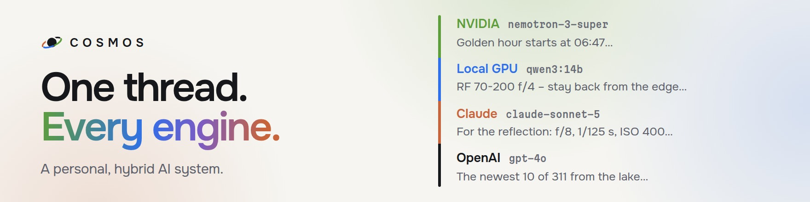
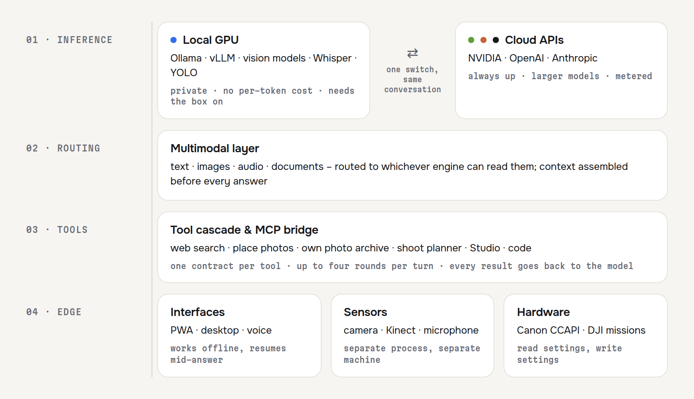
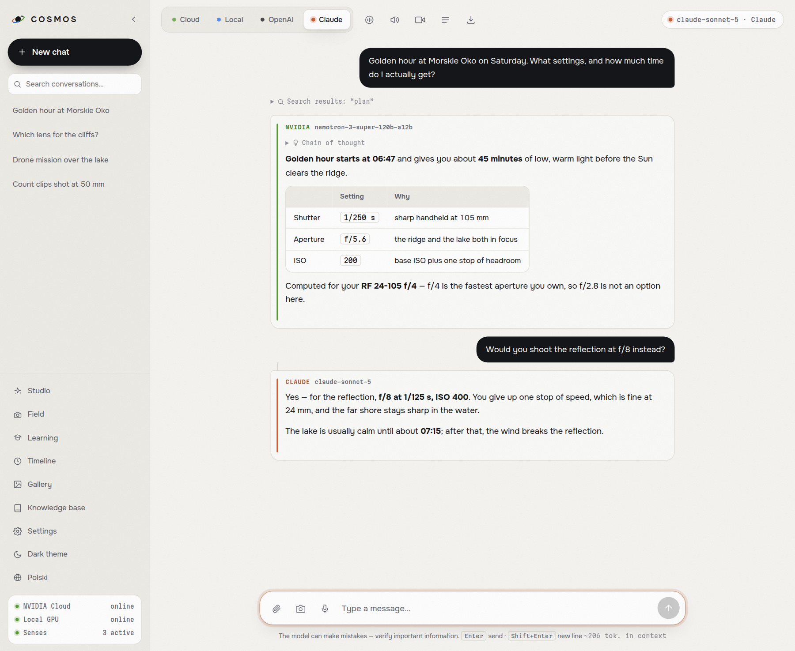
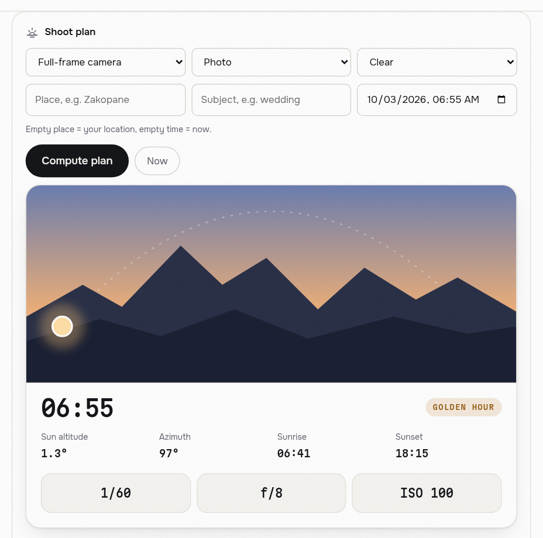
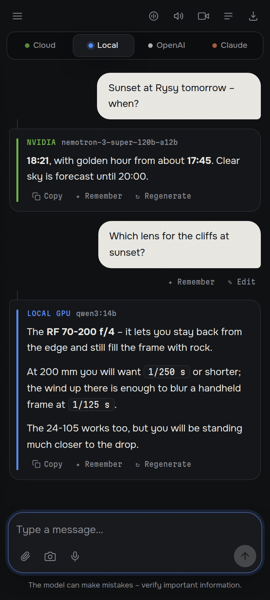
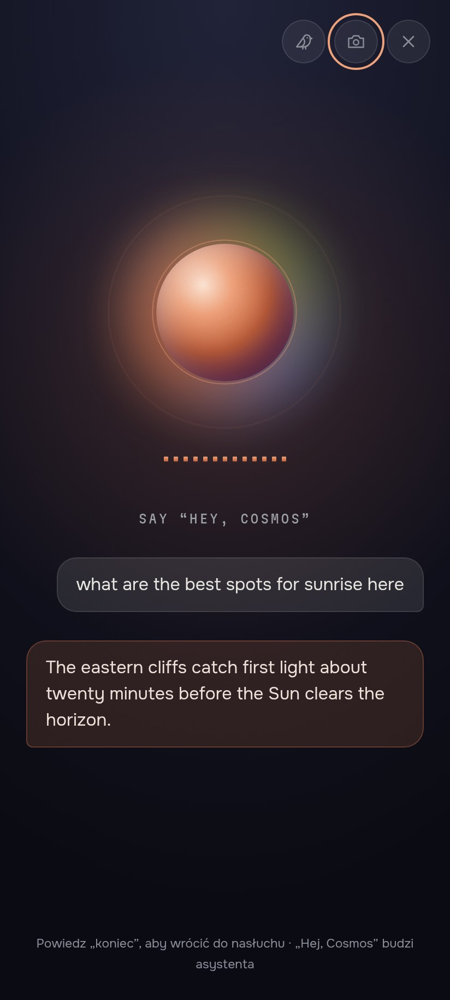
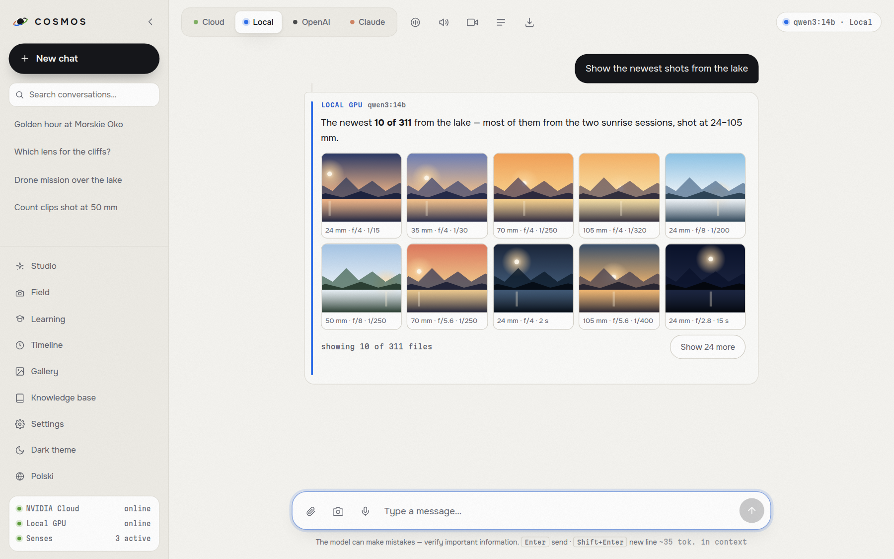
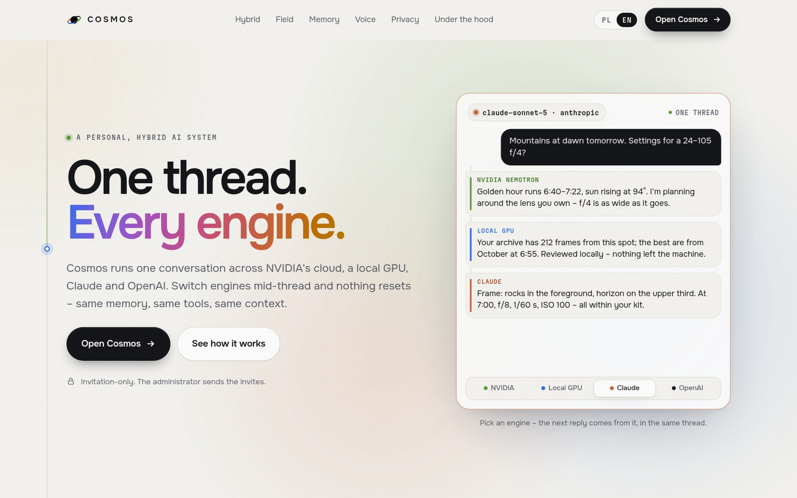

<p align="center">
  <picture>
    <source media="(prefers-color-scheme: dark)" srcset="docs/obrazy/banner-en-ciemny.jpg">
    
  </picture>
</p>

<p align="center">
  <a href="https://cosmosai.live"></a>
  
  
  
  
  <a href="README.pl.md"></a>
</p>

---

## What is Cosmos?

Cosmos is a personal AI environment that runs the same conversation across a
local GPU and three cloud providers, and switches between them mid-thread. It
started as a question I could not answer by reading: **what actually breaks when
you put a multimodal model behind a real interface, on real hardware, with real
data?** Not a demo – something used daily, from a phone, over a home network.

The answer turned out to be *almost everything, and rarely the model*. Streams
die when a phone screen locks. Vision models silently drop images they cannot
read. A context window fills with signed thumbnail URLs instead of photographs.
An archive of 57 000 files answers questions correctly and uselessly. Most of
this repository is the shape those problems left behind.

---

## Architecture

<p align="center">
  <picture>
    <source media="(prefers-color-scheme: dark)" srcset="docs/obrazy/architektura-en-ciemny.png">
    
  </picture>
</p>

Four layers, one rule between them: **each layer only receives what it needs to
do its job.** The tool cascade never sees application state. The view builders
never see the conversation. The Node core never imports a Python sensor. This is
not style – it is what makes the boundaries testable, because a module that
cannot reach something cannot quietly start depending on it.

| Layer | What lives there | Lines |
|---|---|---|
| Inference | provider adapters, streaming, resumable runs | `lib/czat.js`, `lib/model.js`, `lib/biegi.js` |
| Routing | model catalogue, capability detection, context assembly | `lib/czat.js`, `lib/instrukcje-narzedzi.js`, `public/models.js` |
| Tools | one contract per tool, four rounds per turn | `public/narzedzia.js` |
| Edge | PWA, voice, camera, sensors, hardware | `public/`, `senses/` |

---

## Why hybrid?

The switch between local and cloud is the one design decision everything else
follows from. Five reasons, in the order they actually matter:

**Privacy.** The photo archive indexes personal files – family, home, locations.
Those queries run against a local index and, when a vision model is needed, a
local vision model. Nothing about them has to leave the house.

**Cost.** Bulk work is unmetered locally. Indexing 57 000 photos through a cloud
vision API is a bill; through a local GPU it is an evening.

**Latency.** A camera frame that needs a verdict in under a second cannot make a
round trip to a datacentre. Object detection and pose run on the sensor machine.

**Availability.** The local GPU is off most of the day. The cloud is not. A
system that only works when a specific computer is awake is not a system you
use from a train.

**Model choice.** No single provider is best at everything. Reasoning traces,
vision, long context and speech each have a different winner this month, and the
switch is one click because the answer keeps changing.

The interesting part is not that both exist – it is that they share one
conversation, one tool cascade, and one set of guarantees. Switching providers
mid-thread must not lose the thread.

Sharing a thread means respecting each side's limits instead of pretending they
are the same. A home Ollama holds 4 096 tokens by default and silently drops the
oldest messages when a prompt overflows – in one measured search cascade it
dropped the user's actual question. So the local path gets a budget: a shorter
tool description when the window is small, oldest turns trimmed openly (with a
note under the reply), and a reply limit that fits what is left. A sleeping home
PC behind Tailscale is named as such and short-circuited for 30 s, rather than
costing every message an 11-second connect timeout.

---

## Engineering notes

These are the parts I would actually defend in a review.

**Zero runtime dependencies in the Node core.** 31 000 lines of production JavaScript,
`node server.js`, nothing to build. Deployment to a VPS is `git clone`. There is
no dependency tree to audit and nothing that breaks overnight. Python sensors are
the deliberate exception – nobody should write an object detector from scratch –
and they live in a separate process on a separate machine.

**Tests measure behaviour, never source text.** 151 suites plus 10 Python
selftests. This was learned the expensive way: source-text assertions broke six
times in a single refactor while the functions they guarded worked perfectly. A
test that fails when nothing is wrong teaches you to ignore it. Every suite now
calls the thing it checks, and each new one is verified to **fail against the
old, broken code** before it is committed.

**The audit checks whether it is lying to itself.** `scripts/audyt.js` runs 15
static sections – route coverage, translation parity, dead identifiers, secret
leakage, boot smoke test. Section 0 audits the auditor: does it still read every
script the page loads, and do its own patterns still match anything? A regex that
silently stops matching returns an empty list, and an empty list reads exactly
like "all clear". That has happened three times; it is now a hard failure.

**Plain JSON files, but a damaged one never becomes empty state.** There is no
database – at this scale it would add a dependency and nothing else. The price is
that a file cut short by a power loss used to parse as "nothing" and be
overwritten with an empty list on the next save; that is how member accounts
vanished in a measured run. Now a damaged file is set aside as
`*.uszkodzony-<time>`, the previous version comes back from a hard-linked `.bak`,
and a damaged accounts file with no backup stops the server from starting rather
than letting it start without its people. A save that fails never answers `ok`:
a full disk returns `507` and in-memory state is only updated after the write
lands. Every invited person has a storage quota, and the owner's access panel
shows who uses how much and warns when the server disk is nearly full.

**Nothing a browser waits for outlives the proxy.** Behind Cloudflare Tunnel a
request with no response for 100 s turns into an error page, while the server
keeps working and the API bill keeps running. Streaming answers send a heartbeat
every 25 s; image generation that runs past ~75 s answers `202` with a job id,
and the page polls `/api/zadania` until the result lands in the knowledge base.
Files travel to the knowledge base as a raw request body with upload progress,
not as base64 inside JSON – the old way froze a phone for almost five seconds on
a 45 MB recording, because the encoding ran on the main thread. A camera photo
selected in the knowledge base used to ride along with every message as ~16 MB of
base64 – over Claude's 5 MB image limit. The server has no image decoder and
stays dependency-free, so the browser makes a 1568 px preview at upload time and
the model gets that; the original stays untouched.

**Senses run on the asker's own computer, controlled from the app.** Speech
recognition, object detection, pose, Kinect and document extraction used to run on
one machine – the owner's. Now every person pairs their own computer with a 6-digit
code from Settings: the app shows a single command to paste, which fetches a
stdlib-only Python agent, installs Python if needed and adds it to autostart. The
agent connects *outbound* and long-polls the server for jobs, so there is no port
forwarding and no VPN, and the local senses service listens on loopback only. Every
sense call in the server goes through one function that picks the source for the
current person – their own computer, the owner's home GPU with permission, or
nothing – so the privacy rule lives in one place instead of fifteen. Toggles in the
app start and stop the senses, the camera watcher and Kinect on that computer;
packages install from a fixed list with one click, and a component that crashes
shows up in the app with the tail of its log. The Kinect SDK hands the sensor to a
single process, so the senses service owns it and the camera watcher and depth sense
read frames, depth and skeletons from it over loopback – the live preview no longer
goes black the moment another component grabs the sensor. Frames relayed through the
agent ride persistent connections, two in flight, because a fresh TLS handshake per
request made the preview crawl at two frames a second. Hands get their own faster
loop: MediaPipe gives 21 points per hand, Cosmos counts extended fingers from the
geometry and puts "right hand: 2 fingers, V sign" into the perception context, because
the Kinect skeleton has the hand as a single joint and the model could only apologise.
The assistant can also open web pages; a blocked pop-up falls back to a one-click card.
Only a page the person asked for in that very message opens by itself – never a private
address, never one with query parameters – because a search result can carry an
`[AKCJA: otwórz | …?d=<data>]` line and the model may obey it. With a Serper
(Google results) or Brave Search key, web and image search go through them first and
fall back to DuckDuckGo, Commons and Openverse; Brave is only Serper's fallback, results
are shared for fifteen minutes, and members use the owner's paid keys only with a grant
and within a per-person rate limit. Photo grids fill in under the plan's
points as they arrive instead of replacing the answer while they load. Before any
request leaves, messages are normalised to one leading system message and strictly
alternating roles: Gemma 3 and Mistral Nemo chat templates on vLLM rejected the very
first "hi" otherwise, while Ollama's Go templates had hidden the problem. Custom gestures
are recorded from the same hand loop – which fingers are up, the normalised hand shape and
the direction of movement – and replayed as actions ("two fingers moving up" scrolls the
chat), with the person's own meaning passed to the model.
A first-run tutorial walks each new
person through their name, their own API keys, the senses and the phone install.

**Bird recognition works from the forest, not only from home.** Birds were the one
sense that made no sense to route to a home PC: you stand in a forest with a phone and
the computer at home is asleep. BirdNET needs no GPU – eight seconds of audio take
0.3–1 s on one VPS core – so it also runs on the server as a small separate service
(`cosmos-ptaki`, the same senses code filtered to one route, loopback only, 900 MB
memory cap). The source chain for that one route is: the person's own computer if it
has BirdNET, then the server, then the owner's home. The server side is fenced in: one
analysis at a time, a short queue, an immediate `503` past it instead of a hanging
request, one recording in flight per person, 4 MB cap, coordinates rounded to 0.1° and
sent in headers, never in the URL. Members need an explicit grant, and a failure never
shows them a path from someone else's disk. A recording made with no signal waits on
the phone and is recognised when the connection comes back.

**Tell the model what it actually has.** A vision model received the camera frame and
still answered "I have no access to the camera" – because the capability manifest said
"senses: offline" and "never promise what is unavailable". The image path had no bug; the
instructions contradicted the input. Now a turn that carries an image ends the instructions
with one plain sentence: the image is in front of you.

**Falling back is a choice, not a surprise.** When the home GPU is asleep, the error under
the question offers "Send via Cloud" next to "Retry" – one click resends the same question
to NVIDIA's cloud and switches the tab, so the change is visible. It never happens on its own:
the cloud has a different cost and a different privacy story, and that decision belongs to
the person asking.

**Layout that is reasoned about, not patched.** The live camera used to be a floating
panel whose width was computed from its own measured height, with separate rules for an
"expanded" mode, for landscape phones and for the message composer – seven layers, each
fixing one screen size and breaking another (a title on three lines, "Cam…" instead of the
source, ISO outside the frame). It is now a full-screen scene like voice mode, three CSS
grids (phone portrait, phone landscape with a camera-style rail, desktop with a side panel)
and a small picture-in-picture window beside the chat for gestures (scroll gestures work
only there – full screen hides the chat, so the gesture says where it works instead). The suite that guards
it drives real 9:16 and 16:9 canvas streams on the phone sizes the owner actually has
(360 px wide with enlarged text, 740×313 in landscape) and checks that every control is on
screen and unobstructed without scrolling. Settings got real tabs for the same reason: the
old tabs scrolled one long list whose groups were interleaved in the HTML, so the highlight
jumped "out of order". The welcome screen follows the same rule: on a 360×600 phone it
used to scroll by ~120 px under the composer, so the four suggestions now sit in a 2×2 grid,
the model name stays on one line, the suggestions are set quietly (grey, no shadow) so they
do not outweigh the heading, and in landscape the mark gives way to a single row of
suggestions – a suite checks that nothing scrolls at the owner's window sizes.

**Comments explain decisions, not syntax.** Where a fix looks arbitrary, the
comment says which real failure produced it. The codebase is in Polish, which is
a genuine limitation for outside readers – the reasoning is dense and it is all
in the wrong language for most of you.

---

## Experiments

Breadth is the point of the project, but every item here exists because it
answered a question. The interesting column is the last one.

| Experiment | The question | What it cost |
|---|---|---|
| **Photo archive** | Can a model answer questions about 57 000 personal files? | Rewriting how results reach the model. Raw JSON meant six photographs fit in the context window, 71% of it signed thumbnail URLs the model never looks at. |
| **Shoot planner** | Can it compute settings instead of describing them? | Sun position, exposure maths, weather and the user's actual lens inventory. A recommendation of f/2.8 to someone who owns f/4 glass is worse than no recommendation. |
| **Resumable runs** | What happens when a phone screen locks mid-answer? | Moving generation server-side. The answer lives on the server, the browser attaches to it; a dropped connection resumes into the same stream. |
| **Camera & Kinect** | Does a live frame improve the answer, or just the demo? | Sensor process, depth stream, object detection. Mostly yes for "what am I holding", mostly no for anything requiring memory. |
| **Voice mode** | Wake word and continuous listening in a browser | Chrome on Android does not honour `continuous`. It restarts after every utterance and re-recognises audio it already heard, so naïve accumulation produces the same sentence eight times, concatenated. |
| **Canon over Wi-Fi** | Can it write settings back to the camera? | CCAPI integration. A camera that sleeps its Wi-Fi after a few minutes will happily report `online` for another thirty seconds. |
| **Drone missions** | Waypoint missions as a file the aircraft accepts | WPML/KMZ writer using Node's own `zlib`. Never flown – stated plainly rather than implied. |
| **QLoRA fine-tuning** | Is a personal fine-tune worth it over a good prompt? | Dataset export and a training loop. Verdict so far: no, and the prompt work generalises better. |
| **Sharing it** | Can a single-person app host invited people without rewriting every function? | A request-scoped user context (`AsyncLocalStorage`) that follows every `await` into background work. Data access without an established user **throws** instead of falling back to a default – a silent default would show one person's data to another, and nothing would look broken. Invitation links, per-person engine grants, owner-only server capabilities. |

---

## What it looks like

<p align="center">
  <picture>
    <source media="(prefers-color-scheme: dark)" srcset="docs/obrazy/rozmowa-en-ciemny.png">
    
  </picture>
</p>

One thread, two engines: NVIDIA’s cloud computes the plan, Claude answers the
follow-up – and each reply keeps the colour and signature of the engine that
wrote it. Tool results, reasoning traces and search interstitials collapse to a
single quiet line; an answer with fourteen of them should still read as an answer.

<table>
<tr>
<td width="52%"></td>
<td width="24%"></td>
<td width="24%"></td>
</tr>
<tr>
<td><b>Shoot planner.</b> The Sun’s real path for the place and the minute,
and settings that fit the lenses you own – computed, not described.</td>
<td><b>On the phone.</b> Installed as an app. The first answer came from
NVIDIA’s cloud, the next from the home GPU – each keeps its engine’s thread.</td>
<td><b>Voice mode.</b> Live transcript, spoken answer, push-to-talk when the
browser cannot hold a continuous session.</td>
</tr>
</table>

<p align="center">
  
</p>

Archive results come back as a grid the human browses and a summary the model
reads. Those are deliberately different: the model gets a sample and is told
so, the human gets every file.

> Screenshots are captured from the real interface by
> [`scripts/zrzuty-readme.js`](scripts/zrzuty-readme.js) against the test
> environment – real rendering, mock model and mock data. Personal content
> stays out of a public repository. The banner, the architecture diagram and
> the social graphics in [`docs/grafiki/`](docs/grafiki/) are rendered from the
> same fonts, colours and mark as the app by
> [`scripts/grafiki-marki.js`](scripts/grafiki-marki.js).

---

## Running it

```bash
git clone https://github.com/Marcin1000/Cosmos.git
cd Cosmos
cp .env.example .env      # add at least one API key, or point it at a local model
node server.js            # http://localhost:3000 (product page), /app (Cosmos)
```

That is the whole install. No build step, no package manager, no container.

```bash
npm test                  # 151 suites + 10 Python selftests (~12 min)
npm run test:szybkie      # non-browser suites only (~30 s)
node scripts/audyt.js     # 15 static audit sections (~40 s)
```

Optional pieces – Python sensors, Tailscale access from outside the house,
installing as a phone app – are covered in the setup guide below.

---

## Product page

<p align="center">
  
</p>

`/` serves a product page for [cosmosai.live](https://cosmosai.live); Cosmos
itself lives at `/app`. The page is written in Polish and English separately –
two sets of sentences, not one translated into the other – and the switch is
shared with the app. Four decisions worth stating:

- **No build and no dependencies here either.** Hand-written HTML, CSS and one
  script; fonts are self-hosted, so the page makes no third-party requests.
- **The demo is real interaction, not a video.** One question streams through
  four engines in one thread; picking an engine makes the next reply come from
  it. The shoot-planner card computes exposure as you scroll (`t = N² / 2^EV`)
  instead of animating fixed numbers.
- **Motion is progressive.** Everything is readable without JavaScript and with
  `prefers-reduced-motion`; the demo then shows the whole conversation at once.
- **Old invitation links keep working.** A link to `/#zaproszenie=…` is
  forwarded to `/app` before the page paints. `tests/zestawy/strona-produktowa.js`
  guards this, the language switch (every string must change), and phone widths.
- **An invited guest gets the join form in their browser's language.** The app
  itself starts in Polish (it is someone's home), but a first-time guest on an
  English phone hit a Polish form with no visible way out. The invitation link
  now picks the language from the browser, remembers it, and offers a one-click
  switch.
- **A stranger can't lock the owner out.** Ten wrong passwords under a login
  used to block that login everywhere for a quarter of an hour – and an empty
  login means the owner – so anyone could keep the owner out indefinitely.
  A device that has signed in successfully before now carries a long-lived
  cookie (only its hash is stored) and skips the per-login block; unknown
  devices still hit it. A forgotten member password is a one-time link from the
  access panel, not an account deletion.

---

## Repository layout

```
server.js            router, configuration, capability manifest
lib/                 47 domain modules – one concern each, injected, no cycles
public/              client: state, tools, view builders, protocol, text, speech
public/strona/       product page at / (the app is at /app)
senses/              Python sensors: vision, speech, depth (separate machine)
mcp/                 MCP bridge – exposes Cosmos tools to other agents
tests/               151 behaviour suites, mock upstreams, fake DOM
scripts/audyt.js     static audit, including an audit of itself
```

Dependencies point one way: the core knows nothing about the domains. Where a
domain needs another (Studio writing to the knowledge base), the server injects
it once at startup – cross-imports would create a cycle and one side would see
an empty object.

---

## Documentation

| | |
|---|---|
| [`README.pl.md`](README.pl.md) | the same document in Polish |
| [`docs/START-TUTAJ.md`](docs/START-TUTAJ.md) | full setup runbook, from nothing to running (Polish) |
| [`docs/DOSTEP.md`](docs/DOSTEP.md) | own domain via Cloudflare Tunnel, inviting people, what they need on their side (Polish) |
| [`docs/ROADMAP.md`](docs/ROADMAP.md) | every batch of work, what broke and why (Polish) |
| [`tests/README.md`](tests/README.md) | how the test environments work |

The deep documentation is in Polish. It is a working log rather than a product
manual, and translating it would cost more than it would return – but the code
structure, the tests and this page should be enough to judge the engineering.

## License

[PolyForm Noncommercial 1.0.0](LICENSE.md). Read the code, run it at home, change it,
share it – for personal use, study, research, hobby projects, schools, charities and
public institutions. Selling it, running it as a paid service or using it inside a
company needs a separate agreement; open an issue on GitHub to ask.

---

<p align="center">
  <sub>PolyForm Noncommercial · <a href="https://github.com/Marcin1000/Cosmos">source on GitHub</a></sub>
</p>
