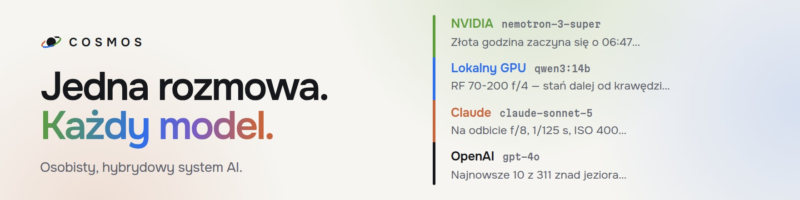
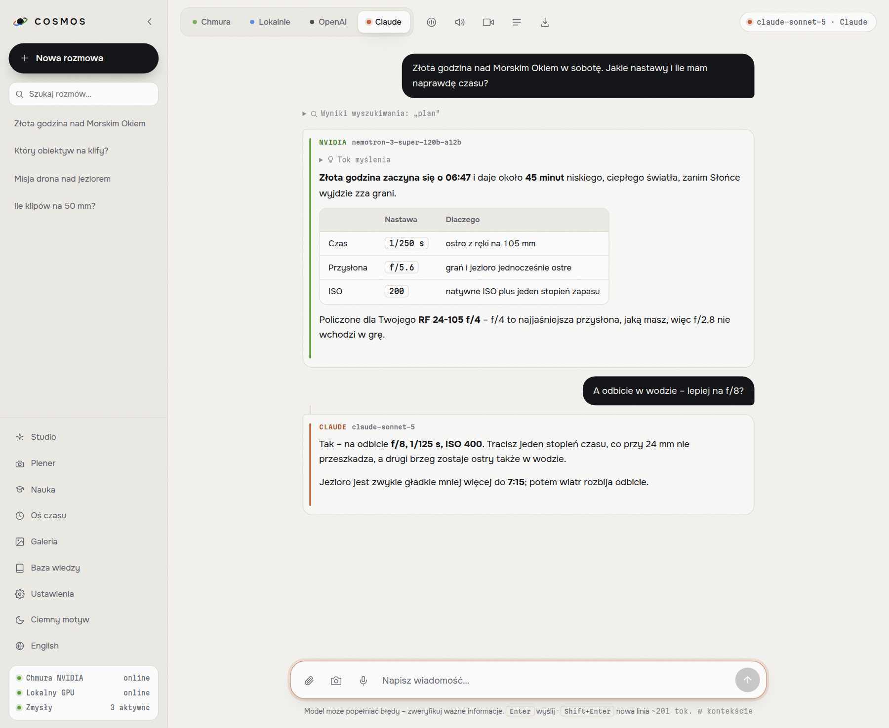
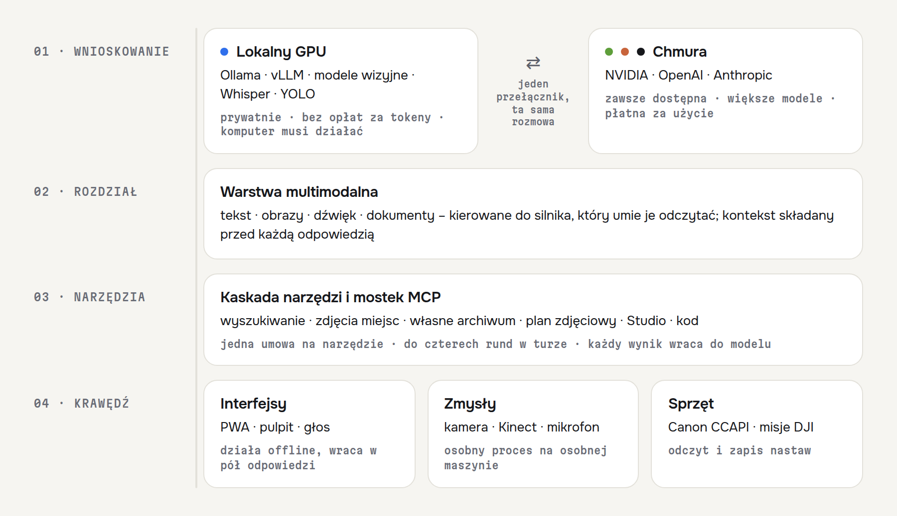
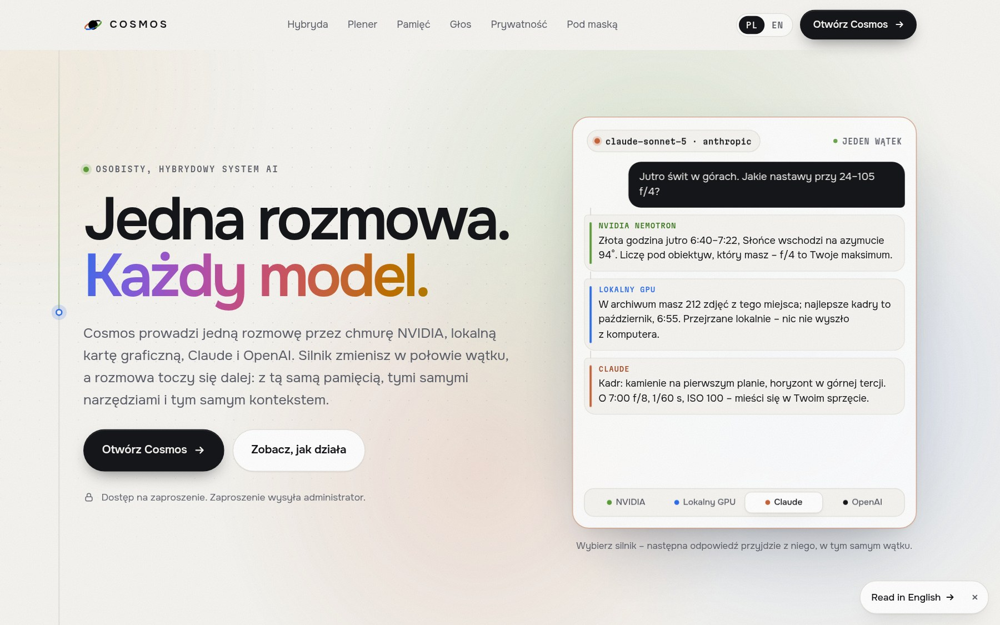

<p align="center">
  <picture>
    <source media="(prefers-color-scheme: dark)" srcset="docs/obrazy/banner-pl-ciemny.jpg">
    
  </picture>
</p>

<p align="center">
  <a href="https://cosmosai.live"></a>
  
  
  
  
  <a href="README.md"></a>
</p>

---

> **To jest pełna wersja dokumentacji.** [`README.md`](README.md) po angielsku jest
> wizytówką – krótszy, o architekturze i decyzjach. Tutaj jest wszystko: opis każdej
> funkcji, konfiguracja, API serwera, zmierzone rekomendacje modeli i koszty.

## Czym jest Cosmos?

Cosmos to osobiste środowisko AI, które prowadzi tę samą rozmowę na lokalnym GPU
i u trzech dostawców w chmurze, przełączając się między nimi w trakcie wątku.
Zaczęło się od pytania, na które nie dało się odpowiedzieć czytaniem: **co
naprawdę się psuje, gdy postawi się model multimodalny za prawdziwym interfejsem,
na prawdziwym sprzęcie i na prawdziwych danych?** Nie demo – rzecz używana
codziennie, z telefonu, po domowej sieci.

Odpowiedź brzmi: *prawie wszystko, i rzadko model*. Strumienie umierają, gdy
telefon gasi ekran. Modele wizyjne po cichu pomijają obrazy, których nie umieją
odczytać. Okno kontekstu zapełnia się podpisanymi adresami miniatur zamiast
zdjęciami. Archiwum 57 tysięcy plików odpowiada poprawnie i bezużytecznie.
Większość tego repozytorium to kształt, jaki zostawiły po sobie te problemy.

<p align="center">
  <picture>
    <source media="(prefers-color-scheme: dark)" srcset="docs/obrazy/rozmowa-pl-ciemny.png">
    
  </picture>
</p>

Jeden wątek, dwa silniki: chmura NVIDIA liczy plan, Claude odpowiada na pytanie
uzupełniające – a każda odpowiedź zachowuje kolor i podpis silnika, który ją napisał.

## Architektura

<p align="center">
  <picture>
    <source media="(prefers-color-scheme: dark)" srcset="docs/obrazy/architektura-pl-ciemny.png">
    
  </picture>
</p>

Cztery warstwy i jedna zasada między nimi: **każda dostaje tylko to, czego
potrzebuje do swojej roboty.** Kaskada narzędzi nie widzi stanu aplikacji.
Budowniczowie widoku nie widzą rozmowy. Rdzeń w Node nie importuje czujnika
w Pythonie. To nie jest kwestia stylu – to jest to, co czyni granice
sprawdzalnymi, bo moduł, który nie ma jak czegoś dosięgnąć, nie zacznie po cichu
od tego zależeć.

## Dlaczego hybrydowo?

Przełącznik lokalne ↔ chmura to jedyna decyzja projektowa, z której wynika cała
reszta. Pięć powodów, w kolejności, w jakiej naprawdę mają znaczenie:

**Prywatność.** Archiwum indeksuje prywatne pliki – rodzinę, dom, lokalizacje.
Te zapytania idą do lokalnego indeksu, a gdy potrzebny jest model wizyjny – do
lokalnego modelu wizyjnego. Nic z tego nie musi opuszczać domu.

**Koszt.** Praca hurtowa lokalnie nic nie kosztuje. Przepuszczenie 57 tysięcy
zdjęć przez chmurowe API wizyjne to rachunek; przez własne GPU to jeden wieczór.

**Opóźnienie.** Klatka z kamery, która potrzebuje werdyktu poniżej sekundy, nie
zdąży polecieć do centrum danych i wrócić. Wykrywanie obiektów i sylwetki chodzi
na maszynie z czujnikami.

**Dostępność.** Lokalne GPU jest wyłączone przez większość doby. Chmura nie.
System, który działa wyłącznie wtedy, gdy konkretny komputer jest włączony, nie
jest systemem, którego używa się w pociągu.

**Wybór modelu.** Żaden dostawca nie jest najlepszy we wszystkim. Rozumowanie,
wizja, długi kontekst i mowa mają w tym miesiącu różnych zwycięzców, a
przełącznik jest jednym kliknięciem, bo odpowiedź wciąż się zmienia.

Ciekawe nie jest to, że oba istnieją – tylko to, że dzielą jedną rozmowę, jedną
kaskadę narzędzi i jeden zestaw gwarancji. Zmiana dostawcy w środku wątku nie
może zgubić wątku.

## Uwagi inżynierskie

To są części, których naprawdę broniłbym na przeglądzie.

**Zero zależności produkcyjnych w rdzeniu Node.** 28 500 linii kodu
produkcyjnego, `node server.js`, nic do zbudowania. Wdrożenie na VPS to
`git clone`. Nie ma drzewa zależności do audytu ani niczego, co psuje się w nocy.
Czujniki w Pythonie są świadomym wyjątkiem – nikt nie powinien pisać detektora
obiektów od zera – i chodzą w osobnym procesie na osobnej maszynie.

**Testy mierzą zachowanie, nigdy tekst źródła.** 161 zestawów plus 10 selftestów
Pythona. Nauczone drogo: testy sprawdzające tekst źródła padły sześć razy przy
jednym refaktorze, mimo że pilnowane przez nie funkcje działały bez zarzutu.
Test, który pada, gdy nic się nie stało, uczy, żeby go ignorować. Każdy zestaw
woła dziś to, co sprawdza, a każdy nowy jest weryfikowany pod kątem tego, czy
**pada na starym, wadliwym kodzie**, zanim trafi do repozytorium.

**Zwykłe pliki JSON, ale uszkodzony nigdy nie staje się pustym stanem.** Bazy
danych nie ma – przy tej skali dołożyłaby zależność i nic więcej. Ceną było to, że
plik ucięty przy zaniku zasilania czytał się jak „nic" i przy następnym zapisie
nadpisywała go pusta lista; tak w pomiarze zniknęły konta członków. Teraz
uszkodzony plik zostaje odłożony jako `*.uszkodzony-<czas>`, poprzednia wersja
wraca z `.bak` (twarde dowiązanie, zero kopiowania), a uszkodzony plik kont bez
kopii zatrzymuje start serwera, zamiast pozwolić mu wstać bez ludzi.

**Zapis, który się nie udał, nie odpowiada „ok".** Na zapchanym do zera dysku
pamięć, profil i baza wiedzy odpowiadały kiedyś `{ ok: true }`, a po restarcie
wszystkiego „zapisanego" nie było. Dziś pełny dysk daje 507 z wyjaśnieniem,
a pamięć serwera nie udaje czegoś, czego nie ma na dysku. Każda zaproszona osoba
ma też własny limit miejsca (`COSMOS_LIMIT_MB_OSOBY`, domyślnie 500 MB); panel
Dostęp pokazuje, kto ile zajmuje, i ostrzega, gdy dysk serwera jest prawie pełny.

**Audyt sprawdza, czy sam nie kłamie.** `scripts/audyt.js` przechodzi 15 sekcji
statycznych – pokrycie tras, parytet tłumaczeń, martwe identyfikatory, wyciek
sekretów, rozruch próbny. Sekcja 0 audytuje audytora: czy wciąż czyta każdy
skrypt wczytywany przez stronę i czy jego własne wzorce jeszcze cokolwiek
znajdują. Regexp, który po cichu przestaje pasować, oddaje pustą listę, a pusta
lista czyta się dokładnie jak „wszystko w porządku". Zdarzyło się to trzy razy;
dziś jest twardym błędem.

## Eksperymenty

Szerokość jest sensem tego projektu, ale każda pozycja istnieje, bo odpowiadała
na jakieś pytanie. Ciekawa jest ostatnia kolumna.

| Eksperyment | Pytanie | Co kosztował |
|---|---|---|
| **Archiwum zdjęć** | Czy model odpowie na pytania o 57 000 prywatnych plików? | Przepisanie sposobu, w jaki wynik dociera do modelu. Surowy JSON znaczył sześć zdjęć w oknie kontekstu, z czego 71% to podpisane adresy miniatur, na które model nawet nie patrzy. |
| **Plan zdjęciowy** | Czy potrafi policzyć nastawy, zamiast je opisywać? | Pozycja Słońca, matematyka ekspozycji, pogoda i rzeczywisty zestaw obiektywów. Rada f/2.8 dla kogoś, kto ma szkła f/4, jest gorsza niż brak rady. |
| **Praca w tle** | Co się dzieje, gdy telefon gasi ekran w połowie odpowiedzi? | Przeniesienie generowania na serwer. Odpowiedź żyje na serwerze, przeglądarka się do niej podpina; zerwane połączenie wraca do tego samego strumienia. |
| **Kamera i Kinect** | Czy klatka na żywo poprawia odpowiedź, czy tylko demo? | Proces czujników, strumień głębi, wykrywanie obiektów. Głównie tak przy „co trzymam w ręku", głównie nie przy czymkolwiek wymagającym pamięci. |
| **Tryb głosowy** | Słowo budzące i ciągły nasłuch w przeglądarce | Chrome na Androidzie nie honoruje `continuous`. Kończy sesję po każdej wypowiedzi i rozpoznaje od nowa audio, które już słyszał – naiwne sklejanie daje to samo zdanie osiem razy pod rząd. |
| **Canon po Wi-Fi** | Czy da się zapisać nastawy z powrotem do aparatu? | Integracja CCAPI. Aparat, który usypia Wi-Fi po kilku minutach, przez następne trzydzieści sekund chętnie melduje `online`. |
| **Misje drona** | Misja waypointowa jako plik, który maszyna przyjmie | Zapis WPML/KMZ na własnym `zlib` z Node. Nigdy nie oblatane – powiedziane wprost, nie zasugerowane. |
| **QLoRA** | Czy własny fine-tune wygrywa z dobrym promptem? | Eksport zbioru i pętla treningowa. Werdykt na razie: nie, a praca nad promptem lepiej się uogólnia. |
| **Udostępnienie** | Czy aplikację dla jednej osoby da się otworzyć dla zaproszonych osób bez przepisywania każdej funkcji? | Kontekst użytkownika na żądanie (`AsyncLocalStorage`), który podąża za każdym `await` aż do pracy w tle. Dostęp do danych bez ustalonej osoby **rzuca wyjątek** zamiast brać domyślną – cicha domyślna pokazałaby dane jednej osoby drugiej i nic nie wyglądałoby na zepsute. Zaproszenia linkiem, silniki przyznawane osobno, zdolności serwera tylko dla właściciela. Instrukcja: [`docs/DOSTEP.md`](docs/DOSTEP.md). |

## Jak to uruchomić

```bash
git clone https://github.com/Marcin1000/Cosmos.git
cd Cosmos
cp .env.example .env      # co najmniej jeden klucz API albo wskazanie modelu lokalnego
node server.js            # http://localhost:3000 (strona produktowa), /app (Cosmos)
```

To cała instalacja. Bez kroku budowania, bez menedżera pakietów, bez kontenera.

```bash
npm test                  # 161 zestawów + 10 selftestów Pythona (~12 min)
npm run test:szybkie      # tylko bez przeglądarki (~30 s)
node scripts/audyt.js     # 15 sekcji audytu statycznego (~40 s)
```

> ### 👉 Pierwszy raz? Zacznij tutaj:
> **[docs/START-TUTAJ.md](docs/START-TUTAJ.md)** – jedna instrukcja od zera do
> działania, prostym językiem. Na początku wybierasz ścieżkę:
> - **Ścieżka A** – serwer na Twoim komputerze (0 zł, maksymalna prywatność;
>   działa, gdy komputer jest włączony) – wraz z wariantem mini-PC 24/7
>   i dostępem przez Tailscale,
> - **Ścieżka B** – serwer w chmurze (VPS): Cosmos **zawsze dostępny** z telefonu
>   i Surface Pro, z RTX 3080 w domu podłączaną na żądanie.
>
> ### 💡 Masz już Cosmosa i szukasz zastosowań?
> **[docs/BADANIA.md](docs/BADANIA.md)** – sześć protokołów badawczych
> z mierzalnym wynikiem.
> **[docs/POMYSLY.md](docs/POMYSLY.md)** – pomysły od praktycznych po badawcze,
> każdy oznaczony: ✅ działa dziś / 🔧 wymaga dopisania / 💰 kosztuje.
> **[docs/ROADMAP.md](docs/ROADMAP.md)** – każda partia pracy: co się zepsuło i dlaczego.

---

## Strona produktowa i adres aplikacji

<p align="center">
  
</p>

Pod `/` stoi strona produktowa (na serwerze: `https://cosmosai.live`), a sam Cosmos
mieszka pod **`/app`**. Stąd kilka praktycznych rzeczy:

- **Aplikację na telefonie dodawaj z `/app`.** Ikona dodana wcześniej z gołego
  adresu otworzy teraz stronę produktową – usuń ją i dodaj jeszcze raz.
- **Zaproszenia** z panelu Dostęp mają postać `…/app#zaproszenie=…`. Starsze linki
  `…/#zaproszenie=…` strona przekierowuje od razu, więc żaden wysłany link nie
  przestał działać. Formularz dołączania mówi językiem przeglądarki gościa
  (z przełącznikiem PL/EN) – sama aplikacja bez zaproszenia startuje po polsku.
- **Zapomniane hasło osoby zaproszonej:** panel Dostęp → **Link do nowego hasła**
  (działa raz, przez 24 godziny; rozmowy zostają). Własne hasło właściciela –
  `node scripts/konto.js haslo <login>` przy zatrzymanym serwerze.
- **Blokada po złych hasłach nie zamknie Ci drzwi.** Urządzenie, na którym ktoś
  już się poprawnie logował, wchodzi mimo blokady pod loginem; obce dostaje
  kwadrans przerwy. Szczegóły: `docs/DOSTEP.md`, „Gdy coś nie działa”.
- **Zalogowany** widzi na stronie „Otwórz Cosmos” zamiast „Zaloguj się”.
- **Język** (PL/EN) jest wspólny dla strony i aplikacji – wybór w jednym miejscu
  obowiązuje w drugim.
- Pliki strony: `public/strona/` (HTML, CSS, jeden skrypt, własne czcionki Onest
  i Martian Mono, obrazek podglądu linku `og.jpg`). Teksty polskie stoją w HTML-u,
  angielskie w `strona.js` – pisane osobno, nie tłumaczone zdanie w zdanie.
- Znak (planeta z pierścieniem z czterech łuków – po jednym na silnik) i wszystkie
  ikony powstają z jednego źródła: `node scripts/ikony.js`.
- **Grafiki marki** – banner i schemat architektury do README oraz grafiki na LinkedIn,
  GitHuba, X i relacje (`docs/grafiki/`, PL i EN) – renderuje z tych samych czcionek,
  kolorów i znaku `scripts/grafiki-marki.js`, na prawdziwych zrzutach aplikacji
  z `scripts/zrzuty-readme.js`. Kolejność: najpierw zrzuty, potem grafiki
  (oba przez `NODE_PATH=/opt/node22/lib/node_modules`, bo potrzebują Playwrighta).

# Dokumentacja techniczna

Poniżej pełny opis każdego elementu – funkcje, konfiguracja, API, koszty.

## ✨ Funkcje

- 💬 Czat ze streamingiem odpowiedzi w czasie rzeczywistym (SSE)
- 📱 **Ekran powitalny bez przewijania** – na telefonie znak, nagłówek, aktywny model
  (w jednym wierszu; pełna nazwa po przytrzymaniu) i cztery podpowiedzi 2×2 mieszczą się
  nad polem wiadomości. Podpowiedzi są celowo ciche (szary tekst, bez cienia), żeby nie
  przejmowały ekranu od nagłówka. W poziomie znak i etykieta ustępują, a podpowiedzi stają w jednym rzędzie
- 🖼️ **Obsługa obrazów** – załącz lub wklej zdjęcie, odpowie model wizyjny (Nemotron VL i in.)
- ☁️ / 🖥️ **Tryb hybrydowy** – przełącznik Chmura NVIDIA ↔ lokalny GPU w pasku górnym.
  Po dodaniu klucza dochodzą osobne zakładki **OpenAI** i **Claude** (`OPENAI_API_KEY`,
  `ANTHROPIC_API_KEY`) – każda z własnym modelem
- 📱 **Powrót do aplikacji na telefonie** – po przełączeniu okna Cosmos daje sieci kilka sekund na
  powrót, zanim pokaże „Brak połączenia”, i sam wraca po odpowiedź, która dokończyła się na serwerze
  (na karcie przerwanej odpowiedzi jest „Pobierz odpowiedź”, nie płatne „Ponów”)
- 🛰️ Monitor statusu silników i zmysłów na żywo w panelu bocznym; kropka w prawym górnym
  rogu jest w kolorze silnika (lokalny GPU – niebieska), gdy silnik odpowiada, a szara z powodem
  w podpowiedzi (np. „brak odpowiedzi w 8 s”), gdy nie
- 🧠 **Modele rozumujące** – tok myślenia widoczny na żywo w zwijanym bloku; gdy model
  zużyje cały budżet na myślenie, Cosmos pokazuje to myślenie zamiast pustej odpowiedzi
- ✦ **Dopracowanie promptu** – przycisk obok mikrofonu przepisuje podyktowaną wypowiedź
  na precyzyjny prompt; drugie kliknięcie przywraca Twoją wersję
- ⌛ **Kolejka wiadomości** – pisz w trakcie odpowiedzi. Wiadomość ląduje w widocznej
  kolejce nad polem, idzie sama po zakończeniu i da się ją stamtąd wyjąć
- 🌙 **Praca w tle** – odpowiedź żyje na serwerze, nie w karcie przeglądarki. Zgaszony
  ekran telefonu, przełączenie aplikacji, zamknięta karta czy zerwane Wi-Fi jej nie
  przerywają: po powrocie Cosmos podpina się do tej samej odpowiedzi, a tę, po którą
  nikt nie wrócił, sam dopisuje do rozmowy
- ✂️ **Odpowiedzi nie urywają się** – gdy modelowi skończy się budżet długości
  (`finish_reason: length`), Cosmos prosi o dalszy ciąg i skleja go bezszwowo,
  zamiast pokazywać zdanie ucięte w połowie
- 🔗 **Źródła w odpowiedziach z internetu** – sekcja „Źródła:" z klikalnymi linkami
  przy każdej odpowiedzi opartej na wyszukiwaniu; przy odpowiedzi z własnej wiedzy
  Cosmos mówi to wprost, zamiast wymyślać przypisy
- 🔍 **Podgląd zdjęć** – kliknięcie otwiera obraz w pełnej rozdzielczości w Cosmosie,
  z podpisem (serwis, licencja) i przyciskiem przejścia do źródła
- 🗂️ Wiele rozmów z historią, renderowanie Markdown, kopiowanie kodu
- 🔎 **Zarządzanie rozmowami**: wyszukiwarka (po tytule i treści), przypinanie, zmiana
  nazwy, eksport, regeneracja odpowiedzi, edycja własnej wiadomości, skróty klawiszowe
- 🧾 **Podsumowania rozmów**, licznik tokenów w kompozytorze, profil użytkownika
  doklejany do kontekstu każdej rozmowy
- ⚙️ Osobny wybór modelu dla chmury i dla GPU, system prompt, temperatura, limit tokenów
- 🌗 Motyw jasny i ciemny (domyślnie jak w systemie), ten sam wygląd co strona produktowa; czcionki Onest i Martian Mono dołączone offline
- 🧵 Nić rozmowy: każda odpowiedź ma pasek i podpis w kolorze silnika, który ją napisał (NVIDIA, lokalny GPU, Claude, OpenAI) – zmianę silnika w połowie wątku widać od razu
- 🎙 Tryb głosowy jako nocna scena: kula z aurą w kolorach silników, fale, słupki dźwięku i dymki pytania oraz odpowiedzi.
  Przycisk kamery pokazuje kamerę przeglądarki albo Kinecta (gdy wybrany w panelu kamery
  albo gdy przeglądarka nie widzi żadnej kamery); pytanie o to, co widać, o palce czy gest
  dołącza klatkę i liczy na niej dłonie. „Hej, Cosmos” łapie też przekręcenia nazwy
  („Hej Cosmo”, „Ej, Kosmos”, „Cosmos, …”), a nasłuch nie kolejkuje hałasu z pokoju.
  Lektor odmienia liczby: „o siedemnastej”, „do dwudziestu jeden stopni”, „dwunastego
  września”, „dwie godziny” – zamiast cyfr czytanych w mianowniku
- 🌄 Plener: karta nieba z łukiem Słońca od wschodu do zachodu, liczona z planu – wysokość, azymut, wschód, zachód i nastawy na kafelkach
- 🌍 **Dwa języki interfejsu – polski i angielski** (przełącznik w panelu bocznym
  i na ekranie logowania); język steruje też instrukcją systemową modelu
  i rozpoznawaniem/syntezą mowy
- 📸 **Panel kamery na żywo** z detekcją YOLO na podglądzie, zdarzeniami pozycji
  (po lewej / na środku / po prawej) i **wake-word „Hej, Kosmos"**. Źródłem może być
  kamera przeglądarki (na telefonie z przełącznikiem przód/tył) albo **Kinect 360** –
  obraz i mapa głębi. Przycisk powiększenia przenosi podgląd na środek ekranu
- ✋ **Dłonie, palce i gesty** – na podglądzie (także z Kinecta) Cosmos rysuje szkielet
  dłoni i pisze, ile palców i które pokazujesz, oraz gest (pięść, otwarta dłoń, znak V,
  kciuk w górę/w dół, palec w górę). Opis trafia do kontekstu rozmowy, więc na „ile
  palców pokazuję?” model odpowiada liczbą. Wymaga pakietu **Ciało** (MediaPipe) –
  model dłoni pobiera się sam przy pierwszym użyciu. Przycisk **Rozpoznawanie** wyłącza
  ramki, dłonie i dymki rozpoznawania (także te z obserwatora na komputerze)
- 🔎 **Wyszukiwanie z Google** – z kluczem `SERPER_API_KEY` (serper.dev, wyniki Google)
  albo `BRAVE_API_KEY` (Brave Search) w `.env` strony i zdjęcia przychodzą z tych
  wyszukiwarek, a zdjęcia miejsc przeplatają się z Wikimedia Commons. Bez klucza –
  jak dotąd DuckDuckGo, Commons i Openverse. Zdjęcia stoją **w tej samej odpowiedzi** – jak
  w ChatGPT: poziomy pasek przewijany palcem nad odpowiedzią (albo pod nagłówkiem punktu,
  którego dotyczą), podpisany nazwą miejsca. Tekst stoi, a paski wypełniają się, gdy
  zdjęcia przychodzą; po zdjęciach tura się kończy – bez drugiej rundy modelu. Plan na kilka dni
  model pisze dzień po dniu („### Dzień 1 · Palermo · zwiedzanie”, pod nim zdjęcia, „Światło:”
  i „Aparat:”), a szeroka tabela na telefonie rysuje się jako karty dni. Zdjęcie, które się nie
  wczytało, znika z paska (pasek bez żadnego zdjęcia znika cały); loga, herby, mapy, ikony i plakaty
  odpadają już na serwerze; „pokaż inne zdjęcia”
  daje zdjęcia, których w rozmowie jeszcze nie było. Klucz płacisz Ty: członek korzysta
  z Serpera i Brave'a tylko z przyznaniem **Wyszukiwarki (Google)** w panelu Dostęp i do
  limitu (`COSMOS_SZUKANIE_NA_MINUTE`, `COSMOS_SZUKANIE_NA_DOBE`); bez przyznania ma
  darmowe źródła. To samo pytanie przez kwadrans nie kosztuje drugi raz, a Brave przy
  obu kluczach jest tylko zapasem Serpera
- 🤚 **Własne gesty** – w panelu kamery „Własne gesty”: nazwij gest, wybierz, co ma
  zrobić (przewinąć rozmowę w górę albo w dół, zrobić migawkę, włączyć tryb głosowy,
  przerwać odpowiedź, wysłać tekst do Cosmosa, otworzyć stronę albo tylko przekazać
  znaczenie), naciśnij **Nagraj gest** i po odliczaniu pokaż go przez 2,5 s. Cosmos
  zapamiętuje palce, kształt dłoni i ruch („dwa palce w górę”), a potem, gdy pokażesz
  gest przy otwartym podglądzie, wykonuje czynność i mówi o tym modelowi. Gesty są
  Twoje – każda osoba ma własne. Gest „otwórz stronę” przyjmuje tylko publiczny adres
  (nie router ani inny adres z sieci domowej). Rozpoznawanie musi być włączone
- 🌐 **Otwieranie stron** – „otwórz onet.pl”, „wejdź na YouTube”: strona otwiera się
  w nowej karcie od razu. Gdy przeglądarka zablokuje okno otwierane bez kliknięcia,
  zostaje karta z przyciskiem **Otwórz** (albo zezwól tej stronie na wyskakujące okna).
  Sama otwiera się tylko strona, o którą prosisz w tej wiadomości, bez parametrów
  w adresie i nigdy adres z sieci domowej. Każda inna propozycja modelu – na przykład
  z wyników wyszukiwania – czeka na Twoje kliknięcie
- 📷 **Plener** – foto i wideo w jednym oknie: sprzęt, plan zdjęciowy dla dowolnego
  miejsca i dowolnej godziny, lista ujęć do nakręcenia dobrana do tematu i sprzętu,
  Canon po Wi-Fi (CCAPI), misja waypointowa dla drona jako `.kmz` i archiwum materiału.
  Studio generuje obraz – Plener pomaga go nakręcić
- 🎤 **Wybór mikrofonu** (Ustawienia) – macierz Kinecta, słuchawki Bluetooth, telefon
  albo mikrofon laptopa; wybór zapamiętywany, z powrotem do domyślnego przy odłączeniu
- 🦴 **Kinect 360 w pełni** – głębia, obraz RGB, **szkielet 20 stawów**, postawa, gesty
  i silnik pochylenia przez `senses/kinect_win.py` (Windows, SDK 1.8)
- 🎓 **Nauka** – uczysz Cosmosa rozpoznawania (pokaż w kamerze i nazwij),
  nagrywasz **procedury** (czynności krok po kroku) i planujesz je jako **rutyny**
  cykliczne; kroki wrażliwe (płatność, wysłanie) zawsze wymagają potwierdzenia.
  Opcjonalnie **automatyzacja web tylko-do-odczytu** (Playwright) wykonuje same
  bezpieczne odczyty (sprawdź cenę / saldo / status)
- 🕰️ **Digital Time Machine** (Ustawienia → Zmysły → Kamera → „Zapisuj migawki, gdy zmienia się scena”) – automatyczny zapis migawek
  sceny do osi czasu, ze wskaźnikiem „REC"
- 💾 **Kopie zapasowe i statystyki** danych, wyłączanie wyszukiwania („Nie szukaj w internecie”), uwierzytelnianie hasłem
- 🎓 **Eksport danych treningowych** (JSONL) + przykład **QLoRA** – dotrenuj własny model
  na swoich rozmowach i wepnij go z powrotem jako profil „Lokalnie" (`training/`)
- 📱 **Instalacja jako aplikacja**: Windows (PWA lub Electron + instalator .exe),
  Android (PWA), iOS/iPadOS (Safari) i macOS (Dock/PWA)

## 📲 Instalacja jako aplikacja

### Windows – wariant 1: PWA (najprostszy)

1. Uruchom serwer (`npm start`) i otwórz `http://localhost:3000/app` w **Chrome lub Edge**.
2. Kliknij ikonę **„Zainstaluj aplikację"** w pasku adresu (albo menu ⋯ → *Zainstaluj Cosmos*).
3. Cosmos pojawi się w menu Start jako osobna aplikacja z własnym oknem i ikoną.

### Windows – wariant 2: aplikacja natywna (Electron)

```bash
npm install        # jednorazowo (pobiera Electrona)
npm run desktop    # uruchamia Cosmos jako aplikację okienkową
npm run dist       # (opcjonalnie) buduje instalator .exe w katalogu dist/
```

Wariant Electron sam startuje serwer – nie musisz nic uruchamiać osobno.

### Android – PWA

1. Upewnij się, że telefon jest **w tej samej sieci Wi-Fi** co komputer z serwerem.
2. Sprawdź adres IP komputera (Windows: `ipconfig` → IPv4, np. `192.168.1.20`).
3. Na telefonie otwórz w Chrome: `http://192.168.1.20:3000`.
4. Menu ⋮ → **„Dodaj do ekranu głównego"** / **„Zainstaluj aplikację"**.

Cosmos działa wtedy jak natywna aplikacja (pełny ekran, własna ikona). Telefon łączy się
z serwerem na Twoim PC – tam jest klucz API i tam wykonuje się cała logika.

### iPhone / iPad – PWA (Safari)

Otwórz adres serwera z dopiskiem `/app` w **Safari** → **Udostępnij** → **„Dodaj do ekranu początkowego"**.
Ikona i pasek stanu są przygotowane pod iOS.

### Mac – PWA (Safari / Chrome)

Safari (macOS Sonoma+): **Plik → Dodaj do Docka**. Chrome/Edge: ikona „Zainstaluj"
w pasku adresu. Cosmos trafia do Docka jako osobna aplikacja.

> 💡 Chcesz używać Cosmos poza domem? Wystaw serwer przez [Tailscale](https://tailscale.com)
> (darmowy VPN między Twoimi urządzeniami) – bez otwierania portów na routerze.

**Ikony aplikacji** są dołączone dla wszystkich platform: Windows/Android (192, 512,
maskable 192/512, SVG), iOS (`apple-touch-icon` 180, nieprzezroczysta), macOS Safari
(`mask-icon` do przypiętej karty) oraz 1024 px dla ekranów o wysokiej rozdzielczości.

## 🔌 Konfiguracja modeli (`.env`)

### Profil „Chmura" – NVIDIA build.nvidia.com

```ini
NVIDIA_API_KEY=nvapi-...            # klucz z build.nvidia.com (darmowa rejestracja)
NEMOTRON_BASE_URL=https://integrate.api.nvidia.com/v1
NEMOTRON_MODEL=nvidia/nvidia-nemotron-nano-9b-v2   # podmień na wybrany model
NEMOTRON_VISION_MODEL=              # model wizyjny (VL) do rozmów z obrazami
```

> 👁 **`NEMOTRON_VISION_MODEL` warto ustawić.** Większość modeli tekstowych nie
> odczytuje obrazów – wysłane zdjęcie albo kończy się błędem 400, albo (gorzej)
> odpowiedzią „nie mam dostępu do żadnego zdjęcia", choć obraz poleciał. Gdy to
> pole jest wypełnione, Cosmos **sam kieruje same zdjęcia** do modelu wizyjnego,
> a rozmowę zostawia modelowi wybranemu w Ustawieniach; pod odpowiedzią widać
> wtedy, który model ją napisał. Bez tego pola żądanie ze zdjęciem jest
> zatrzymywane z czytelnym wyjaśnieniem. Sprawdzony wybór:
> `nvidia/llama-3.1-nemotron-nano-vl-8b-v1`.

> ⚠️ **NVIDIA zmienia identyfikatory modeli** – ten sam model bywa dostępny raz jako
> `nvidia/nemotron-nano-9b-v2`, a po jakimś czasie jako `nvidia/nvidia-nemotron-nano-9b-v2`.
> Nieaktualny wpis kończy się błędem **404 „page not found"**. Nie przepisuj więc nazw
> z dokumentacji w ciemno – sprawdź aktualną listę w aplikacji.

Dokładne identyfikatory modeli sprawdzisz w aplikacji: **Ustawienia → Silniki → Pobierz listę**.
Pod polem wyboru pojawia się opis modelu – do czego się nadaje, czy widzi obrazy,
jaki ma kontekst i na co uważać. Katalog opisów: `public/models.js`.

### „Sprawdź" – które modele naprawdę działają

Lista z „Pobierz listę" to **wszystko, co dostawca hostuje**, a nie to, do czego
Twój klucz ma dostęp. Część pozycji NVIDII kończy się błędem
*„Function … Not found for account"*. Katalog opisów też tylko zgaduje po nazwie,
czy model widzi obrazy. Jedyna pewna odpowiedź to spróbować – i od tego są dwa
przyciski w Ustawieniach:

| Przycisk | Co robi |
|---|---|
| **Sprawdź** (obok pola modelu) | Wysyła do wybranego modelu dwa najtańsze możliwe żądania (`max_tokens: 1`): jedno tekstowe, jedno z obrazkiem 1×1. Odpowiada: `✓ rozmowa działa`, `👁 czyta też obrazy` albo `✗ niedostępny na Twoim koncie` z powodem od dostawcy |
| **Sprawdź wszystkie z listy** (pod wybierakiem) | To samo dla całej pobranej listy, **po kolei** (nie równolegle – inaczej dostawca odrzuci nas za nadmiar żądań). Każdą pozycję oznacza znaczkiem: `✗` nie działa, `✓` rozmowa, `👁` rozmowa + obrazy. Na końcu podsumowanie „Działa N z M. Obrazy czyta K." |

Sprawdzenie rozdziela pięć stanów, nie dwa – bo „nie masz dostępu" to co innego
niż „nie zdążył odpowiedzieć":

| Znaczek | Znaczenie |
|---|---|
| `👁` | rozmawia i czyta obrazy |
| `✓` | rozmawia, obrazów nie czyta |
| `⏳` | nie odpowiedział na czas mimo ponownej próby – u dostawcy wstaje z zimnego startu. Sprawdź go pojedynczo |
| `⚙` | inne przeznaczenie: embeddingi, przeszukiwanie, OCR. Nie jest wadą, że nie rozmawia – część z nich Cosmos sam wykorzystuje |
| `✗` | niedostępny na Twoim koncie |

Identyfikator konta, który dostawca wpisuje w odmowę („Not found for account
'…'"), jest z komunikatów usuwany – trafiał inaczej do schowka i na zrzuty
ekranu, a do zdiagnozowania problemu nie jest potrzebny.

Po przejściu całej listy pojawia się **📋 Kopiuj wynik** – wrzuca do schowka
gotowy raport (osobno modele z obrazami, osobno z samą rozmową, osobno
niedostępne wraz z powodem od dostawcy). Znaczki przy pozycjach znikają po
odświeżeniu strony, więc jeśli wynik ma gdzieś trafić, skopiuj go od razu.

To samo bez przeglądarki – skryptem na serwerze:

```bash
./scripts/sprawdz-modele.sh              # chmura
./scripts/sprawdz-modele.sh local        # silnik lokalny
./scripts/sprawdz-modele.sh cloud > wynik.txt
```

Hasło bierze z `.env`, więc nie trafia do historii poleceń (a hasło
z wykrzyknikiem dodatkowo rozbiłoby się o rozwijanie historii basha).
Serwer pod innym adresem: `COSMOS_URL=http://... ./scripts/sprawdz-modele.sh`.

Wzrok sprawdzamy tylko wtedy, gdy sama rozmowa działa – inaczej zdublowalibyśmy
ten sam błąd dostępu i niepotrzebnie obciążyli limit.

**Ile to kosztuje?** Jedno sprawdzenie to jeden lub dwa tokeny. Przy chmurze to
w praktyce zero; przy modelu lokalnym – tyle, ile ładowanie modelu do pamięci GPU.

**Czego to NIE naprawia.** Jeśli model jest wyłączony na Twoim koncie u dostawcy,
Cosmos nie ma jak tego obejść – pokaże tylko uczciwie, że tak jest. A modelu
lokalnego, którego nie masz jeszcze na dysku, nie da się użyć bez pobrania:
w takiej sytuacji komunikat podaje gotową komendę `ollama pull <model>`.

Model wybrany w Ustawieniach jest **ważniejszy niż `.env`** i obowiązuje wszędzie:
w czacie, przy dopracowywaniu promptu i przy streszczeniach. `.env` to wartość
domyślna dla urządzeń, które niczego nie wybrały.

**Który model wybrać?**

| Do czego | Model | Uwagi |
|---|---|---|
| Czat w chmurze | `nemotron-3-ultra-550b-a55b` | Domyślny. 55 mld aktywnych = najlepsza polszczyzna; 2,5–3,6 s, zawsze 3/3 prób |
| Czat, gdy wolisz tempo | `nemotron-3-super-120b-a12b` | MoE 12 mld aktywnych, kontekst 1M. Zwykle 1,3 s, raz na kilka razy 4,4 s |
| Wzrok w chmurze | `nemotron-3-nano-omni-30b-a3b-reasoning` | Omni-modalny: obrazy, wideo, mowa, tekst |
| Model lokalny (RTX 3080) | `nemotron-nano-9b-v2` | ~6 GB w 4-bit – mieści się w 10 GB |
| Lokalny wzrok | `llama-3.1-nemotron-nano-vl-8b-v1` | 8B, zmieści się obok |

> ⚠️ **`nemotron-3-nano-30b-a3b` nie zmieści się na RTX 3080** mimo opisu „3 mld
> aktywnych" – MoE oszczędza obliczenia, nie pamięć: wszystkie 30 mld musi być
> w VRAM (~16–18 GB). Ten i większe (super, ultra) – tylko przez chmurę.
>
> Po polsku lepiej radzą sobie modele większe, stąd sensowny podział: **chmura do
> pisania i rozumowania, model lokalny do rzeczy prywatnych i pracy bez internetu**.
> Pełny przewodnik: [docs/START-TUTAJ.md](docs/START-TUTAJ.md#który-model-nemotron-wybrać).

### Profil „Lokalnie" – Twój RTX 3080

Najprościej przez [Ollama](https://ollama.com) (Windows/Linux/macOS):

```bash
# po zainstalowaniu Ollama:
ollama pull rwxproject/nemotron-nano-9b-v2-q4_k_m
```

```ini
LOCAL_BASE_URL=http://localhost:11434/v1
LOCAL_MODEL=rwxproject/nemotron-nano-9b-v2-q4_k_m
LOCAL_VISION_MODEL=qwen2.5vl   # lokalny model wizyjny (opcjonalnie)
LOCAL_NUM_CTX=16384            # okno kontekstu – to samo co OLLAMA_CONTEXT_LENGTH
```

Dwie zmienne środowiskowe **na komputerze domowym** (Windows: Ustawienia systemu →
Zmienne środowiskowe, potem restart Ollamy):

- `OLLAMA_CONTEXT_LENGTH=16384` – Ollama domyślnie mieści 4096 tokenów i przy
  przepełnieniu po cichu wyrzuca najstarsze wiadomości. Cosmos wie o oknie
  z `LOCAL_NUM_CTX`: przy małym daje modelowi krótszy opis narzędzi, najstarsze
  wiadomości pomija jawnie (z adnotacją pod odpowiedzią) i dopasowuje limit odpowiedzi.
- `OLLAMA_KEEP_ALIVE=24h` – model zostaje w pamięci karty. Domyślnie Ollama
  zwalnia go po 5 minutach i pierwsze pytanie po przerwie czeka na zimny start.

> Nemotron Nano 9B v2 nie ma oficjalnego wpisu w bibliotece Ollamy – dostępne są tylko
> konwersje społeczności. Wybór wersji (`q4_k_m` vs `q8_0`…), weryfikacja po pobraniu
> i zapasowe źródło z Hugging Face: [docs/START-TUTAJ.md](docs/START-TUTAJ.md) – KROK 8.

Alternatywy dla Ollama: **vLLM** (`http://localhost:8000/v1`) albo kontener **NVIDIA NIM**.

> **Co zmieści się na RTX 3080 (10 GB)?** Modele do ~9–14 mld parametrów w kwantyzacji
> 4-bit (np. Nemotron Nano 9B, Qwen 7B/14B, Mistral 7B). Większe modele (49B+) używaj
> przez profil „Chmura".

## 🧠 Orkiestra – jeden byt, wiele zmysłów

Cosmos to nie czat + osobne narzędzia, tylko **jeden organizm**:

```
                        🖥 UI (przeglądarka / PWA / Electron)
                 mikrofon 🎤 · aparat 📷 · głos 🔊 · czat 💬
                                   │
                          ✦ COSMOS CORE (server.js)
              dyrygent: routing modeli + pamięć zdarzeń percepcji
                 │                  │                    │
        ☁ chmura NVIDIA      🖥 lokalny GPU        🐍 COSMOS SENSES (Python)
        Nemotron / VL        Ollama / vLLM         słuch  – Whisper (STT)
        OpenAI · Claude      (RTX 3080)            głos   – Piper (TTS)
        (opcjonalnie)                              wzrok  – YOLO (detekcja)
                                                   głębia – Kinect 360 (SDK 1.8)
                                                   szkielet – 20 stawów, gesty
                                                   słuch³ – macierz 4 mikrofonów
                                                   oczy²  – watcher.py (kamera 24/7)
```

> `ciało – MediaPipe (pozy)` jest zainstalowane i wystawione jako `/pose`, ale
> **żadna funkcja interfejsu go jeszcze nie wywołuje** – sylwetkę czyta się dziś
> z Kinecta. Stan każdego modułu: [`senses/README.md`](senses/README.md).

**Jak zmysły współgrają z mózgiem:** obserwator kamery (`senses/watcher.py`) wykrywa
zmiany w otoczeniu i wysyła je do Cosmosa (`POST /api/events`). Serwer dokleja ostatnie
zdarzenia do **kontekstu każdej rozmowy** (sekcja „KONTEKST PERCEPCJI"), więc możesz
zapytać *„co się zmieniło w pokoju?"* – a Nemotron odpowie na podstawie prawdziwych
obserwacji, niezależnie od tego, czy działa lokalnie, czy w chmurze.

### 👥 Zespół agentów – modele, które pomagają głównemu

Główny model (ten z zakładki: Chmura, Lokalnie, OpenAI albo Claude) może poprosić o pomoc inne
modele – albo ten sam model w kilku rolach. Działa przy każdym silniku i przy mieszaniu ich
(np. lokalny model prowadzi, a rola działa w chmurze).

- **Jak poprosić:** przycisk z dwiema osobami w polu wiadomości (działa na jedną wiadomość) albo
  słowa „zrób to zespołem”, „niech agenci…”. W trybie **„Proponuj, gdy warto”** (domyślny) model
  odpowiada od razu, a pod odpowiedzią pojawia się cicha linijka „Mogę to sprawdzić zespołem…”
  z przyciskami **Odpowiedz zespołem · Zmień · ×**. Wersja zespołowa zastępuje odpowiedź – pod
  jednym pytaniem zawsze jest jedna odpowiedź, a poprzednia zostaje zwinięta nad nią jako
  „Odpowiedź bez zespołu” (jedno kliknięcie, żeby ją przeczytać). Stopka bloku podaje koszt całej
  odpowiedzi, razem z zastąpioną wersją i każdą rundą prowadzącego.
- **Role:** badacz (szuka w sieci), sprzętowiec, programista, oko (zdjęcia), analityk, recenzent
  (sprawdza pozostałych), **fotograf** (nastawy i godziny z policzonego planu zdjęciowego). Skład –
  najwyżej 3 role – dobiera krótki planista, a **model do każdej roli dobiera Cosmos**: Twój wybór →
  Twoje uprawnienia → w czym model jest dobry (wyniki „Sprawdź”, katalog) → model prowadzącego.
  Przed startem możesz skład zmienić: inny model do roli, „Auto”, usuń albo dodaj rolę.
- **Darmowe modele:** obok proponowanego składu Cosmos daje drugi – **„Darmowe modele”**: te
  same role na najlepiej dopasowanych modelach open source (chmura NVIDIA, lokalny GPU), za 0 zł.
  Uczciwie mówi, że trzeba się liczyć ze słabszą odpowiedzią. W bramce przełączasz składy jednym
  kliknięciem, pod odpowiedzią solo jest link **„Za 0 zł”**, a w Ustawienia → Agenci → **Jaki skład
  proponować** możesz ustawić darmowy jako domyślny – wtedy rolom na „Auto” serwer dobiera tylko
  darmowe silniki. Proponowany skład to zawsze najlepiej dopasowany (może być płatny); premie za
  darmowość działają tylko w wariancie „Darmowe modele”, więc bramka ma z czego wybierać. Plan
  wycieczki „w okolicy” zawsze dostaje badacza, żeby miejsca były z wyszukiwania, a nie zmyślone.
  Zalecany model open source trafia do składu dopiero po udanej sondzie na Twoim
  kluczu (serwer sprawdza listę przy starcie i raz na dobę), a model, który NVIDIA wycofała (odpowiedź
  410), zostaje zapamiętany i nie wraca w następnej turze. Gdy rola musi przejść na zapasowy model,
  blok pokazuje jedną cichą notę „Niedostępne: … – role na zapasowym modelu”.
- **Fotograf nie zgaduje liczb.** Planista podaje miejsce i czas, Cosmos liczy plan (Słońce,
  złota i niebieska godzina, pogoda, nastawy w Twoim sprzęcie) tak samo jak przy „[PLAN:]”,
  a fotograf pracuje wyłącznie na tych liczbach (plan dla zdjęć, wideo tylko na prośbę o film;
  przy samej dacie – na złotą godzinę). Gdy planu nie da się policzyć, pisze, że planu nie
  policzono, i nie podaje godzin. Plan liczy się dla miejsca i czasu z pytania: „za rok we
  wrześniu” to 15 września przyszłego roku w strefie tego miejsca, a pytanie o wyjazd bez miejsca nie
  dostaje planu Twojej lokalizacji. Blok „Zespół” mówi, dla czego plan policzono („Plan zdjęciowy ·
  Taormina · 15 wrz 2027”). Główny model w turze zespołu nie ma narzędzia planu, więc nie liczy
  drugiego i nie pisze odpowiedzi od nowa.
- **Poprawka kodu po recenzji:** gdy w składzie są programista i recenzent, a recenzent ma uwagi,
  programista dostaje jedną rundę na poprawienie wskazanych problemów. Prowadzący dostaje wersję
  poprawioną tylko wtedy, gdy przyszedł pełny kod – urwana albo skrócona poprawka przepada
  i zostaje kod sprzed recenzji; w bloku „Zespół” to osobny wiersz „Programista – poprawka po recenzji”.
- **Własne role:** Ustawienia → Agenci → **Własne role** – do 8 ról z nazwą, celem, instrukcją,
  cechami (kod, obraz, rozumowanie, szybkość, polszczyzna) i falą (pracuje od razu albo po innych).
  Planista wybiera je tak samo jak wbudowane, a w edytorze składu są w „Dodaj rolę” z dopiskiem
  „własna”. Każda osoba widzi tylko swoje.
- **W trakcie:** blok „Zespół” w odpowiedzi pokazuje każdą rolę w kolorze jej silnika, z nazwą
  silnika i stanem słowami. Możesz **pominąć rolę**, kazać **odpowiedzieć od razu** z tym, co jest,
  albo zatrzymać wszystko. Praca idzie na serwerze – zgaszony ekran jej nie przerywa. Po wyniku
  blok zwija się do jednej linijki; notatki ról zostają w rozmowie.
- **Prywatność:** gdy prowadzi model lokalny, a rola miałaby działać w chmurze, Cosmos pyta
  o zgodę (Start / Tylko lokalnie / Bez agentów). Pilnuje tego serwer. Role nie dostają Twojego
  profilu, pamięci ani percepcji – tylko zadanie i skrót rozmowy.
- **Ustawienia → Agenci:** tryb (Wyłączony / Na prośbę / Proponuj, gdy warto / Uruchamiaj sam),
  pytanie przed startem (zapisane na serwerze, więc to samo na telefonie i komputerze), stała zgoda
  na chmurę, najwięcej ról, przypięty model do roli, własne role i budżet.
- **Budżet w złotówkach:** liczą się w zł wszystkie płatne wywołania OpenAI, Claude, ElevenLabs
  i Studia: czat, zespół (także przerwane role), streszczenia i dopracowanie polecenia, głos
  (rozpoznawanie za minutę nagrania, czytanie za znaki), przepisywanie nagrań do bazy wiedzy
  oraz obrazy, lektor i wideo w Studiu. Ceny z cennika modeli i kursu dolara
  (`COSMOS_KURS_USD_PLN`, domyślnie 3,70; własne ceny w `COSMOS_CENNIK`); model, którego Cosmos
  nie zna, liczy się najwyższą ceną jego rodziny. Chmura NVIDIA, lokalny GPU i zmysły nie liczą
  się do budżetu. Każde płatne wywołanie rezerwuje kwotę przed wysłaniem, więc kilka pytań
  naraz nie przebije limitu. Przed startem zespołu widać szacunek całej tury („koszt ok.
  0,12 zł”), po wyniku – koszt ról i całej odpowiedzi w stopce bloku. W Ustawienia → Agenci ustawiasz **limit dzienny i miesięczny**;
  po jego wyczerpaniu płatna rola jest pomijana albo przechodzi na darmowy silnik, a zwykły czat
  na płatnym silniku odpowiada komunikatem z przyciskiem „Wyślij przez Chmurę”; głos schodzi
  na zmysły albo głos przeglądarki, a Studio odmawia jak czat.
- **Zaproszone osoby:** bez przyznania **„Zespół agentów”** (panel Dostęp) zespół działa im tylko
  na chmurze NVIDIA i na ich własnych kluczach; jeden zespół naraz i limit dzienny. W panelu Dostęp
  widać zużycie silników (wywołania i tokeny z 30 dni) – bez treści rozmów i bez nazw ról.
- **Tryb głosowy:** zespół tylko na wyraźną prośbę; pod kulą kropki ról, czytana jest wyłącznie
  odpowiedź prowadzącego. Gdy zespół potrzebuje zgody na chmurę, Cosmos **pyta głosem**
  („Powiedz »tak«, »tylko lokalnie« albo »bez agentów«”; zgoda obowiązuje do końca rozmowy) i słucha odpowiedzi; na ekranie są też
  trzy przyciski. Przeczenie („nie chcę do chmury”) nigdy nie jest brane za zgodę. Cisza przez
  10 s albo dwie niejasne odpowiedzi znaczą „bez agentów”.

### 🎙️ Asystent głosowy – „Hej, Kosmos"

Kliknij ikonę fal dźwiękowych w pasku górnym – Cosmos przechodzi w tryb asystenta
głosowego (jak Asystent Google na Androidzie):

1. **Nasłuch**: orb oddycha, czekając na słowa **„Hej, Kosmos"** (możesz też od razu
   dokończyć: *„Hej, Kosmos, co mam w ręku?"*).
2. **Rozmowa**: po sygnale mówisz pytanie; odpowiedź jest czytana na głos, a Cosmos
   od razu słucha pytania uzupełniającego – rozmowa płynie bez powtarzania wake word.
   Cisza albo „koniec" wraca do nasłuchu.
3. **Wzrok**: przy pytaniach typu *„co mam w ręku?"*, *„co widzisz?"* Cosmos może
   dołożyć klatkę z kamery. Podgląd **włączasz świadomie** ikoną kamery w oknie
   głosowym – nie startuje sam, bo na telefonie zasłaniał pół ekranu.
4. **Internet**: gdy pytasz np. *„jaki to telefon?"*, model może zarządzić
   wyszukiwanie – Cosmos mówi „Sprawdzam w internecie", pobiera wyniki
   (DuckDuckGo, bez klucza API) i odpowiada z podaniem źródeł.

Wyszukiwanie pobiera **treść dwóch pierwszych stron**, nie same tytuły i zajawki.
Zajawka wyszukiwarki to zwykle opis serwisu („Radar temperatury pokazuje aktualne
wartości…"), a nie odpowiedź – model nie znajdował w niej liczby, o którą pytano,
i szukał w kółko. Rundy są ograniczone; po wyczerpaniu limitu model dostaje
polecenie odpowiedzieć tym, co zebrał, i podać adresy do sprawdzenia.

Wymagania trybu głosowego: przeglądarka **Chrome lub Edge** (Web Speech API; działa
też w PWA na Androidzie). Rozpoznawanie wake word wymaga otwartej aplikacji.
Wyszukiwarkę można podmienić na własną (np. SearXNG): `SEARCH_URL` w `.env`.

### 📚 Baza wiedzy

Przycisk **„Baza wiedzy"** w panelu bocznym otwiera Twój prywatny magazyn materiałów
(`data/kb/` na serwerze):

- **Pliki dowolnego typu** (przycisk lub przeciągnij-upuść): dokumenty, PDF, Word,
  **Excel**, PowerPoint, grafiki, **audio i wideo**. Tekst jest wyciągany automatycznie
  (dokumenty – usługa zmysłów `/extract`; nagrania – transkrypcja Whisper; obrazy –
  opis detekcji YOLO, a przy użyciu w rozmowie trafiają do modelu wizyjnego).
  Plik do 95 MB idzie na serwer w oryginalnej postaci, z paskiem „Wysyłam 37%" –
  telefon nie zamiera nawet przy dużym nagraniu.
- **Zdjęcia idą do modelu w mniejszej wersji.** Przy wgrywaniu dużego zdjęcia
  przeglądarka robi podgląd (dłuższy bok 1568 px, JPEG) i to on trafia do modelu
  wizyjnego – oryginał zostaje w bazie nietknięty. Zdjęcie z aparatu nie leci już
  w każdej wiadomości jako kilkanaście MB. Starsze pozycje dostają podgląd przy
  pierwszym zaznaczeniu ☑; do tego czasu model dostaje informację, że obraz jest za
  duży, i poprosi o otwarcie bazy wiedzy.
- **Linki do stron** – Cosmos pobiera treść strony i indeksuje ją jak plik.
- **Notatki głosowe** – przycisk 🎙 w bazie (start/stop) albo **komendy głosowe**
  w trybie „Hej, Kosmos": powiedz *„nowa notatka"* / *„zacznij nagrywanie"*, dyktuj,
  zakończ słowami *„koniec notatki"* – transkrypcja ląduje w bazie.

**Użycie w rozmowie:** pozycje zaznaczone ☑ są **zawsze** dołączane do kontekstu
(„interesują mnie te konkretne pliki"), a z pozostałych Cosmos **sam przywołuje
pasujące fragmenty** (embeddingi bge-m3 albo słowa kluczowe, gdy zmysły są offline).
Licznik zaznaczonych pozycji widać na przycisku w panelu bocznym.

**W interfejsie:**
- 🎤 przycisk mikrofonu – dyktowanie: Whisper (lokalnie, przez Senses), a gdy usługa
  nie działa, rozpoznawanie wbudowane w Chrome/Edge. **Którym mikrofonem** – wybierasz
  w Ustawieniach (macierz Kinecta, słuchawki Bluetooth, telefon, mikrofon laptopa);
  wybór jest zapamiętywany,
- 🗣 **tryb głosowy ma dwa sposoby słuchania** (Ustawienia → Głos → „Rozmowa głosowa”).
  *Mikrofon Cosmosa* otwiera mikrofon raz na całą rozmowę i sam wycina wypowiedzi – znika
  dźwięk włączania mikrofonu na Androidzie, słyszenie samego siebie i pętle. Mowę
  rozpoznaje Whisper na komputerze ze zmysłami, a bez niego usługa w chmurze (własny
  serwer rozpoznawania albo OpenAI); gdy nie ma żadnej, Cosmos wraca do rozpoznawania
  w przeglądarce i pisze o tym pod polem wyboru,
- 🐦 przycisk **rozpoznawania ptaka** w nakładce głosowej – 8 s nagrania, gatunek
  z BirdNET-a (polska nazwa), czytany na głos. Współrzędne dokłada serwer, bo BirdNET
  zawęża listę do gatunków, które w tym tygodniu naprawdę występują w tym miejscu
  (zaokrąglone do 0,1°, w nagłówkach, nie w adresie). **Działa bez komputera w domu**:
  kolejność źródeł to Twój komputer ze zmysłami → usługa ptaków na serwerze
  (`scripts/instaluj-ptaki.sh`, KROK 6b w `docs/START-TUTAJ.md`, zmienna `PTAKI_URL`)
  → komputer domowy właściciela. Na serwerze jedna analiza naraz i krótka kolejka
  (`PTAKI_NARAZ`, `PTAKI_KOLEJKA`), ponad to od razu „spróbuj za chwilę”. Zaproszona
  osoba potrzebuje przyznania **Ptaki na serwerze** w panelu Dostęp. Nagranie zrobione
  bez zasięgu czeka w telefonie i rozpozna się samo, gdy sieć wróci,
- 👁 **zdjęcie i klatka z kamery** idą do modelu wizyjnego także bez zmysłów – model dostaje
  wprost, że obraz ma przed sobą (dawniej manifest „zmysły offline” sprawiał, że odpowiadał
  „nie mam dostępu do kamery”, choć klatkę widział),
- 🔁 gdy chmura przerwie odpowiedź, zanim napisze pierwsze słowo („Service temporarily
  overloaded”), Cosmos po cichu ponawia raz; komunikat o błędzie jest po polsku, bez surowego
  angielskiego tekstu dostawcy. Lektor czyta zakresy „około 8–9 °C” jako „około ośmiu do
  dziewięciu stopni”, przy każdym rodzaju kreski, jaką pisze model – także na końcu zdania
  („Około 8–9.”), w datach („od dwunastego do czternastego września”), przed zwykłym słowem
  („od trzech do pięciu dni”, „dwie, trzy godziny”), z minusem („od minus pięciu do minus
  dwóch stopni”) i z jednostką po przyimku („do dwóch stopni”, nie „do dwóch stopnie”),
- ☁ gdy silnik **Lokalnie** nie odpowiada (komputer w domu śpi albo Ollama nie działa), pod
  błędem obok „Ponów” stoi **„Wyślij przez Chmurę”**: jedno kliknięcie wysyła to samo pytanie
  do modelu NVIDIA i przełącza zakładkę na Chmurę. Samo się nie przełącza – chmura to inny
  koszt i inna prywatność, więc decyzja jest Twoja,
- 🎙 **nagranie w bazie wiedzy** przepisuje się także bez komputera w domu – tą samą drogą co
  rozmowa (własny serwer rozpoznawania albo OpenAI, do 25 MB, popularne formaty). Gdy klucz
  do rozpoznawania w chmurze jest nieważny albo skończyły się środki, tryb głosowy od razu
  przechodzi na rozpoznawanie w przeglądarce i mówi dlaczego (dawniej gubił trzy wypowiedzi),
- ✦ „dopracuj prompt" (obok mikrofonu, pojawia się przy dłuższym tekście) – przepisuje
  podyktowaną wypowiedź na precyzyjny prompt: usuwa wypełniacze i powtórzenia,
  porządkuje wymagania w listę. Drugie kliknięcie przywraca Twoją wersję,
- 🔊 przełącznik głosu (pasek górny) – odpowiedzi czytane przez Piper (naturalny polski
  głos, lokalnie), fallback: głos systemowy przeglądarki,
- 📷 przycisk aparatu – zdjęcie z kamery (webcam/Kinect RGB) prosto do rozmowy,
  analizowane przez model wizyjny; na telefonie przełącznik przód/tył (wybór
  zapamiętywany),
- 🛰 **telemetria klipów z drona** – Mavic 3 zapisuje obok każdego nagrania plik
  `.SRT` z GPS-em, wysokością i nastawami DLA KAŻDEJ KLATKI. Cosmos czyta go
  i dopisuje do archiwum, więc klipy trafiają do tych samych pytań co zdjęcia:
  „pokaż ujęcia znad jeziora o zachodzie" obejmuje wreszcie wideo,
- 📸 **aparat po Wi-Fi (Canon CCAPI)** – przy R6 II z firmware'em 1.7.0 Cosmos
  odczytuje FAKTYCZNE nastawy aparatu, porównuje je z policzonymi dla tego
  światła i na życzenie ustawia. Działa, gdy Cosmos i aparat są w tej samej sieci,
- 🗺 **misja waypointowa jako plik `.kmz`** – plan lotu policzony przez Cosmosa
  da się wyeksportować dla drona (siatka nalotu układana „wężem"),
- 🎬 **klip wrzucony do rozmowy** → cztery klatki kluczowe wycięte w przeglądarce
  (`<video>` + `<canvas>`, bez wysyłania pliku) i opisane jako kolejne momenty
  JEDNEGO ujęcia, nie cztery osobne zdjęcia. Minuta z R6 II to 300-500 MB –
  wysyłanie takiego pliku po to, żeby dostać z niego cztery klatki, nie ma sensu,
- 🔗 adresy w odpowiedziach są klikalne – także te wpisane gołym tekstem, nie tylko
  w formie `[nazwa](adres)`; otwierają się w nowej karcie,
- 🖼 kliknięcie w obraz w rozmowie otwiera go na pełnym ekranie, z pobieraniem,
- 🧠 przy modelach rozumujących (Nemotron 3, gpt-oss, R1) tok myślenia jest
  widoczny na żywo w zwijanym bloku. Gdy model zużyje cały budżet tokenów na
  myślenie, Cosmos pokazuje to myślenie zamiast pustej odpowiedzi,
- 🛰️ status „Zmysły" w panelu bocznym pokazuje, które zmysły są aktywne.

Instalacja zmysłów: **[senses/README.md](senses/README.md)** (każdy jest opcjonalny –
Cosmos działa też bez żadnego z nich).

### 🔎 Embeddingi – wyszukiwanie semantyczne, które działa zawsze

Baza wiedzy i pamięć długotrwała używają wektorów semantycznych. Cosmos liczy je
**lokalnie** (bge-m3 w zmysłach – za darmo i prywatnie), a gdy komputer domowy jest
wyłączony, **automatycznie przechodzi na darmowy endpoint NVIDII**
(`llama-nemotron-embed-1b-v2`, 26 języków z polskim). Dzięki temu **baza wiedzy działa
w pełni także z VPS-a**, gdy Twój PC śpi.

```ini
EMBED_PROVIDER=auto        # domyślnie: zmysły → chmura (senses | nvidia | off)
NVIDIA_EMBED_MODEL=nvidia/llama-nemotron-embed-1b-v2
```

> **Bezpieczeństwo wyników:** wektory z różnych modeli mają inny wymiar i znaczenie –
> porównywanie ich dałoby bezsens. Cosmos znakuje każdy zapisany wektor modelem, który
> go policzył, i przy zmianie **sam dolicza** brakujące wpisy w tle (fragmenty bazy wiedzy
> po kilku minutach, gdy nowy dostawca się utrzyma). Każdy wpis trzyma wektory **obu**
> dostawców naraz, więc uśpienie i obudzenie komputera domowego niczego nie przelicza od
> nowa – po powrocie wyszukiwanie od razu idzie wektorami. Aktywnego dostawcę zobaczysz
> w `/api/status` i w manifeście zdolności.

### Pamięć długotrwała (RAG)

Pod każdą wiadomością jest przycisk **„✦ Zapamiętaj"** – zapisany fakt trafia do
`data/memory.json` na serwerze. Podczas rozmowy Cosmos **sam przywołuje pasujące
wpisy** (wyszukiwanie semantyczne przez embeddingi **bge-m3** z usługi zmysłów;
gdy zmysły są offline – wyszukiwanie po słowach kluczowych) i dokleja je do
kontekstu jako sekcję „PAMIĘĆ DŁUGOTRWAŁA". Wpisami zarządzasz w **Ustawieniach**.

### 🎓 Nauka – uczysz Cosmosa (przycisk „Nauka" w panelu bocznym)

Cztery zakładki (Pokaż i nazwij, Procedury, Rutyny, Pomysły), wszystkie z zasadą **człowiek w pętli** (nic nieodwracalnego nie dzieje się samo):

**1. Pokaż i nazwij (rozpoznawanie przez zmysły).** Włącz kamerę, pokaż coś (klucz, gest, pozę), nazwij
i kliknij *Naucz*. Cosmos zapisuje wzorzec (etykieta + opis + miniatura + embedding) i od
tej pory **rozpoznaje to na żywo** w panelu kamery – dopisuje np. „✦ Mój klucz" do statusu
i melduje jako zdarzenie percepcji, więc możesz o tym rozmawiać. To nauka **przez przykład**,
lokalnie – nie dotrenowuje wag Nemotrona. Bez usługi zmysłów działa dopasowanie po słowach
kluczowych.

**2. Procedury (nauka czynności).** Rozpisz czynność (np. *„sprawdź rachunek za prąd"*) na
kroki – ręcznie **albo nagraj z ekranu**: przycisk **„🔴 Nagraj procedurę"** (gdy masz
zainstalowany Playwright) otwiera przeglądarkę na komputerze z serwerem, a Twoje kliknięcia,
wpisywany tekst i nawigacja zapisują się jako kroki (stabilne selektory elementów, nie
współrzędne – dlatego odtwarzają się wiernie). Po „Zakończ" procedura jest gotowa. Nagrywarka
**nie** zapisuje haseł (pole → krok „logowanie" z `{{secret:...}}`), nie rejestruje ruchów
myszki ani innych aplikacji (przeglądarka nie widzi reszty systemu). Dostępne akcje kroku:
otwórz stronę, kliknij, wpisz, odczytaj, poczekaj, **potwierdź**, notatka. Kroki
oznaczone jako **wrażliwe** (płatność, wysłanie, potwierdzenie) w runnerze **zawsze** wymagają
Twojego kliknięcia – Cosmos nigdy nie zapłaci sam. Hasła i dane karty **nie są** zapisywane
w procedurze (wartość kroku możesz zostawić jako wskazówkę „z menedżera haseł"). Uruchomienie
prowadzi Cię krok po kroku (asystent z bramką), z przyciskiem otwarcia strony i kopiowaniem
wartości. Nemotron może sam zaproponować uruchomienie: *„odpal sprawdzenie rachunku"* →
`[AKCJA: procedura | nazwa]`, którą zatwierdzasz.

**3. Rutyny (cyklicznie).** Zaplanuj procedurę: codziennie / co tydzień / co miesiąc / co N
minut. O wyznaczonej porze Cosmos **przygotowuje** czynność i pyta, czy uruchomić (z bramką
na krokach wrażliwych). Licznik przy „Nauce" pokazuje, ile rutyn czeka.

**4. Pomysły.** Cosmos na podstawie swojego stanu, Twojego profilu i tematów rozmów
proponuje, jak jeszcze mógłby Ci pomóc („Co jeszcze możesz dla mnie zrobić?”); możesz też
dopisać własny pomysł. Nic nie dzieje się bez Twojej zgody – propozycje czekają tu na akceptację.

**Automatyzacja web tylko-do-odczytu (opcjonalny moduł Playwright).** Dla procedur
zawierających wyłącznie kroki nie zmieniające stanu (otwórz / poczekaj / odczytaj /
nawigacja) pojawia się przycisk **„⚡ Uruchom auto (tylko odczyt)"** – Cosmos sam otwiera
stronę w prawdziwej przeglądarce i zwraca odczytane wartości (np. saldo z publicznej strony,
cena, status), a wynik trafia do kontekstu rozmowy. Rutyna z **trybem auto** zrobi to sama
o wyznaczonej porze i przyśle powiadomienie. **Twarda bramka:** jeśli procedura ma choć jeden
krok wrażliwy lub zmieniający stan (wpisywanie danych, potwierdzenie, płatność), moduł
odmawia i odsyła do ręcznego runnera z potwierdzeniem. Włączenie: `npm install playwright`
(szczegóły: **[automation/README.md](automation/README.md)**).

**Logowanie z menedżera haseł.** Aby auto‑odczyt działał też za logowaniem, krok możesz
oznaczyć jako **„logowanie"** i podać hasło jako odwołanie `{{secret:nazwa}}` – Cosmos
pobierze je z Twojego menedżera (Bitwarden / 1Password / pass / KeePassXC / zmienne
środowiskowe / własne polecenie) **w chwili uruchomienia**. Hasło **nigdy** nie trafia do
procedury, plików ani przeglądarki‑klienta; leci do runnera przez potok. Konfiguracja:
`SECRETS_PROVIDER` w `.env`. Logowanie jest dozwolone w trybie auto – ale każdy krok
płatności/wysłania/potwierdzenia i tak wraca do ręcznego runnera z bramką.

> **Bezpieczeństwo pieniędzy:** żadna rutyna nie wykonuje płatności automatycznie. Tryb auto
> obsługuje odczyt (i ewentualnie logowanie); kroki zmieniające stan zawsze wymagają Twojego
> potwierdzenia.

### 🎓 Trening własnego modelu (fine-tuning)

„Nauka" uczy **Cosmosa** (pamięć/umiejętności) – nie zmienia wag modelu. Jeśli chcesz
**wpisać** swój styl/domenę w wagi, możesz dotrenować własny model:

1. **Ustawienia → Dane → „Dane do treningu” → „Eksport JSONL (chat)"** – Twoje rozmowy jako zbiór
   treningowy (jedna rozmowa na linię; dostępny też format „instrukcje").
2. **`training/`** – gotowy skrypt **QLoRA** (Unsloth, pod jedno GPU jak RTX 3080) i przewodnik.
3. Po treningu wpinasz model z powrotem jako profil **„Lokalnie"** (przez Ollama/GGUF) –
   rozmawiasz z własnym modelem w tym samym UI. **Pętla:** używaj → zbierz dane → dotrenuj → wepnij.

**Albo jednym kliknięciem – przycisk „🎓 Dotrenuj teraz"** (Ustawienia → Dane → „Dane do treningu”).
Pojawia się, gdy masz lokalnie **Pythona** i skrypt; Cosmos zapisuje dataset, uruchamia
QLoRA w tle (podgląd logu na żywo) i po sukcesie **sam rejestruje model w Ollamie**
(`ollama create`) – zostaje tylko ustawić `LOCAL_MODEL` i przełączyć na profil „Lokalnie".
Wymaga zainstalowanych zależności (patrz `training/README.md`); trening korzysta z Twojego GPU.

Szczegóły, wybór modelu bazowego (Qwen/Llama/Nemotron) i wymagania sprzętowe:
**[training/README.md](training/README.md)**.

### 🖥️ Zmysły na Twoim komputerze – agent zmysłów

Zmysły (Whisper, wykrywanie obiektów, sylwetka, Kinect, wyciąganie tekstu,
embeddingi) liczą się na komputerze **tej osoby, która pyta** – nie zawsze na
komputerze właściciela. Każda osoba podłącza swój komputer w **Ustawienia → Zmysły**:

1. „Podłącz komputer” daje jedno polecenie do wklejenia (PowerShell na Windowsie,
   Terminal na macOS i Linuksie) z 6-cyfrowym kodem ważnym 10 minut.
2. Polecenie pobiera `senses/agent.py` (sama biblioteka standardowa Pythona),
   w razie potrzeby instaluje Pythona (winget), paruje komputer z kontem, dodaje
   agenta do autostartu i odpina go od okna – okno można zamknąć.
3. Resztą sterujesz z aplikacji: przełączniki **Mowa, obraz i dokumenty**,
   **Kamera w tle**, **Kinect** uruchamiają i zatrzymują programy na tym komputerze; „Zainstaluj
   zalecane” instaluje pakiety do osobnego środowiska `~/.cosmos/venv`; „Aktualizuj
   agenta” (pojawia się po każdej zmianie któregokolwiek pliku zmysłów na serwerze, nie
   tylko `agent.py`, i uruchamia składniki od nowa na nowym kodzie), autostart, „Odłącz komputer”. Gdy składnik padnie (brak pakietu, brak kamery),
   w aplikacji widać „Nie udało się uruchomić” z końcówką dziennika.

Połączenie jest **wychodzące**: agent sam pyta serwer o zlecenia (długie
odpytywanie, 25 s), więc nie trzeba przekierowywać portów ani stawiać VPN-a,
a usługa zmysłów słucha tylko na `127.0.0.1`. Agent przekazuje wyłącznie ścieżki
zmysłów z zamkniętej listy i instaluje wyłącznie pakiety z własnej listy.

Co się dzieje, gdy coś pójdzie nie tak:

- **Uśpiony laptop.** Zlecenie, którego agent nie odebrał w 4 s, kończy się od
  razu, a zmysły tej osoby schodzą na drogę zapasową (przeglądarka, chmura) –
  zamiast minuty ciszy w trybie głosowym. Po przebudzeniu komputer wraca sam.
- **Zgadywanie kodu.** Polecenie instalacji niesie długi kod, którego nie da się
  zgadnąć; 6 cyfr jest tylko do przepisania ręcznie. Seria błędnych kodów
  z dowolnych adresów wstrzymuje podłączanie na 10 minut i unieważnia kody.
- **Odłączenie albo usunięte konto.** Agent dostaje 410, usuwa u siebie
  autostart i token i kończy pracę – nie łączy się na próżno przy każdym starcie.
- **Duże pliki.** Do zmysłów idzie najwyżej 32 MB, wynik wraca do 48 MB –
  surowymi bajtami, bez base64, więc duże nagranie nie zatrzymuje serwera.
- Na jedną osobę przypada najwyżej 5 komputerów.

Kolejność źródeł dla osoby: **jej komputer** (gdy zmysły na nim działają) →
komputer domowy właściciela pod `SENSES_URL` (tylko właściciel albo osoba z jego
zgodą) → bez zmysłów (mowa i kamera w przeglądarce, embeddingi w chmurze). Zdarzenia
z obserwatora kamery idą tokenem agenta i trafiają tylko na konto tej osoby.

Właściciel robi to samo: podłączony komputer domowy ma pierwszeństwo przed
`SENSES_URL`, a zmysły włącza się i wyłącza przełącznikiem zamiast z wiersza poleceń.

Za odwrotnym pośrednikiem innym niż Cloudflare Tunnel ustaw `COSMOS_PUBLIC_URL`
(adres, pod którym komputery osób widzą Cosmosa) – trafia do skryptu instalacji.

### 🦴 Kinect 360 – cztery czujniki w jednym

Kinect nie jest kamerą UVC: przeglądarka go nie widzi, a `getUserMedia` nigdy go nie
zwróci. Dlatego obraz idzie inną drogą – usługa zmysłów → serwer → przeglądarka.

Na **Windowsie** `senses/kinect_win.py` mostkuje oficjalne Kinect for Windows SDK 1.8
przez `ctypes` – bez C# i bez C++. Potwierdzone na sprzęcie:

| Czujnik | Polecenie | Co daje |
|---|---|---|
| Mapa głębi | `python kinect_win.py depth` | dystans, obecność, ruch |
| Obraz RGB | `python kinect_win.py color -o kadr.png` | zwykła kamera dla YOLO |
| **Szkielet – 20 stawów** | `python kinect_win.py skeleton` | postawa, gesty, kierunek zwrócenia |
| Silnik pochylenia | `python kinect_win.py tilt 10` | zakres −27…27° |
| Macierz 4 mikrofonów | `python soundloc.py --listen` | kierunek źródła dźwięku |

Zanim podłączysz czujnik: `python kinect_win.py selftest` sprawdza układ struktur
i logikę **bez sprzętu** (22 kontrole).

**W interfejsie Cosmosa** „Kamera na żywo” otwiera się **na cały ekran**, jak tryb głosowy
(ciemna scena, obraz w całości): u góry zamknięcie, wybór źródła – kamera przeglądarki,
**Kinect – obraz**, **Kinect – głębia** – przód/tył i „zmniejsz do okienka”; pod obrazem
**nastawy kadru** w jednej linii (dotknięcie rozwija sprzęt, tryb i zachmurzenie) i własne
gesty; na dole **Rozpoznawanie**, migawka i **Gesty**. Telefon w poziomie dostaje obraz na całą
wysokość i przyciski na szynie po prawej jak w aparacie, komputer – obraz po lewej i sekcje
obok. „Wstecz” na Androidzie i Esc zamykają kamerę. **Okienko** to sam obraz nad polem
wiadomości – do gestów przy rozmowie (tylko ono nie blokuje czatu); ikona kamery w pasku ma
wtedy czerwoną kropkę, a jej dotknięcie wraca na pełny ekran. Ostatni wybór jest zapamiętany.
Gesty „przewiń rozmowę” działają **tylko w okienku** – na pełnym ekranie rozmowy nie widać,
więc gest zamiast przewijać mówi na kadrze, gdzie działa. Pozostałe gesty (migawka, wyślij
tekst, tryb głosowy, stop, otwórz stronę) działają w obu widokach.

Obraz leci strumieniem MJPEG (jedno połączenie, klatki jedna za drugą), więc podgląd jest
płynny także przez Tailscale. Detekcja YOLO działa na obu źródłach tak samo. **Rozpoznawanie**
mówi pod przyciskiem słowami, co robi: „wł. · zaznacza”, „czeka na komputer” (zmysły nie
odpowiadają – wtedy działa sam podgląd i nastawy, a na kadrze stoi „Sam podgląd”),
„wył. · sam podgląd” albo „niedostępne” (konto bez zmysłów). Wyłączone nie wysyła klatek.

**Ustawienia** mają zakładki (Konto, Zmysły, Silniki, Głos, Pamięć, Dom, Dane) – widać
tylko wybraną; na telefonie w jednym przewijanym wierszu, na komputerze i w poziomie jako
lista po lewej. Każda zakładka to sekcje z nagłówkiem, a przełączniki działają od razu.
**Głośnik** w pasku górnym to jedyny przełącznik w pasku: przekreślony = odpowiedzi nie są
czytane na głos; ten sam przełącznik jest w Ustawienia → Głos → „Czytanie na głos”. Na
wspólnym telefonie czytanie i źródło kamery (Kinect) nie przechodzą na następną osobę.
Na dole Ustawienia → Konto stoi **linia wersji**: commit serwera i nazwa pamięci aplikacji
na tym telefonie – gdy są różne, wystarczy odświeżyć stronę. Pamięć aplikacji zmienia nazwę
sama przy każdej zmianie plików, więc po `git pull` i restarcie telefon od razu dostaje pasek
„Jest nowa wersja”.

Przez agenta zmysłów strumienia nie ma, więc klatki idą pojedynczo – ale po dwie naraz,
a agent trzyma z serwerem stałe połączenia zamiast otwierać nowe przy każdej klatce.

SDK oddaje czujnik **jednemu programowi**, więc trzyma go usługa zmysłów, a obserwator
kamery i zmysł głębi biorą z niej obraz, głębię i sylwetki. Dzięki temu podgląd,
obserwator i zmysł głębi działają naraz. Komputer bez zwykłej kamery: obserwator sam
bierze obraz z Kinecta. Gdy podglądu nie ma, pod kadrem stoi przyczyna podana przez
usługę zmysłów (np. „urządzenie w użyciu”), a nie sama czarna ramka.

Na **Linuksie** `kinect_watcher.py` używa libfreenect – daje głębię, ale **nie ma
szkieletu**; ten jest wyłącznie w SDK Microsoftu. Pełny opis, z pułapkami dwóch różnych
konwencji wywołań w jednym API: [`senses/README.md`](senses/README.md).

### 🏡 Analiza terenu – Cosmos Terrain (dron → pomiary)

`senses/terrain.py` zamienia model 3D z `photoscan.py` w **realne pomiary** – czysta
geometria, bez AI i bez internetu:

```bash
python senses/terrain.py selftest                     # sprawdź poprawność obliczeń
python senses/terrain.py sun model.ply --lat 52.23 --lon 21.01 --date 2026-06-21
python senses/terrain.py shadow model.ply --lat 52.23 --lon 21.01 --time "2026-06-15 17:30"
python senses/terrain.py view model.ply --eye 4.5     # co widać z okna na piętrze
python senses/terrain.py volume halda.ply             # kubatura pryzmy
python senses/terrain.py compare styczen.ply maj.ply  # co się zmieniło
```

- **`sun`** – mapa godzin bezpośredniego słońca na każdy metr kwadratowy w danym dniu
  (+ JSON: długość dnia, maks. wysokość słońca, **jaki % terenu ma ≥6 h** – próg dla
  warzywnika i paneli PV). Gdzie postawić dom, taras, panele, grządki.
- **`shadow`** – cień o konkretnej godzinie („sun scouting" przed zdjęciami).
- **`view`** – analiza widoku: co zobaczysz z danego punktu i czy sąsiad widzi Twój taras.
- **`volume`** / **`compare`** – kubatura hałd i wykopów, postęp budowy, erozja.

Pozycja słońca liczona algorytmem NOAA (offline), zapis map PNG bez zewnętrznych
bibliotek – wymagane tylko `numpy`. Wyniki są poprawne **tylko dla modelu w metrach
i zorientowanego na północ** (ENU) – flagi `--scale`, `--north`, `--up` pozwalają
doprowadzić do tego chmurę bez georeferencji.

### 🧭 Samoświadomość – Cosmos wie, czym jest i co potrafi

Do kontekstu każdej rozmowy trafia **manifest zdolności** budowany z żywego stanu systemu:
które mózgi są gotowe, czy zmysły są online, jakie silniki Studia masz opłacone, ile masz
rozmów, faktów, wzorców, procedur, rutyn i urządzeń, czy są moduły terenu i treningu.
Dzięki temu Cosmos **nie obiecuje rzeczy, których nie ma** – wymienia je i mówi, jak je
włączyć („wideo Seedance – ustaw SEEDANCE_API_KEY").

**Nauka → Pomysły** to jego własna inicjatywa, zawsze za Twoją zgodą:
- **„✨ Co jeszcze możesz dla mnie zrobić?"** – model dostaje swój manifest, Twój profil,
  tematy ostatnich rozmów i zawartość bazy wiedzy, po czym proponuje konkretne
  zastosowania **szyte pod Ciebie**, z krokami wdrożenia.
- **„Pokaż, co potrafisz"** – pełny, uczciwy stan systemu w jednym miejscu.
- **Backlog usprawnień** – pomysły (Twoje i jego) ze statusami *nowy → zaakceptowany →
  zrobione*. W rozmowie model może zaproponować `[AKCJA: pomysł | …]`, ale zapis następuje
  dopiero po Twoim kliknięciu.

Endpointy: `/api/capabilities`, `/api/suggest`, `/api/improvements`.

### 🏠 Urządzenia i poranna odprawa (Jarvis)

- **Urządzenia** (Ustawienia → Dom → Urządzenia): dowolny sprzęt sterowany przez HTTP –
  Home Assistant, Shelly, Hue, Tasmota. W rozmowie powiesz *„przygaś światło"*,
  a Cosmos zaproponuje `[AKCJA: urządzenie | …]` – **wykonanie zawsze po Twoim kliknięciu**.
- **Poranna odprawa** (Ustawienia → Dom → Poranna odprawa): pogoda (open-meteo, bez klucza API),
  wydarzenia z kalendarza `.ics`, czekające rutyny i ostatnie zdarzenia – streszczone
  modelem i **czytane na głos**. Ręcznie albo automatycznie o wybranej godzinie.
  Konfiguracja: `BRIEFING_LAT`, `BRIEFING_LON`, opcjonalnie `CALENDAR_ICS`.

### Fotogrametria – Cosmos PhotoScan

`python senses/photoscan.py <folder-ze-zdjęciami>` – copilot ocenia zestaw
(liczba ujęć, ostrość, ekspozycja) i radzi po polsku, co poprawić, a gdy
zainstalowany jest **COLMAP** (CUDA na RTX 3080), buduje model 3D automatycznie
(`--dense` = gęsta chmura punktów `.ply` do Blendera/MeshLaba). Wynik skanu
trafia do Cosmosa jako zdarzenie.

### 📷 Plener – foto i wideo w jednym miejscu

Przycisk **Plener** w panelu bocznym, tuż nad Nauką. Stoi obok Studia świadomie:
w Studiu obraz się **generuje**, w Plenerze się go **kręci**.

| Sekcja | Co robi | Skąd to się bierze |
|---|---|---|
| 🎒 **Mój sprzęt** | korpus, obiektywy, reszta (dron, gimbal, statyw) – zapis własnym przyciskiem | `/api/gear`; z tego liczą się nastawy i to, które ujęcia są w ogóle wykonalne |
| 🌅 **Plan zdjęciowy** | czas / przysłona / ISO, faza Słońca, ile zostało do złotej godziny i do zachodu, pogoda, zorza | `/api/plan` – działa **bez kamery**, dla podanego MIEJSCA i wybranej GODZINY |
| 🎬 **Ujęcia do nakręcenia** | lista z liczbami (ogniskowa, ruch, czas trwania) ułożona jako **otwarcie → rozwinięcie → domknięcie**, każda pozycja **do odhaczenia**, plus **czego się nie da i dlaczego** | `lib/ujecia.js`, dobierane po temacie, filtrowane przez sprzęt; kadry z drona liczone na **optyce drona**, nie na obiektywach korpusu |
| 📷 **Aparat po Wi-Fi** | co aparat ma ustawione teraz, „Ustaw w aparacie", zdalna migawka | Canon CCAPI (`CANON_CCAPI_URL`); wiersz znika, gdy aparat nie odpowiada |
| 🚁 **Misja drona** | siatka nalotu (szerokość, długość, odstęp, kierunek, wysokość, prędkość) → plik `.kmz` do DJI Fly | `/api/plan/mission`, format WPML |
| 🗂 **Archiwum materiału** | OneDrive: indeksowanie, dane z plików (data, aparat, obiektyw, ISO, GPS) czytane z EXIF-u przez żądanie zakresu, opisy obrazem, telemetria klipów z `.SRT` | `/api/onedrive/*`, `/api/archive/*` |

**Archiwum przerobione w całości na 59 tysiącach plików** – indeksowanie, dane
z plików i rozpoznana treść na każdym zdjęciu. Prawie wszystko, co w nim jest,
wzięło się z pomiaru na tym zbiorze, bo małe archiwum nie pokazuje żadnej
z tych rzeczy:

- **Indeks nie trzyma adresów miniatur** – 1,2 kB na plik, wygasają po godzinie,
  nikt ich nie czyta. To było 70 z 98 MB pliku.
- **Zapis idzie w tle, a jego odstęp dobiera się do kosztu.** `JSON.stringify`
  na 28 MB zamraża pętlę zdarzeń na pół sekundy; przy stałych trzech sekundach
  serwer stał przez 22% czasu pracy. Teraz najwyżej 5%, a indeks dopisuje się
  przed zamknięciem, więc restart niczego nie gubi.
- **Podgląd do rozpoznawania wyjmujemy z WNĘTRZA pliku RAW.** Microsoft musi
  wyrenderować podgląd z CR3 u siebie i zmierzone trwa to 8-14 s; ten sam
  podgląd, który widać na ekraniku aparatu, siedzi w pliku i schodzi
  żądaniem zakresowym. Obsługiwane CR3, CR2, NEF, DNG i TIF; gdy pliku nie da
  się odczytać, wracamy po miniaturę do Graph, więc gorzej być nie może
  (`lib/raw-podglad.js`).
- **RAW i JPG tego samego kadru to jedno rozpoznanie.** Para poznaje się po
  nazwie pliku i sekundzie zdjęcia, nie po ścieżce – działa też, gdy JPG-i
  leżą w osobnym folderze albo w podfolderze obok RAW-ów.
- **Równoległość dobiera się sama.** Gdy Graph odpowie `429`, pula schodzi
  o połowę i **zapamiętuje ścianę**: poziom, przy którym Microsoft powiedział
  dość. Wraca do niej powoli, nie do pułapu z `.env`. Bez tej pamięci tempo
  szło falami: minuta pełnego gazu, potem cztery minuty postoju na karze.
- **Odpowiedzi znaczące „nigdy"** (`404`, `410`, `416` dla pustego pliku)
  oznaczają wpis jako przerobiony – inaczej cztery puste pliki zatrzymywały
  kolejkę na 56 tysiącach.

Panel pokazuje przy pracy wszystkie liczby, z których te decyzje wynikły:
czasy etapów osobno dla JPG i dla RAW, ilu robotników realnie pracowało,
gdzie stoi ściana i ile paczka przestała na karze. `node scripts/pary-w-archiwum.js`
odpowiada bez uruchamiania czegokolwiek, ile jeszcze zostało i na jak długo.

Dwie z tych rzeczy – misja `.kmz` i karty ujęć – do tej pory istniały wyłącznie
jako trasa HTTP i jako narzędzie modelu. Działały, ale nie było ich jak uruchomić
z interfejsu. To nie jest funkcja, której nie ma; to funkcja, o której nie sposób
się dowiedzieć.

> ⚠ **Misja KMZ nie przeszła jeszcze przez prawdziwego drona.** Struktura jest
> odtworzona z dokumentacji WPML i sprawdzona cudzą implementacją (`zipfile`
> i parser XML), ale pierwszy import zrób nad pustym polem i z ręką na drążkach.
> Za zgodność lotu z przepisami odpowiadasz Ty.

### 🎨 Studio i silniki komercyjne (Twoje klucze API)

Po wpisaniu kluczy w `.env` Cosmos zyskuje dodatkowe moce (płacisz tylko za to,
czego użyjesz – środkami ze swoich kont):

- **OpenAI** (`OPENAI_API_KEY`) – nowa zakładka czatu **OpenAI** obok Chmura/Lokalnie
  oraz **generowanie obrazów** w Studiu (gpt-image-1). W rozmowie wystarczy poprosić:
  *„wygeneruj grafikę…"* – model użyje narzędzia `[OBRAZ:]` i obraz pojawi się w czacie.
- **Claude** (`ANTHROPIC_API_KEY`) – zakładka czatu **Claude** (przez warstwę
  zgodności Anthropic z API OpenAI). Świetny do pracy nad kodem.
- **ElevenLabs** (`ELEVENLABS_API_KEY`) – **Studio → Dźwięk**: naturalny lektor
  z dowolnego tekstu (mp3).
- **Seedance** (`SEEDANCE_API_KEY`) – **Studio → Wideo**: generowanie klipów
  z promptu, także **z wygenerowaną wcześniej grafiką jako pierwszą klatką**
  (wybierasz obraz z bazy wiedzy). Zadania są asynchroniczne – Cosmos sam
  odpytuje o status i pobiera gotowy plik.

**Wszystko spina baza wiedzy:** każdy wygenerowany obraz, dźwięk i wideo trafia
do niej automatycznie (z promptem jako opisem), więc możesz się do nich odnosić
w rozmowie i używać ich w kolejnych krokach (obraz z OpenAI → wideo w Seedance).

**Długie generowanie nie przepada.** Obraz w wysokiej jakości, cztery warianty
albo storyboard potrafią trwać kilka minut – dłużej, niż Cloudflare trzyma
żądanie (100 s, potem strona błędu 524). Po ~75 s Studio pisze „Trwa dłużej niż
zwykle", a serwer kończy pracę w tle. Możesz zamknąć Studio albo przejść do
innej aplikacji – wynik i tak trafi do bazy wiedzy. Jedna osoba może mieć
naraz najwyżej trzy takie zadania.

**Studio to więcej niż jeden przycisk „generuj":**
- **Warianty** – jednym poleceniem stwórz 1 / 2 / 4 wersje tego samego promptu.
- **Szablony promptów** – gotowe style (np. fotorealizm, plakat, ikona) doklejane
  do Twojego opisu jednym kliknięciem.
- **Storyboard** – rozpisz scenę na kadry i wygeneruj je seryjnie (przydatne przed
  klipem w Seedance).
- **Edycja / inpainting** – zamaluj fragment obrazu na płótnie i podmień tylko go.
- **Upscale** – powiększanie i wyostrzanie (Real-ESRGAN przez usługę zmysłów).
- **Galeria** – wszystkie wygenerowane materiały w jednym miejscu, z podglądem
  i ponownym użyciem w rozmowie lub jako pierwsza/ostatnia klatka wideo.

### 🎬 Adobe: Firefly + Creative Cloud

**Adobe Firefly** działa w Studiu jako drugi silnik obrazów (obok OpenAI –
wybierasz z listy przy generowaniu). Jak zdobyć dane dostępowe:

1. Wejdź na [developer.adobe.com/console](https://developer.adobe.com/console)
   i zaloguj się kontem Adobe.
2. *Create new project → Add API → Firefly Services → OAuth Server-to-Server*.
3. Skopiuj **Client ID** i **Client Secret** do `.env`
   (`FIREFLY_CLIENT_ID`, `FIREFLY_CLIENT_SECRET`).

Cosmos sam pobiera i odświeża token Adobe IMS. Uwaga: dostęp do Firefly API
bywa rozliczany osobno od subskrypcji Creative Cloud (kredyty generatywne /
plan Firefly Services) – sprawdź warunki w konsoli developerskiej.

**Aplikacje Creative Cloud (Premiere, Photoshop…):** ustaw `STUDIO_EXPORT_DIR`
w `.env` na folder swojego projektu (np. `C:\Projekty\Premiere\assets`) – każdy
plik ze Studia zapisze się tam automatycznie; w Premiere podpinasz folder
w Media Browser. (Adobe nie udostępnia publicznego API do zdalnego sterowania
aplikacjami desktopowymi, więc most działa przez pliki – standardowy,
niezawodny workflow.)

### 🖱️ Cursor (i inne narzędzia MCP)

Cosmos wystawia mostek **MCP** (`mcp/cosmos-mcp.js`) – agent w Cursorze może
przeszukiwać Twoją bazę wiedzy, czytać pamięć i zdarzenia percepcji, dopisywać
notatki i generować obrazy przez Studio. W Cursorze: *Settings → MCP → Add server*:

```json
{
  "mcpServers": {
    "cosmos": {
      "command": "node",
      "args": ["C:/sciezka/do/Cosmos/mcp/cosmos-mcp.js"],
      "env": { "COSMOS_URL": "http://localhost:3000" }
    }
  }
}
```

Ten sam wpis działa w Claude Desktop i Claude Code. Cosmos musi być uruchomiony.

### Pozostałe elementy orkiestry

| Zadanie | Narzędzie | Jak podłączyć |
|---|---|---|
| Widzenie (opis obrazu) | Nemotron VL (chmura) lub **Qwen2.5-VL** (Ollama) | `NEMOTRON_VISION_MODEL` / `LOCAL_VISION_MODEL` w `.env` |

## 🏗️ API serwera

| Endpoint | Metoda | Opis |
|---|---|---|
| `/api/chat` | POST | Rozmowa (tekst + obrazy) + kontekst percepcji i pamięci, strumień SSE. Z polem `bieg` (identyfikator nadany przez przeglądarkę) odpowiedź staje się **biegiem**: żyje na serwerze i nie ginie po zamknięciu karty |
| `/api/chat/bieg?id=&od=` | GET | Powrót do trwającej odpowiedzi. `od` = numer pierwszego zdarzenia, którego przeglądarka jeszcze nie ma; wcześniejsze serwer odtwarza z bufora |
| `/api/chat/biegi` | GET | Co się teraz liczy – po odświeżeniu strony przeglądarka po tym poznaje, czy jest do czego wracać |
| `/api/chat/odebrane` | POST | „Mam tę odpowiedź i zapisałem ją u siebie" – odwołuje zapis awaryjny po stronie serwera |
| `/api/chat/stop` | POST | Świadome przerwanie biegu. Odkąd rozłączenie nie przerywa generowania, Stop musi dolecieć tam, gdzie trzymane jest połączenie z modelem |
| `/api/models?endpoint=` | GET | Lista modeli danego endpointu |
| `/api/models/check` | POST | Sprawdza jednym najtańszym żądaniem, czy dany model działa na tym koncie i czy czyta obrazy. Zwraca `{model, silnik, rozmowa, obrazy, niepewne, inneZadanie, blad, podpowiedz, bladObrazy}` |
| `/api/zespol/plan` | POST | Zespół agentów: proponuje skład (role i modele) dla pytania, bez uruchamiania. Zwraca `{sklad, wymagaZgody}` |
| `/api/zespol/katalog` | GET | Role zespołu (bez instrukcji) i silniki, z których osoba może korzystać w zespole |
| `/api/zespol/ustawienia` | GET/POST | Ustawienia zespołu osoby: `{tryb: wylaczony\|prosba\|proponuj\|sam, maxRol, zgodaChmura, role, potwierdzaj, wlasneRole, budzetZl: {dzien, miesiac}}` |
| `/api/zespol/pomin` | POST | Pomija jedną rolę w trwającej turze zespołu (`{bieg, r}`) |
| `/api/zespol/scal` | POST | Kończy pracę ról i każe prowadzącemu scalić to, co już jest (`{bieg}`) |
| `/api/status` | GET | Dostępność chmury, lokalnego GPU i zmysłów |
| `/api/config` | GET | Konfiguracja serwera (bez kluczy) |
| `/api/events` | POST/GET | Zdarzenia percepcji (od watcherów/czujników) |
| `/api/events/stream` | GET | **Strumień SSE w drugą stronę** – przeglądarka dowiaduje się o zdarzeniach zamiast tylko je wysyłać. Dzięki temu „Hej, Kosmos" wykryte przez `senses/wake_listener.py` na domowym komputerze otwiera tryb głosowy na telefonie |
| `/api/memory` | POST/GET/DELETE | Pamięć długotrwała (zapis, lista, usuwanie) |
| `/api/gesty` | GET/POST/DELETE | Własne gesty osoby: wzorzec dłoni (palce, kształt, ruch), czynność, znaczenie |
| `/api/stt` `/api/tts` `/api/detect` `/api/pose` `/api/dlonie` | POST | Proxy do zmysłów (Whisper/Piper/YOLO/MediaPipe). `/api/pose` – postawa, `/api/dlonie` – palce i gesty; oba woła panel kamery |
| `/api/kinect/stream` `/api/kinect/frame` `/api/kinect/status` | GET | Obraz z Kinecta 360 (kolor / głębia) – przeglądarka nie widzi go sama, bo nie jest kamerą UVC. `stream` to MJPEG (płynny podgląd), `frame` to pojedyncza klatka |
| `/api/agent/kod` `/api/agent/lista` `/api/agent?id=` | POST / GET / DELETE | Agent zmysłów: kod podłączenia (6 cyfr do przepisania i długi kod do polecenia instalacji, oba ważne 10 min), lista Twoich komputerów z ich stanem, odłączenie komputera (agent dostaje 410, usuwa u siebie autostart i token) |
| `/api/agent/ustaw?id=` `/api/agent/polecenie?id=` | POST | Przełączniki Zmysły / Obserwator / Kinect (zapamiętane na serwerze) oraz polecenia: instalacja pakietów z zamkniętej listy, aktualizacja plików, autostart |
| `/api/agent/instaluj.ps1?kod=` `/api/agent/instaluj.sh?kod=` `/api/agent/agent.py` `/api/agent/paruj` | GET / POST | Publiczne: skrypt instalacji jednym poleceniem, sam agent i parowanie kodem (odpowiada tokenem agenta; na serwerze zostaje tylko jego skrót) |
| `/api/agent/czekaj` `/api/agent/cialo` `/api/agent/wynik` `/api/agent/stan` `/api/agent/zdarzenie` `/api/agent/pliki` `/api/agent/plik` | GET / POST | Kanał agenta, tokenem agenta: długie odpytywanie o zlecenia (25 s, same metadane), ciało zlecenia surowymi bajtami (to też potwierdzenie odbioru), wynik surowym ciałem ze statusem w `X-Status`, stan komputera co 10 s, zdarzenie, pliki zmysłów do pobrania (stała lista, skróty SHA-256) |
| `/api/konto/samouczek` | POST | Samouczek pierwszego uruchomienia przejęty albo pominięty – pamiętane per osoba |
| `/api/polish` | POST | Przepisuje podyktowany tekst na precyzyjny prompt (`{text, endpoint}` → `{text}`) |
| `/api/lessons` `/api/lessons/match` | GET/POST/DELETE | Nauka: wzorce rozpoznawania i dopasowanie |
| `/api/procedures` | GET/POST/PUT/DELETE | Nauka: procedury (czynności krok po kroku) |
| `/api/routines` `/api/routines/due` | GET/POST/PUT/DELETE | Nauka: rutyny (harmonogram) i zadania do wykonania |
| `/api/automation/status` `/api/procedures/run-readonly` | GET / POST | Nauka: automatyzacja web tylko-do-odczytu (Playwright) |
| `/api/procedures/record/{start,stop,status}` | GET/POST | Nauka: nagrywanie procedury z ekranu (Playwright) |
| `/api/train/dataset?format=` `/api/train/stats` | GET | Eksport danych treningowych (JSONL: chat/instrukcje) i licznik przykładów |
| `/api/train/env` `/api/train/start` `/api/train/status` `/api/train/stop` | GET/POST | Trening w aplikacji: wykrycie wymagań, start/stop, log |
| `/api/devices` `/api/devices/run` | GET/POST/DELETE | Urządzenia smart home (HTTP) i ich uruchamianie za zgodą |
| `/api/briefing` | GET | Poranna odprawa: pogoda + kalendarz + zadania, streszczone |
| `/api/capabilities` | GET | Manifest zdolności – czym Cosmos jest i co realnie potrafi teraz |
| `/api/suggest` | POST | Propozycje zastosowań szyte pod użytkownika (z manifestu + profilu) |
| `/api/improvements` | GET/POST/PUT/DELETE | Backlog usprawnień z akceptacją |
| `/api/auth` `/api/login` `/api/logout` | GET/POST | Stan logowania (z kontem: kto i jaka rola), logowanie loginem i hasłem (pusty login = właściciel), wylogowanie |
| `/api/zaproszenie` | GET/POST | Publiczne: podgląd zaproszenia po tokenie i przyjęcie go (nowe konto członka + sesja) |
| `/api/konto` `/api/konto/*` | GET/PUT/POST | Własne konto: imię, zmiana hasła (wylogowuje pozostałe urządzenia), własne klucze OpenAI/Claude, wylogowanie wszędzie |
| `/api/konta` `/api/konta/*` | GET/POST/PUT/DELETE | **Tylko właściciel:** lista kont (bez treści – konto, ostatnia wizyta, zużycie, zajęte miejsce), wolne miejsce na dysku serwera, zaproszenia, przyznawanie silników, wylogowanie i usuwanie osoby |
| `/api/conversations` `/api/conversations/meta` `/api/conversations/search` | GET/PUT/POST/DELETE | Rozmowy: treść, metadane (tytuł, przypięcie), szukanie po treści |
| `/api/kb` `/api/kb/file` `/api/kb/link` `/api/kb/note` `/api/kb/raw` `/api/kb/search` | GET/POST/DELETE | Baza wiedzy: pliki (surowe ciało z typem w `Content-Type` i nazwą w nagłówku `X-Cosmos-Nazwa`; dawny JSON z base64 też działa), linki, notatki, pobieranie, wyszukiwanie |
| `/api/kb/podglad?id=` | POST | Podgląd zdjęcia z bazy dla modelu (surowe ciało JPEG/WebP/PNG, do 3,5 MB); robi go przeglądarka, oryginał zostaje |
| `/api/studio/*` | GET/POST | Studio: obraz, warianty, storyboard, edycja, upscale, dźwięk, wideo + status |
| `/api/zadania` | GET | Praca w tle po odpowiedzi 202 (Studio): pracuje / gotowe z wynikiem / błąd – tylko własne zadania |
| `/api/timeline` | GET/POST/DELETE | Oś czasu (Digital Time Machine) |
| `/api/gear` | GET/PUT | Zestaw sprzętu użytkownika (korpus, obiektywy) – domyślny dla planu zdjęciowego |
| `/api/canon/status` | GET | Czy aparat odpowiada po CCAPI: model, numer, firmware |
| `/api/canon/settings` | GET/PUT | Odczyt i zmiana ISO, przysłony i czasu w aparacie (Canon CCAPI) |
| `/api/canon/shutter` | POST | Zdalne wyzwolenie migawki (autofokus domyślnie wyłączony) |
| `/api/profile` | GET/POST | Profil użytkownika (pamięć profilowa) |
| `/api/document` | POST | Załącznik do rozmowy → tekst (PDF, DOCX, XLSX, PPTX, CSV) |
| `/api/ptak` | POST | Nagranie → gatunek ptaka (BirdNET: Twój komputer → serwer → dom); współrzędne dokłada serwer |
| `/api/run` | POST | Uruchomienie programu napisanego przez model (liczenie na danych) |
| `/api/plan` | POST | Plan zdjęciowy: pozycja Słońca, złota godzina, czas/przysłona/ISO |
| `/api/plan/mission` | POST | Misja waypointowa dla DJI jako plik `.kmz` (WPML) – z listy punktów albo z siatki nalotu |
| `/api/archive/add` | POST | Dołożenie paczki wpisów do archiwum (źródła wpychają) |
| `/api/archive/search` | GET | Wyszukiwanie w archiwum: rok, sprzęt, ogniskowa, GPS, pora światła, pora dnia, temat, miejsce po nazwie, wykluczanie folderu (`bezFolderu=`). Stronicowanie przez `pomin=` – nie `od=`, bo `od` znaczy „od tej daty" |
| `/api/archive/lenses` | POST | Dociągnięcie modelu obiektywu z EXIF-u (pierwsze 128 KB pliku przez `Range`) |
| `/api/archive/vision` | POST | Co WIDAĆ na zdjęciu – YOLO ze zmysłów po miniaturze z OneDrive, paczkami |
| `/api/archive/telemetry` | POST | Telemetria klipów DJI z plików `.SRT` – GPS, wysokość, ISO, czas, przysłona, ogniskowa |
| `/api/archive/thumb` | GET | Miniatura pliku z OneDrive, dociągana w chwili pytania (adresy z Graph wygasają) |
| `/api/archive/stats` | GET | Podsumowanie albo zestawienie liczbowe wg wybranego pola |
| `/api/archive/source` | DELETE | Usunięcie całego źródła przed przeindeksowaniem od zera |
| `/api/onedrive/status` | GET | Stan połączenia i postęp indeksowania |
| `/api/onedrive/login` | GET | Adres logowania Microsoft (OAuth) |
| `/api/onedrive/callback` | GET | Powrót po autoryzacji – wymiana kodu na token |
| `/api/onedrive/index` | POST/DELETE | Start i przerwanie indeksowania w tle. Kolejka folderów leży na dysku osoby: po restarcie serwera indeksowanie dokańcza się samo, bez przechodzenia jeszcze raz po zrobionych folderach (`{odNowa: true}` – od początku). Przerwanie kasuje kolejkę |
| `/api/onedrive/disconnect` | POST | Odłączenie konta; zaindeksowane wpisy zostają (usunięcie: `DELETE /api/archive/source?zrodlo=onedrive`) |
| `/api/search/images` | GET | Wyszukiwanie zdjęć w internecie (znacznik `[GRAFIKA:]`) |
| `/api/search/thumb` | GET | Proxy miniatur – wąskie, tylko znane hosty |
| `/api/location` | GET/POST | Lokalizacja domowa – używa jej rozmowa i wyszukiwanie |
| `/api/location/resolve` | POST | Współrzędne z przeglądarki → nazwa miejscowości |
| `/api/summarize` | POST | Streszczenie rozmowy |
| `/api/search` | GET | Wyszukiwanie w internecie (dla narzędzia `[SZUKAJ:]`) |
| `/api/backup` | GET/POST | Kopia zapasowa: pobranie i przywrócenie |
| `/api/admin/stats` | GET | Statystyki danych i włączonych silników |

## 🧩 Układ kodu

```
server.js          router, konfiguracja, manifest zdolności
lib/czat.js        czat: składanie kontekstu, okno modelu lokalnego, wybór modelu, strumień
lib/rozmowy.js     historia rozmów: plik na rozmowę, indeks, kopia zapasowa
lib/baza-wiedzy.js baza wiedzy: pliki, linki, notatki, fragmenty z wektorami
lib/instrukcje-narzedzi.js  opisy narzędzi doklejane do promptu systemowego
lib/rdzen.js       konfiguracja, silniki, ścieżki, cztery pomocnicze
lib/pamiec.js      pamięć długotrwała (RAG) i embeddingi – wektory plus słowa
lib/pomysly.js     backlog usprawnień proponowanych przez Cosmosa do akceptacji
lib/nagrywanie.js  nagrywanie procedur Playwrightem (opcjonalne, wymaga ekranu)
lib/model.js       wywołania modelu bez strumienia (streszczenia, prompt)
lib/studio.js      generowanie mediów (OpenAI / Firefly / ElevenLabs / Seedance)
lib/nauka.js       rozpoznawanie, procedury, rutyny, automatyzacja
lib/trening.js     eksport JSONL i uruchamianie QLoRA
lib/urzadzenia.js  smart home i poranna odprawa
lib/dokumenty.js   PDF, DOCX, XLSX, PPTX, CSV → tekst (bez zależności)
lib/kod.js         uruchamianie programów modelu z ograniczeniami
lib/slonce.js      pozycja Słońca, złota i niebieska godzina (NOAA)
lib/ekspozycja.js  EV sceny i dobór czasu, przysłony oraz ISO
lib/exif.js        metadane zdjęcia z pliku JPEG (aparat, nastawy, GPS)
lib/archiwum.js    indeks własnych zdjęć i klipów, filtry i zestawienia
lib/archiwum-trasy.js  trasy /api/archive/* – wyszukiwanie, uzupełnianie, statystyki
lib/srt.js         telemetria z klipów DJI: plik .SRT obok nagrania
lib/canon.js       Canon CCAPI – odczyt i zmiana nastaw aparatu po Wi-Fi
lib/kmz.js         misja waypointowa DJI w formacie WPML (własny zapis ZIP)
lib/onedrive.js    OAuth i indeksowanie OneDrive przez Microsoft Graph
lib/pogoda.js      prognoza dla planu zdjęciowego (Open-Meteo)
lib/zorza.js       zorza polarna: Kp z NOAA i próg dla Twojej szerokości
lib/miejsca.js     nazwa miejsca → współrzędne i promień (Nominatim)
lib/tematy.js      CO fotografujesz: nastawy pod temat i kategorie w archiwum
lib/ujecia.js      karty ujęć do trybu wideo – co nakręcić, czym i jak długo
lib/grafiki.js     wyszukiwanie zdjęć w czterech źródłach naraz, z zapasem
```

Klient dzieli się tak samo – `public/app.js` trzyma stan aplikacji i obsługę
zdarzeń, a wszystko, co da się opisać jako „wchodzą dane, wychodzi wynik",
mieszka obok:

```
public/app.js      stan rozmowy, kaskada odpowiedzi, asystent głosowy, ustawienia
public/kamera.js   kamera na żywo: podgląd, Kinect, detekcja, sylwetka
public/nauka-widok.js  panel Nauka: rozpoznawanie, procedury, rutyny
public/wysylka.js  wysyłka do bazy wiedzy z postępem, podgląd zdjęcia dla modelu
public/i18n.js     tłumaczenia PL/EN
public/models.js   katalog modeli – wspólny z serwerem
public/narzedzia.js  rejestr narzędzi modelu: jedno miejsce na jedno narzędzie
public/widoki.js   budowniczowie DOM: siatki, panele, podglądy
public/tekst.js    treść wiadomości i mini-renderer Markdown
public/protokol.js znaczniki modelu i wynik archiwum → kontekst
public/plener.js   plan zdjęciowy, karty ujęć, misja drona
public/mowa.js     scalanie rozpoznań mowy i słowo budzące
public/nasluch.js  drugi silnik nasłuchu: własny strumień z mikrofonu + Whisper
```

Granica jest ta sama, co po stronie serwera i równie sprawdzalna: moduły nie
dostają stanu aplikacji, więc **nie mogą** po niego sięgnąć. Dzięki temu każdy
z nich da się wczytać w Node i sprawdzić wywołaniem – bez Chromium i bez
zgadywania z tekstu źródła. Nowy plik trzeba dopisać w dwóch miejscach:
`public/index.html` (przed `app.js`) i `public/sw.js` (żeby działał offline).
Audyt pilnuje obu.

Zależność idzie w jedną stronę: rdzeń nie wie nic o dziedzinach. Tam, gdzie
dziedzina potrzebuje czegoś z innej (Studio zapisuje do bazy wiedzy), serwer
wstrzykuje to raz przy starcie przez `polacz()` – krzyżowe `require` dałoby
cykliczną zależność i jedna ze stron widziałaby pusty obiekt.

**Kolekcje podmieniane przy usuwaniu** (`procedures = procedures.filter(...)`)
wychodzą z modułów jako funkcje odczytujące, nie jako tablice: `module.exports`
kopiuje wiązanie w chwili eksportu, więc tablica zdezaktualizowałaby się po
pierwszym skasowaniu. Audyt to sprawdza.

### Kiedy bierzemy gotową bibliotekę, a kiedy piszemy sami

Cosmos ma **dwie strefy** i to nie przypadek:

| Strefa | Zależności | Dlaczego tak |
|---|---|---|
| **Rdzeń w Node** (`server.js`, `lib/`) | zero (Playwright opcjonalny) | Na VPS instalacja to `git clone` i `node server.js`. Brak drzewa paczek = brak nocnych wywrotek po `npm audit` i nic, co trzeba budować |
| **Zmysły w Pythonie** (`senses/`) | pełno: YOLO, Whisper, Piper, MediaPipe, OpenCV, pypdf | Tu problemy mają długi ogon poprawności, którego nie da się dogonić samemu. Nikt nie pisze detektora obiektów od zera |

**Zasada przy nowej funkcji:**

- **Bierzemy bibliotekę**, gdy problem ma długi ogon (formaty dokumentów,
  kodeki, modele, astronomia, strefy czasowe), biblioteka jest utrzymywana,
  a całość da się zamknąć za jednym modułem. Jeśli to biblioteka ciężka albo
  wymagająca budowania – idzie do zmysłów, nie do rdzenia.
- **Piszemy sami**, gdy to logika produktu (pętla narzędzi, prompt, interfejs),
  gdy zmieściłoby się w stu linijkach, albo gdy Node ma to w standardzie
  (`zlib` zamiast paczki do ZIP-a).
- **Nigdy** nie dokładamy zależności do rdzenia po to, żeby zaoszczędzić
  pięćdziesiąt linijek.

Czytniki dokumentów (`lib/dokumenty.js`) są świadomym przykładem drugiej
kolumny: to sto linijek na `zlib`, działa bez sieci i bez instalacji, a skany
i tak trafiają do `pypdf` w zmysłach. Jedna funkcja, dwie drogi – łatwiejsza
wygrywa, gdy wystarcza.

## 🖼️ Grafiki – które źródła działają z tego serwera

```bash
node scripts/grafiki.js              # zapytanie domyślne
node scripts/grafiki.js Kraków Wawel # własne
```

Wyszukiwanie obrazów stoi na trzech cudzych usługach: **DuckDuckGo** (najszerszy
zasięg, ale wymaga żetonu skrobanego ze strony), **Wikimedia Commons**
i **Openverse** (prawdziwe API, materiał na jasnych licencjach). Odpytywane są
równolegle, a wyniki przeplatane – dzięki temu awaria jednej nie zostawia
Cosmosa bez ani jednego zdjęcia.

Wcześniej źródło było jedno i to była wada konstrukcyjna, nie usterka: kiedy
DuckDuckGo odmawiał, Cosmos pisał „szukam zdjęć" i nie pokazywał nic. Adresom
centrów danych odmawia się łatwo, a format żetonu już się zmieniał.

Każda z tych usług może być niedostępna z **konkretnego** serwera i z innego
powodu – limity zapytań, blokada hostingu, captcha. Tego pytania nie da się
rozstrzygnąć znikąd indziej niż z tej maszyny, i właśnie po to jest ten skrypt.
Pokazuje każde źródło osobno z powodem odmowy. Zawężenie listy na stałe:
`IMAGE_SEARCH_SOURCES=commons,openverse` w `.env`.

## 🌌 Zorza – czy dziś w nocy jest po co wychodzić

```bash
node scripts/zorza.js               # dla Warszawy
node scripts/zorza.js 54.35 18.65   # dla podanych współrzędnych
```

Plan zdjęciowy dopisuje pole `zorza`, gdy Słońce jest pod horyzontem. Dane idą
z NOAA SWPC – publicznie i bez klucza.

Sedno nie leży w samym Kp, tylko w PROGU. „Kp 7" nic nie znaczy bez odpowiedzi
na pytanie „a gdzie stoisz": w Tromsø zorza jest przy Kp 0, w Zakopanem trzeba
Kp 8. Cosmos liczy więc szerokość geomagnetyczną miejsca i podaje próg obok
prognozy, zamiast obiecywać widok.

Progi wychodzą tak: **Gdańsk 5 · Warszawa 6 · Kraków 7 · Zakopane 8** (łuna nad
północnym horyzontem). Zgadza się to z rzeczywistością – burzę z maja 2024
(Kp 8-9) widziano w całej Polsce.

Szerokość geomagnetyczną liczymy przybliżeniem dipolowym, które dla Polski
wypada o 2-3° korzystniej niż tablice oparte na szerokości skorygowanej, więc
próg jest lekko optymistyczny i Cosmos mówi o tym wprost. Zorzę i tak zasłoni
zachmurzenie, Księżyc w pełni i światła miasta.

## ⚡ Płynność – który model nadaje się do rozmowy

```bash
./scripts/plynnosc.js cloud          # zmierz wszystkie modele w chmurze
./scripts/plynnosc.js local          # to samo lokalnie
./scripts/plynnosc.js cloud nemotron # tylko pasujące nazwą
```

„Działa" i „da się z tego korzystać" to dwie różne rzeczy. Model odpowiadający
poprawnie, ale pokazujący pierwszy znak po ośmiu sekundach, jest w rozmowie
nie do zniesienia – a w liście modeli wygląda tak samo jak każdy inny.

Skrypt mierzy cztery liczby, każdą trzy razy (mediana – pojedynczy pomiar łapie
zimny start i kłamie):

| Miara | Dlaczego akurat ta |
|---|---|
| **ruch** | Cisza, zanim dotrze cokolwiek. Przy modelach rozumujących to zwykle sam tok myślenia, nie odpowiedź |
| **treść** | Pierwsze słowo właściwej odpowiedzi. Na to czeka człowiek, więc **ocena patrzy tutaj** |
| **tempo** | Znaków na sekundę. Poniżej ~20 czyta się szybciej, niż model pisze – i to widać |
| **całość** | Do ostatniego znaku krótkiej odpowiedzi |

Gdy „treść" mocno odstaje od „ruchu", wiersz dostaje znacznik `🧠myśli X s`.

Ocena łączy szybkość **z niezawodnością**: `✦` jak rozmowa · `✓` nie
przeszkadza · `~` nierówny albo czuć czekanie · `✗` zawodny lub męczący.

> ⚠️ **Darmowy endpoint NVIDII bywa mocno przeciążony i pojedynczy przebieg
> kłamie.** Zmierzone na żywym koncie: `nemotron-3-super-120b` raz 0,5 s
> (`✦`), pięć minut później 5,8 s (`✗`); `mistral-nemotron` raz 0,4 s, raz
> brak odpowiedzi w 120 s. Dlatego skrypt wykonuje **wszystkie** próby (nie
> przerywa na pierwszym błędzie), pokazuje ile z nich się udało (`2/3`)
> i sortuje **najpierw po niezawodności**, dopiero potem po szybkości.
> Przy ważnej decyzji puść pomiar dwa razy o różnych porach dnia.

### Zmierzone rekomendacje (żywe konto, wszystkie 3/3 prób)

**Patrz na „całość", nie na „pierwszy znak".** Model rozumujący zaczyna od
myślenia, więc `0,1 s` znaczy tylko „coś się dzieje" – treść przychodzi
kilka sekund później. Skrypt pokazuje obie liczby i oznacza to `🧠myśli`.

Poniżej **trzy niezależne przebiegi** o różnych porach – bo jeden kłamie,
a dwa nie wystarczą, żeby odróżnić trend od przypadku. Liczby to „całość",
czyli czas do ostatniego znaku krótkiej odpowiedzi.

| Do czego | Model | przebieg 1 · 2 · 3 |
|---|---|---|
| **Rozmowa (jakość)** | `nvidia/nemotron-3-ultra-550b-a55b` | 3,1 · 2,5 · 3,6 s · 55 mld aktywnych = najlepsza polszczyzna |
| **Rozmowa (tempo)** | `nvidia/nemotron-3-super-120b-a12b` | 4,4 · 1,2 · 1,3 s · kontekst 1M, ale 12 mld aktywnych |
| **Zdjęcia** | `nvidia/nemotron-3-nano-omni-30b-a3b-reasoning` | 1,7 · 1,9 · 1,0 s · czyta też wideo |
| Najszybszy sensowny | `openai/gpt-oss-20b` | 1,0 · 1,5 · 1,7 s |
| Wizyjny, lekki | `nvidia/nemotron-nano-12b-v2-vl` | 2,2 · 1,2 · 2,5 s · **wycofany przez NVIDIĘ 26.08.2026 (410)** |
| Bardzo szybki, słaby po polsku | `nvidia/nemotron-mini-4b-instruct` | 0,3 · 0,3 · 0,4 s |

**Ultra czy Super – to jest realny wybór, nie oczywistość.** Super odpowiada
zwykle w 1,3 s, ale raz potrzebował 4,4 s. Ultra trzyma się przedziału
2,5–3,6 s i nigdy nie zeszedł niżej. Czyli: **Super jest przeciętnie ponad
dwa razy szybszy, Ultra bardziej przewidywalny i wyraźnie lepszy po polsku**
(55 mld aktywnych parametrów wobec 12 mld – MoE oszczędza obliczenia kosztem
tego, ile modelu naprawdę pracuje nad zdaniem).

Domyślny jest **Ultra**, bo 3 s mieszczą się jeszcze w ocenie „dobra – nie
przeszkadza", a polszczyzny nie da się nadrobić szybkością. Jeśli wolisz
tempo – jedna linijka w `.env` i restart:

```bash
NEMOTRON_MODEL=nvidia/nemotron-3-super-120b-a12b
```

Cztery rzeczy, które pomiar obalił – **wszystkie były błędami narzędzia,
nie wadami modeli**:

- `nemotron-3-ultra-550b`, `nano-omni-30b` i `nvidia-nemotron-nano-9b-v2`
  wychodziły jako „pusta odpowiedź". To modele rozumujące, a limit 160
  tokenów zużywały w całości na myślenie. Po podniesieniu do 700 – wszystkie
  3/3 prób i w czołówce.
- `llama-3.3-nemotron-super-49b-v1` ma 0,3 s do pierwszego znaku, ale **4,9 s
  do końca odpowiedzi** – dużo myśli. Sama „szybkość startu" wprowadzała
  w błąd, dlatego doszła kolumna „całość".
- **Ranking szedł po pierwszym znaku, choć ocena patrzyła już na treść.**
  `super-120b` dostawał `✦` przy 1,2 s całości i wypadał poza pierwszą
  szóstkę, przegrywając z modelami, które zaczynały wcześniej, a kończyły
  wielokrotnie później.
- **Klasyfikatory bezpieczeństwa wygrywały ranking „najlepsze do rozmowy".**
  `nemoguard`, `safety-guard`, `topic-control` odsyłają słowo „safe"
  w 0,1 s – nie da się ich pobić na czas i nie da się z nimi porozmawiać.
  Razem z tłumaczami (`riva-translate`) i modelami badawczymi
  (`ising-calibration`) trafiają teraz do osobnej sekcji **„poza rankingiem"**,
  a w tabeli mają dopisek `⚙ nie rozmówca`.

Pomiar idzie **bez pamięci, bazy wiedzy i manifestu zdolności** – inaczej
porównywalibyśmy stan Cosmosa, a nie modele między sobą.

### Co Cosmos robi, żeby nie przeszkadzać

Zasada jest jedna: **nic, co jest tylko dodatkiem do odpowiedzi, nie może
wstrzymywać samej odpowiedzi.**

- **Pamięć długotrwała** ma budżet 1,2 s na embedding zapytania; po jego
  przekroczeniu idzie dopasowanie po słowach kluczowych, a rozmowa rusza.
  Przeliczanie wektorów po zmianie dostawcy embeddingów dzieje się **w tle**.
  Wcześniej siedziało w ścieżce żądania z limitem 60 s – zmierzone 5 s ciszy
  przed **każdą** wiadomością, gdy usługa zmysłów była zajęta.
- **Bezpiecznik**: gdy jedno źródło embeddingów (zmysły w domu albo chmura
  NVIDII) raz nie wyrobi się w budżecie, przez minutę rozmowa je pomija i idzie
  od razu do drugiego. Bez tego cisza wracała przy każdej wiadomości – przy
  śpiącym komputerze domowym ~6 s przed pierwszym znakiem. Wektor pytania
  liczy się raz na wiadomość, dla pamięci i bazy wiedzy naraz.
- **Wyszukiwanie**: 8 s na listę wyników, 5 s na treść strony, strony
  pobierane równolegle. Model potrafi zrobić trzy rundy, więc każda sekunda
  mnoży się przez trzy.
- **Strumień** idzie z serwera bez buforowania, a przeglądarka przemalowuje
  dymek raz na klatkę (zmierzone: 7,8 ms przy 20 tys. znaków na telefonie –
  mieści się w budżecie 16 ms).

Budżety zmienisz w `.env` (`MEMORY_SEARCH_BUDGET_MS`, `SEARCH_TIMEOUT_MS`,
`PAGE_TIMEOUT_MS`), ale domyślne są dobrane pomiarem.

## 🧪 Testy

```bash
npm test                 # 161 zestawów + 10 selftestów Pythona (~12 min)
npm run test:szybkie     # tylko bez przeglądarki (~30 s)
npm test -- --lista      # co jest do uruchomienia
```

Każdy zestaw dostaje własny serwer, własny port i świeży katalog danych – bo
połowa dawnych „awarii" brała się z tego, że wspólny serwer akurat wstał z inną
konfiguracją. Szczegóły i instrukcja pisania nowych zestawów: `tests/README.md`.

## 🔍 Audyt spójności

```bash
node scripts/audyt.js
```

Dwanaście kontroli statycznych, każda mówi, co sprawdza i co znalazła: składnia
(JS, Python, bash, nawiasy CSS), parytet i pokrycie tłumaczeń, zgodność `$('id')`
z HTML-em, czy klient nie woła nieistniejących tras i czy każda trasa jest
opisana, kompletność zmiennych `.env` (także tych po stronie zmysłów), martwe
odwołania w dokumentacji, przełączniki w wypisanych komendach, zasoby service
workera i manifestu, bezpieczeństwo (`.env` i `data/` poza repo, brak klucza
w `/api/config`, redakcja danych konta, bramka logowania, limity czasu na
żądaniach), zgodność katalogu modeli z pomiarem oraz higiena (TODO, wydruki
diagnostyczne, czystość drzewa).

Kod wyjścia `0` znaczy „zero problemów”. Uwagi (`·`) to rzeczy do świadomej
decyzji, nie usterki – skrypt celowo ich nie liczy jako błędów.

## 💰 Koszty

- **Lokalnie (RTX 3080):** 0 zł za tokeny – płacisz tylko za prąd (~0,3–0,5 zł za godzinę
  intensywnego generowania).
- **Chmura NVIDIA (build.nvidia.com):** rejestracja darmowa, konto deweloperskie dostaje
  pulę darmowych zapytań; przy większym użyciu obowiązuje cennik NVIDIA. Do prototypowania
  zwykle wystarcza pula darmowa.
- **Aplikacja Cosmos:** bez opłat do użytku niekomercyjnego (licencja PolyForm Noncommercial 1.0.0,
  patrz niżej); czcionki Onest i Martian Mono na licencji OFL.

## 🛠️ Rozwiązywanie problemów

| Problem | Rozwiązanie |
|---|---|
| „Brak klucza API dla chmury NVIDIA" | Uzupełnij `NVIDIA_API_KEY` w `.env` i zrestartuj serwer |
| „Nie udało się połączyć z lokalnym modelem" | Uruchom Ollama/vLLM; sprawdź `LOCAL_BASE_URL` |
| Lokalny status „offline" | Ollama nie działa lub inny port – `ollama serve` i sprawdź `.env` |
| Błąd 404 przy czacie / „404 page not found" | Zły identyfikator modelu. Komunikat podaje w nawiasie kwadratowym silnik i model, który poleciał. NVIDIA zmienia nazwy – sprawdź **Ustawienia → Silniki → Pobierz listę** i popraw `NEMOTRON_MODEL` w `.env` |
| „(pusta odpowiedź modelu)" | Model rozumujący zużył cały budżet na myślenie. Zwiększ **Maks. tokenów odpowiedzi** albo weź szybszy model; Cosmos pokaże wtedy przynajmniej tok myślenia |
| „Model oddał odpowiedź, której nie da się odczytać" | Dostawca zwrócił coś innego niż JSON – strumień mimo `stream: false` albo stronę błędu proxy. Komunikat zawiera status HTTP i początek odpowiedzi |
| „Wyszukiwarka ogranicza ruch z tego serwera (HTTP 202)" | DuckDuckGo odmawia adresom centrów danych. Zmierzone na VPS-ie: dwa pierwsze zapytania dostają wyniki, każde następne stronę weryfikacyjną. Z domu tego nie widać. Najprostsze wyjście – klucz do wyszukiwarki z API (`SERPER_API_KEY` – wyniki Google, albo `BRAVE_API_KEY`); inne – własny SearXNG (`SEARXNG_URL`): nie znosi blokady, ale pyta kilkanaście silników, więc odmowa jednego nie kończy sprawy |
| „Wyszukiwarka nie odpowiada (fetch failed, przyczyna: …)" | To jest awaria połączenia, a przyczyna po przecinku mówi która: `ENOTFOUND` – DNS, `ECONNREFUSED` – nic nie nasłuchuje pod tym adresem, `ENETUNREACH` – brak trasy, `CERT_*` – certyfikat. Bez tej przyczyny wszystkie te przypadki wyglądały identycznie |
| Czytanie na głos milczy, w oknie zmysłów `wave.Error: # channels not specified` | Stare API Pipera. Zaktualizuj zmysły (`git pull` na komputerze z czujnikami) |
| Dyktowanie nie działa, `Library cublas64_12.dll is not found` | Brak bibliotek CUDA 12 dla `faster-whisper`. Usługa sama przechodzi na procesor; żeby pominąć próbę – `WHISPER_DEVICE=cpu` |
| Dyktowanie urywa się w pół zdania | Chrome kończy sesję rozpoznawania po pauzie. Naprawione – nasłuch wznawia się do kliknięcia „stop" |
| Obraz bez odpowiedzi „wizyjnej" | Ustaw `NEMOTRON_VISION_MODEL` / `LOCAL_VISION_MODEL` na model VL |
| Telefon nie łączy się z serwerem | Ta sama sieć Wi-Fi + zapora Windows: zezwól Node.js na sieć prywatną |

## 📜 Licencja

[PolyForm Noncommercial 1.0.0](LICENSE.md). Kod można czytać, uruchamiać u siebie, zmieniać
i przekazywać dalej – do użytku osobistego, nauki, badań, projektów hobbystycznych, a także
w szkołach, organizacjach pożytku publicznego i instytucjach publicznych. Sprzedaż, płatna
usługa albo użycie w firmie wymagają osobnej zgody – zapytaj przez zgłoszenie na GitHubie.

Tekst licencji jest po angielsku i tylko on jest wiążący.
